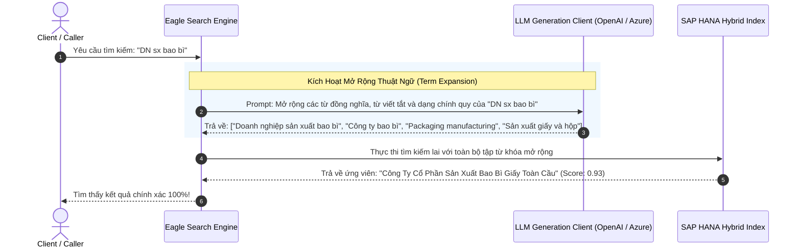

# 04. Mở Rộng Từ Khóa Bằng LLM (LLM Term Expansion)

> **Phân hệ:** AI Eagle Platform  
> **Chủ đề:** Kỹ thuật mở rộng từ khóa ngữ nghĩa bằng mô hình ngôn ngữ lớn (LLM Term Expansion) giúp chống bỏ sót ứng viên trùng lặp.

---

## 1. Hạn Chế Khi Tìm Kiếm Theo Từ Khóa Thô

Trong thực tế giao dịch, người dùng và các chi nhánh thường sử dụng rất nhiều từ viết tắt, tiếng lóng doanh nghiệp, hoặc thuật ngữ đa ngôn ngữ:
- Cụm từ người dùng nhập: `"DN sx bao bì"`
- Tên chính thức trong CSDL SAP: `"Công Ty Cổ Phần Sản Xuất Bao Bì Giấy Toàn Cầu"`
- Nếu chỉ tìm kiếm theo từ khóa thô (`"DN sx bao bì"`), hệ thống sẽ không tìm thấy bất kỳ kết quả nào vì các từ `"DN"`, `"sx"` không khớp trực tiếp với `"Công ty"`, `"Sản xuất"`.

---

## 2. Quy Trình Mở Rộng Từ Khóa (Term Expansion Workflow)

Khi caller kích hoạt cờ `enable_term_expansion = True` trong request kiểm tra hoặc tìm kiếm:

---

## 3. Quản Lý Ngân Sách & Cơ Chế Dự Phòng (Fallback)

- **Kiểm Soát Độ Trễ:** Quá trình gọi LLM được bọc trong bộ ngắt mạch (**Circuit Breaker**) với thời gian timeout ngắn (tối đa 2.5 giây).
- **Cơ Chế Dự Phòng (Graceful Degradation):** Nếu dịch vụ LLM gặp sự cố timeout hoặc hết quota, hệ thống tự động bỏ qua bước mở rộng từ khóa và sử dụng trực tiếp từ khóa thô cùng bộ nhúng vector cục bộ để hoàn tất quy trình mà không làm gián đoạn người dùng.
