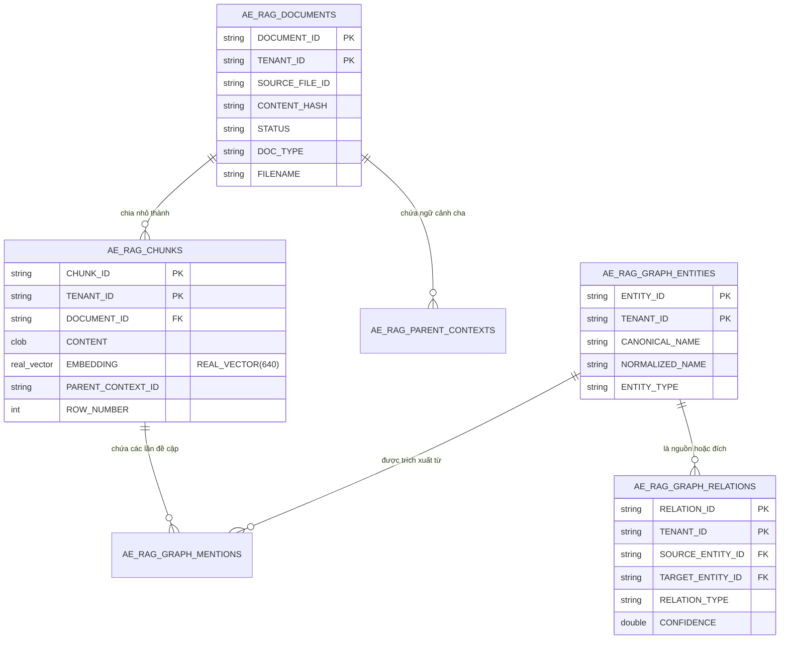

# 01. Mô Hình Dữ Liệu SAP HANA (`AE_*` Tables)

> **Phân hệ:** AI Eagle Platform  
> **Chủ đề:** Chi tiết cấu trúc các bảng `AE_*` trên SAP HANA Cloud, quan hệ thực thể, và vai trò của từng bảng trong quy trình so khớp & tri thức.

---

## 1. Bản Đồ Thực Thể Quan Hệ Tổng Thể

Hạ tầng dữ liệu của AI Eagle được chuẩn hóa trên tiền tố **`AE_`** (AI Eagle) nhằm cách ly hoàn toàn với các bảng nghiệp vụ khác trong cùng CSDL SAP HANA:

---

## 2. Chi Tiết Vai Trò Của Từng Bảng

### 2.1. Quản Lý Tài Liệu & Phân Đoạn (Documents & Chunks)
- **`AE_RAG_DOCUMENTS`:** Lưu trữ thông tin tài liệu nguồn tải lên từ File Service (PDF, CSV, Excel), mã băm nội dung `CONTENT_HASH` để chống trùng lặp tệp nguồn.
- **`AE_RAG_CHUNKS`:** Lưu trữ các đoạn văn bản đã được phân mảnh (Semantic Chunks) hoặc các dòng bảng tính. Bảng này mang cột vector đặc chủng **`REAL_VECTOR(640)`** giúp tìm kiếm tương đồng ngữ nghĩa tức thì.
- **`AE_RAG_PARENT_CONTEXTS`:** Lưu trữ toàn văn của bảng tính hoặc trang tài liệu cha, giúp khi tìm thấy một chunk con có thể truy xuất ngược lại ngữ cảnh xung quanh mà không làm loãng vector index.

---

### 2.2. Đồ Thị Tri Thức Quan Hệ (Knowledge Graph)
- **`AE_RAG_GRAPH_ENTITIES`:** Danh mục các đỉnh thực thể được trích xuất (Tên công ty, Tên người, Tên chất hóa học, Địa chỉ, Mã số thuế).
- **`AE_RAG_GRAPH_RELATIONS`:** Các cạnh kết nối giữa 2 thực thể kèm loại quan hệ (`LEGAL_REPRESENTATIVE`, `SUBSIDIARY_OF`, `LOCATED_AT`, `MANUFACTURES`) và độ tin cậy `CONFIDENCE` (0.0 đến 1.0).
- **`AE_RAG_GRAPH_MENTIONS`:** Vị trí chính xác của thực thể trong văn bản (`START_OFFSET`, `END_OFFSET`, `SURFACE_TEXT`).

---

### 2.3. Vết Quyết Định & Cấu Hình Vận Hành
- **`AE_RAG_CHECK_RESULTS`:** Lưu trữ kết quả của các lần gọi `/api/v1/duplicate-check` kèm toàn bộ cây suy luận `DECISION_TRACE_JSON`.
- **`AE_RAG_BACKGROUND_JOBS`:** Theo dõi tiến độ các tác vụ nạp chỉ mục chạy ngầm (`STATUS`, `STARTED_AT`, `ENDED_AT`, `ERROR_MESSAGE`).
- **`AE_SERVICE_CONFIGURATIONS`:** Bảng Key-Value lưu trữ các tham số cấu hình nhạy cảm (`SEARCH_FUZZY_THRESHOLD`, `VECTOR_SEARCH_TOP_K`, `VECTOR_MIN_SCORE`).
