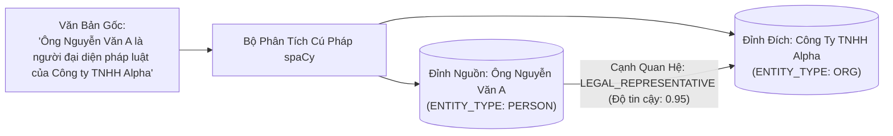

# 02. Đồ Thị Tri Thức & Trích Xuất Thực Thể (Graph Workspace & NLP)

> **Phân hệ:** AI Eagle Platform  
> **Chủ đề:** Khởi tạo `AE_GRAPH_WORKSPACE` trên SAP HANA, trích xuất thực thể bằng spaCy, và thuật toán duyệt đồ thị tri thức.

---

## 1. Không Gian Đồ Thị Bản Địa Trong SAP HANA: `AE_GRAPH_WORKSPACE`

SAP HANA không chỉ là CSDL quan hệ và vector, mà còn tích hợp sẵn một **Động cơ đồ thị in-memory (SAP HANA Graph Engine)**.

AI Eagle tự động khởi tạo không gian đồ thị thông qua module `schema_initializer.py`:

```sql
CREATE OR REPLACE GRAPH WORKSPACE "AE_GRAPH_WORKSPACE"
    VERTEX TABLE "AE_RAG_GRAPH_ENTITIES"
        KEY "ENTITY_ID"
    EDGE TABLE "AE_RAG_GRAPH_RELATIONS"
        KEY "RELATION_ID"
        SOURCE "SOURCE_ENTITY_ID" REFERENCES "AE_RAG_GRAPH_ENTITIES"
        TARGET "TARGET_ENTITY_ID" REFERENCES "AE_RAG_GRAPH_ENTITIES";
```

### Lợi Ích Của Graph Workspace:
- Cho phép thực thi các thuật toán duyệt đồ thị (Graph Traversal, Shortest Path, Neighborhood k-Hop, Triangles) trực tiếp trong bộ nhớ RAM của SAP HANA bằng ngôn ngữ **GraphScript** với tốc độ mili-giây.

---

## 2. Trích Xuất Thực Thể Bằng NLP: `SpacyDependencyGraphExtractor`

Để biến các tài liệu văn bản tự do thành các đỉnh và cạnh của đồ thị tri thức:
- Hệ thống sử dụng bộ trích xuất **`SpacyDependencyGraphExtractor`** (`app/layer4_frameworks/retrieval/spacy_dependency_graph_extractor.py`).
- **Quy trình phân tích cú pháp:**
  1. **Named Entity Recognition (NER):** Nhận diện các thực thể tên riêng (`ORG` - Doanh nghiệp, `PERSON` - Con người, `GPE` - Địa danh, `PRODUCT` - Sản phẩm).
  2. **Dependency Tree Parsing:** Phân tích cấu trúc ngữ pháp câu (Chủ ngữ - Động từ - Vị ngữ) để xác định động từ quan hệ (ví dụ: *"Ông A [Chủ ngữ] đại diện pháp luật [Động từ] cho Công ty B [Tân ngữ]"*).
  3. **Tạo Cạnh Quan Hệ:** Sinh bản ghi cạnh trong `AE_RAG_GRAPH_RELATIONS` nối từ Ông A tới Công ty B kèm nhãn `LEGAL_REPRESENTATIVE`.



---

## 3. Duyệt Đồ Thị Tìm Bằng Chứng Trùng Lặp (Graph Traversal)

Khi cần đánh giá mối liên kết giữa 2 bản ghi ứng viên:
- Hệ thống chạy truy vấn duyệt láng giềng bậc 1 và bậc 2 (1-Hop & 2-Hop Neighborhood Search) trong `AE_GRAPH_WORKSPACE`.
- Nếu phát hiện thấy có đỉnh trung gian kết nối cả 2 ứng viên ➔ Trả về bằng chứng thực thể cụ thể và tăng điểm số trùng lặp một cách có căn cứ.
