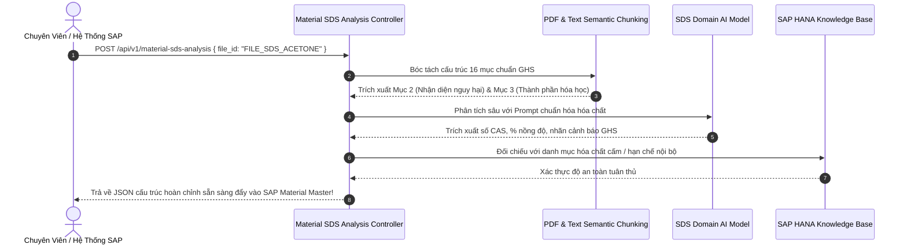

# 01. Động Cơ Phân Tích Bảng Dữ Liệu An Toàn Hóa Chất (Material SDS Analysis)

> **Phân hệ:** AI Eagle Platform  
> **Chủ đề:** Phân tích tài liệu an toàn hóa chất (Safety Data Sheet - SDS), trích xuất thành phần nguy hại theo chuẩn quốc tế GHS.

---

## 1. Thách Thức Quản Trị Hóa Chất Doanh Nghiệp

Trong các ngành công nghiệp nặng, sản xuất, hóa chất, dược phẩm và nông nghiệp:
- Mỗi khi nhập một nguyên vật liệu mới, doanh nghiệp bắt buộc phải có **Bảng Dữ Liệu An Toàn Hóa Chất (Safety Data Sheet - SDS)** theo chuẩn quốc tế **GHS (Globally Harmonized System)**.
- Tài liệu SDS là các file PDF dài từ 10 đến 30 trang, chứa hàng trăm thông số phức tạp:
  - Mã số danh mục hóa chất quốc tế (**CAS Registry Number**).
  - Tỷ lệ nồng độ phần trăm từng hợp chất.
  - Các cụm từ cảnh báo nguy hại (H-Statements: H225 - Chất lỏng dễ cháy, H315 - Gây kích ứng da) và cụm từ phòng ngừa (P-Statements).
- **Thực trạng đau đớn:** Chuyên viên an toàn phải đọc từng trang PDF và gõ tay vào hệ thống SAP Material Master. Một hồ sơ mất từ 1–2 giờ và rất dễ gõ nhầm số CAS, dẫn đến vi phạm pháp luật nghiêm trọng về lưu trữ hóa chất độc hại!

---

## 2. Giải Pháp Tự Động Hóa Của AI Eagle: `/api/v1/material-sds-analysis`

Module `material_sds_analysis` (`app/layer2_application/features/material_sds_analysis/`) tự động hóa toàn bộ quy trình:



---

## 3. Cấu Trúc Dữ Liệu Đầu Ra Chuẩn Hóa

```json
{
  "product_name": "Industrial Solvent Blend X",
  "sds_date": "2026-01-15",
  "ghs_classification": {
    "signal_word": "DANGER",
    "pictograms": ["GHS02_FLAME", "GHS07_EXCLAMATION_MARK"],
    "hazard_statements": [
      { "code": "H225", "description": "Highly flammable liquid and vapour." },
      { "code": "H319", "description": "Causes serious eye irritation." }
    ]
  },
  "hazardous_components": [
    {
      "chemical_name": "Acetone",
      "cas_number": "67-64-1",
      "concentration_percentage_min": 60.0,
      "concentration_percentage_max": 80.0
    },
    {
      "chemical_name": "Isopropanol",
      "cas_number": "67-63-0",
      "concentration_percentage_min": 20.0,
      "concentration_percentage_max": 40.0
    }
  ],
  "compliance_check": {
    "is_restricted_substance": false,
    "storage_temperature_max_celsius": 30.0
  }
}
```

### Lợi Ích Mang Lại:
- Giảm thời gian nhập liệu từ **90 phút xuống dưới 5 giây** cho mỗi tài liệu SDS.
- Độ chính xác trích xuất số CAS và mã nguy hại đạt trên **98%**, đảm bảo an toàn tuyệt đối cho nhà máy.
