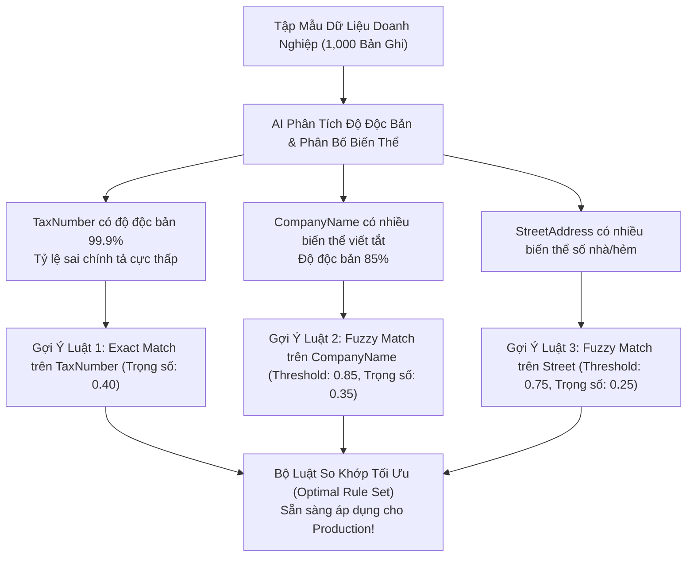

# 02. Làm Sạch Dữ Liệu & Gợi Ý Luật So Khớp (Cleansing & Rule Suggestions)

> **Phân hệ:** AI Eagle Platform  
> **Chủ đề:** Làm sạch & làm giàu dữ liệu (`cleansing-enrichment`), và động cơ AI gợi ý luật quản trị dữ liệu (`rule-suggestions`).

---

## 1. Làm Sạch & Làm Giàu Dữ Liệu: `/api/v1/cleansing-enrichment/new-record`

Trước khi một bản ghi được đưa vào kho dữ liệu chính thức, nó cần được "tắm rửa" sạch sẽ:
- **Chuẩn Hóa Chuỗi (Standardization):**
  - Đưa tên riêng về dạng viết hoa chữ cái đầu tiêu chuẩn (`"CONG TY ABC"` ➔ `"Công ty ABC"`).
  - Chuẩn hóa số điện thoại theo định dạng quốc tế E.164 (`"0901234567"` ➔ `"+84901234567"`).
  - Chuẩn hóa định dạng địa chỉ hành chính (Tỉnh/Thành phố, Quận/Huyện, Phường/Xã) theo danh mục chuẩn quốc gia.
- **Làm Giàu Dữ Liệu (Enrichment):**
  - Dựa vào Mã số thuế, hệ thống tự động tra cứu và bổ sung thêm: Ngành nghề kinh doanh chính, Tình trạng doanh nghiệp đang hoạt động, Tên người đại diện pháp luật.

---

## 2. Động Cơ AI Gợi Ý Luật So Khớp: `/api/v1/rule-suggestions`

Một trong những khó khăn lớn nhất của các kỹ sư triển khai hệ thống quản trị dữ liệu là: **Làm sao để biết nên đặt luật so khớp nào cho từng trường dữ liệu?**
- Nếu đặt luật quá chặt ➔ Bỏ sót trùng lặp.
- Nếu đặt luật quá lỏng ➔ Báo động giả (False Positives) quá nhiều, làm ách tắc quy trình phê duyệt.

Endpoint `POST /api/v1/rule-suggestions` sử dụng AI để phân tích tập dữ liệu mẫu của doanh nghiệp:

### Lợi Ích:
- Giúp doanh nghiệp thiết lập hệ thống Master Data Governance chuẩn chỉnh ngay từ ngày đầu tiên mà không cần thuê đội ngũ tư vấn dữ liệu đắt đỏ.
