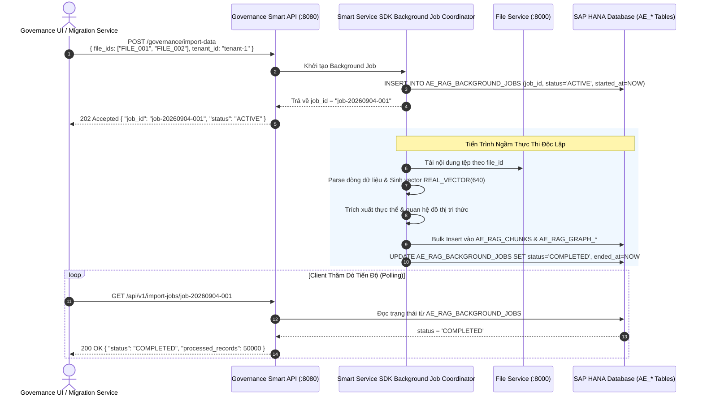

# 01. Nhập Dữ Liệu Chỉ Mục Ngầm (Request-Driven Duplicate Import)

> **Phân hệ:** AI Eagle Platform  
> **Chủ đề:** Tác vụ nhập dữ liệu chỉ mục ngầm qua `POST /governance/import-data`, theo dõi tiến độ qua `AE_RAG_BACKGROUND_JOBS`.

---

## 1. Vấn Đề Nhập Dữ Liệu Khối Lượng Lớn

Khi doanh nghiệp di chuyển hoặc khởi tạo hệ thống Master Data:
- Có hàng chục ngàn đến hàng triệu bản ghi khách hàng/nhà cung cấp cần được nạp vào chỉ mục so khớp.
- Quá trình tính toán embedding vector và trích xuất thực thể đồ thị cho 100,000 dòng có thể mất từ vài phút đến nửa tiếng.
- **Yêu cầu kỹ thuật:** Tuyệt đối không được để caller HTTP phải chờ đợi (tránh Timeout HTTP 504). Mọi tác vụ nạp dữ liệu lớn phải chạy dưới dạng **Tác Vụ Ngầm Bất Đồng Bộ (Background Job)**.

---

## 2. Quy Trình Vận Hành Của Tác Vụ Nhập Liệu

---

## 3. Khả Năng Khôi Phục & Quản Trị Lỗi

- **Lưu Vết Lỗi Chi Tiết:** Nếu có bất kỳ sự cố nào xảy ra trong quá trình nạp (ví dụ tệp CSV bị lỗi cú pháp dòng 1500), thông tin ngoại lệ được ghi nhận chi tiết vào cột `ERROR_MESSAGE` của bảng `AE_RAG_BACKGROUND_JOBS`.
- **An Toàn Đa Người Thuê (Tenant Isolation):** Mọi bản ghi được nạp vào đều được gán nhãn `TENANT_ID` cố định, ngăn chặn hoàn toàn hiện tượng dữ liệu chỉ mục của tenant này bị truy vấn bởi tenant khác.
