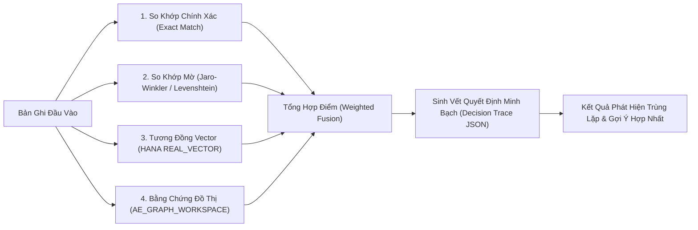

# Tài Liệu Thiết Kế Kiến Trúc: AI Eagle Platform

> **Động cơ so khớp thông minh, phát hiện dữ liệu trùng lặp (Deduplication) và phân tích tài liệu kỹ thuật SDS doanh nghiệp**  
> *Được xây dựng trên Python, FastAPI, Clean Architecture 4 lớp, tích hợp SAP HANA Vector Engine (`REAL_VECTOR(640)`), SAP HANA Graph Workspace và mô hình ngôn ngữ lớn (LLM).*

---

## 📚 Mục Lục Toàn Bộ Tài Liệu Chi Tiết

Tài liệu được phân tách thành 5 phân hệ chuyên sâu theo cấu trúc module hóa:

### 1. [Kiến Trúc Tổng Thể (Architecture)](./01-architecture/)
- [01. Tổng Quan & Các Khái Niệm Cốt Lõi](./01-architecture/01-overview-and-concepts.md): Mục đích kiến trúc, bài toán dữ liệu trùng lặp trong MDG, đường ống so khớp lai 4 tầng (Exact + Fuzzy + Vector + Graph).
- [02. Topology Hệ Thống & Cổng Giao Tiếp](./01-architecture/02-system-topology.md): Bản đồ dịch vụ, kết nối FastAPI (`governance-smart-api` :8080 & `smart-service-sdk` :8088), các bảng `AE_*` trên SAP HANA, và kiến trúc nhúng hợp nhất tiến trình.
- [03. Kiến Trúc Phân Tầng Clean Architecture](./01-architecture/03-clean-architecture-and-composition.md): Chi tiết 4 tầng Clean Architecture, các Interface cốt lõi, và cơ chế Bootstrap Container qua `smart_create_app`.

### 2. [Động Cơ So Khớp Trùng Lặp Lai (Duplicate Detection Engine)](./02-duplicate-detection-engine/)
- [01. Đường Ống So Khớp Trùng Lặp Lai](./02-duplicate-detection-engine/01-hybrid-matching-pipeline.md): So khớp chính xác (Exact), so khớp mờ chuỗi ký tự (Levenshtein & Jaro-Winkler), tương đồng vector, và công thức tổng hợp điểm có trọng số.
- [02. Tương Đồng Vector & Nhúng Ngôn Ngữ](./02-duplicate-detection-engine/02-vector-similarity-and-embeddings.md): Cột `REAL_VECTOR(640)` trong SAP HANA, mô hình nhúng cục bộ FastEmbed (`bge-small-en-v1.5`), và câu lệnh Cosine Similarity Pushdown.
- [03. Bằng Chứng Đồ Thị & Vết Quyết Định](./02-duplicate-detection-engine/03-graph-evidence-and-decision-trace.md): Tra cứu thực thể liên kết chung trong CSDL đồ thị, và cấu trúc vết suy luận minh bạch `decision_trace` phục vụ kiểm toán.
- [04. Mở Rộng Từ Khóa Bằng LLM](./02-duplicate-detection-engine/04-llm-term-expansion.md): Kỹ thuật mở rộng thuật ngữ viết tắt và từ đồng nghĩa qua LLM kèm cơ chế ngắt mạch Circuit Breaker.

### 3. [Đồ Thị Tri Thức & Lưu Trữ SAP HANA (Knowledge Graph & RAG)](./03-knowledge-graph-and-rag/)
- [01. Mô Hình Dữ Liệu SAP HANA (`AE_*` Tables)](./03-knowledge-graph-and-rag/01-sap-hana-ae-data-model.md): Chi tiết các bảng quản lý tài liệu, phân đoạn chunk, ngữ cảnh cha, đỉnh thực thể, cạnh quan hệ và cấu hình runtime.
- [02. Đồ Thị Tri Thức & Trích Xuất Thực Thể](./03-knowledge-graph-and-rag/02-graph-workspace-and-mentions.md): Khởi tạo `AE_GRAPH_WORKSPACE` trên SAP HANA, trích xuất thực thể bằng spaCy, và thuật toán duyệt đồ thị láng giềng k-hop.

### 4. [Phân Tích Dữ Liệu An Toàn Hóa Chất (Material SDS Analysis)](./04-material-sds-analysis/)
- [01. Động Cơ Phân Tích Bảng Dữ Liệu Hóa Chất (Material SDS)](./04-material-sds-analysis/01-material-sds-analysis-engine.md): Tự động bóc tách tài liệu Safety Data Sheet theo chuẩn GHS, trích xuất số CAS, % nồng độ và phân loại nguy hại.
- [02. Làm Sạch Dữ Liệu & Gợi Ý Luật So Khớp](./04-material-sds-analysis/02-cleansing-enrichment-and-rule-suggestions.md): Làm sạch, chuẩn hóa và làm giàu dữ liệu tự động, cùng động cơ AI gợi ý luật quản trị dữ liệu tối ưu.

### 5. [Cổng Quản Trị & Giao Diện Điều Khiển (Governance Smart API)](./05-governance-smart-api/)
- [01. Nhập Dữ Liệu Chỉ Mục Ngầm](./05-governance-smart-api/01-request-driven-duplicate-import.md): Tác vụ nhập chỉ mục ngầm khối lượng lớn qua `POST /governance/import-data`, theo dõi trạng thái `AE_RAG_BACKGROUND_JOBS`.
- [02. Nạp Tệp Trực Tiếp & Giao Diện Quản Trị UI Console](./05-governance-smart-api/02-csv-upload-and-inline-console.md): Nạp tệp CSV kéo thả trực tiếp, xem trước inline và giao diện web console nội bộ (`/api/v1/ui`).

---

## 🚀 Sơ Đồ Khái Niệm Động Cơ So Khớp AI Eagle

