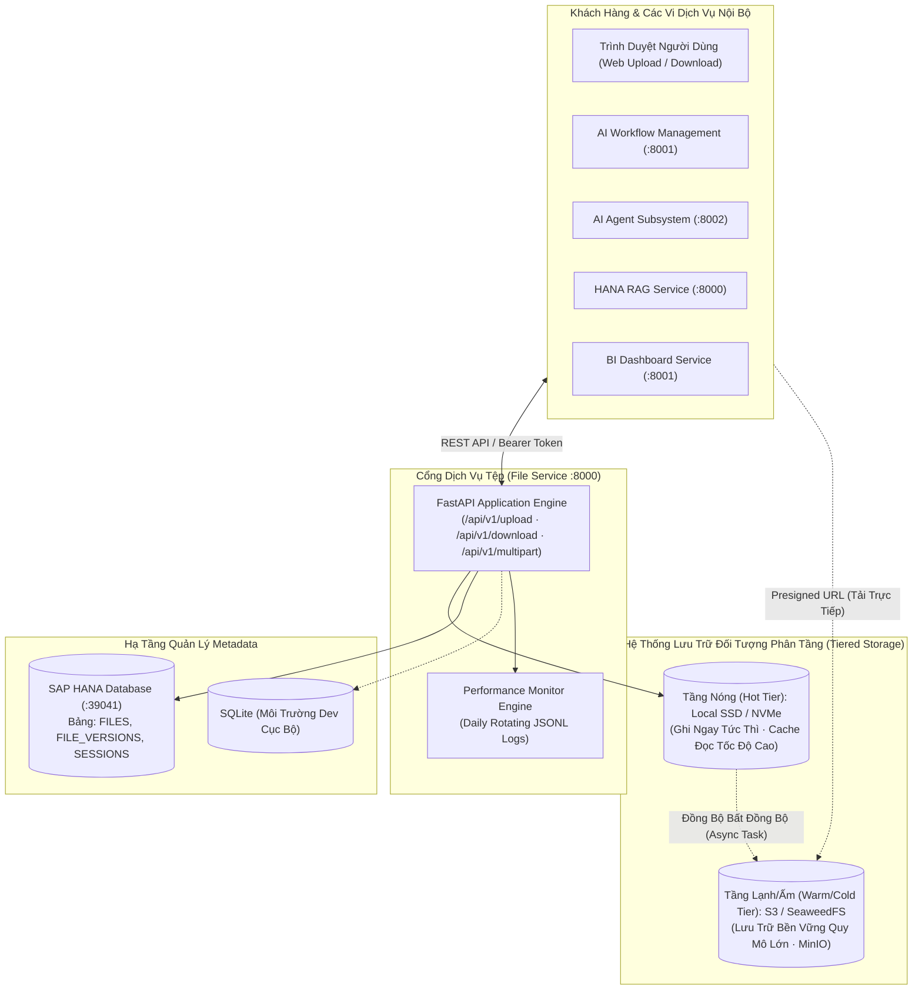

# 02. Topology Hệ Thống & Cổng Giao Tiếp (System Topology)

> **Phân hệ:** File Service  
> **Chủ đề:** Bản đồ liên kết dịch vụ, các tầng lưu trữ đối tượng, và giao tiếp giữa các vi dịch vụ trong hệ sinh thái.

---

## 1. Sơ Đồ Topology Mạng Toàn Diện

File Service đóng vai trò là xương sống trung chuyển và lưu trữ tệp cho toàn bộ nền tảng SimpleMDG:

---

## 2. Các Cổng Giao Tiếp & Biến Môi Trường

| Thành Phần | Cổng Mặc Định | Biến Cấu Hình | Ghi Chú |
|---|---|---|---|
| **File Service REST API** | `8000` (hoặc `8003`) | `PORT=8000`, `HOST=0.0.0.0` | Cung cấp toàn bộ các API tải lên, tải xuống, tạo presigned URL. |
| **Local Storage Directory** | File System | `LOCAL_STORAGE_DIR=/data/storage` | Thư mục đĩa SSD dùng làm Hot Tier đệm. |
| **AWS S3 / S3-Compatible** | HTTPS / `443` | `STORAGE_TYPE=AWS_S3`, `BUCKET_NAME` | Kết nối AWS S3 hoặc MinIO qua `S3_ENDPOINT_URL`. |
| **SeaweedFS Storage** | `8333` (Filer) | `STORAGE_TYPE=SEAWEEDFS`, `SEAWEEDFS_ENDPOINT` | Hệ thống lưu trữ đối tượng phân tán mã nguồn mở hiệu năng cao. |
| **SAP HANA Metadata DB** | `39041` | `HANA_CONNECTION_STRING` | Lưu trữ siêu dữ liệu phiên bản tệp chuẩn ACID. |

---

## 3. Cơ Chế Đường Dẫn Tắt: Presigned URLs

Đối với các tệp dung lượng lớn (từ 50MB đến hàng gigabyte):
- Client không cần phải gửi toàn bộ luồng byte qua máy chủ File Service (tránh gây tắc nghẽn CPU và mạng của web server).
- **Quy trình Presigned URL:**
  1. Client gọi: `GET /api/v1/presigned-url/{file_id}`.
  2. File Service ký số một URL an toàn có thời hạn (ví dụ: 15 phút).
  3. Client tải trực tiếp dữ liệu lên/xuống thẳng kho lưu trữ S3 / SeaweedFS bằng URL đã ký đó.
