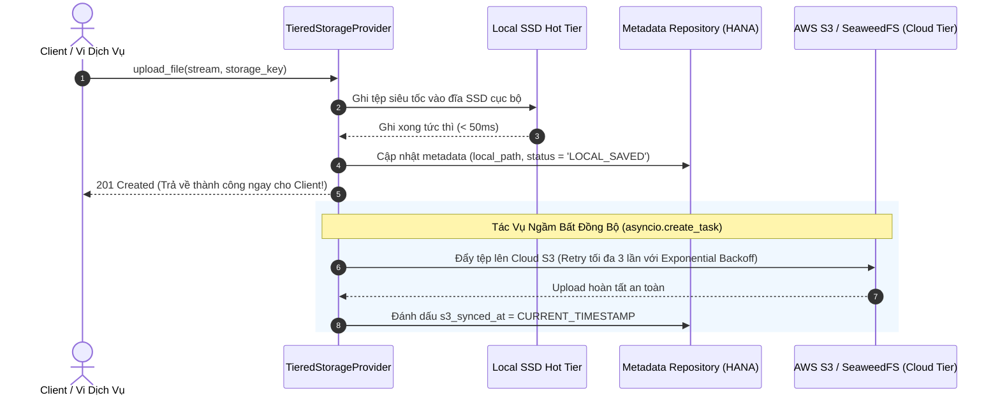

# 01. Bộ Lưu Trữ Phân Tầng (Tiered Storage Provider)

> **Phân hệ:** File Service  
> **Chủ đề:** Bộ điều phối lưu trữ phân tầng `TieredStorageProvider`, cơ chế ghi đệm Write-Behind bất đồng bộ, và tự động thu hồi dung lượng đĩa.

---

## 1. Vấn Đề Hiệu Năng Của Cloud Storage Thuần Túy

Khi lưu trữ toàn bộ tệp trực tiếp lên Cloud Object Storage (như AWS S3 ở vùng dữ liệu từ xa):
- **Độ trễ cao (Latency Bottleneck):** Mỗi lần tải lên hoặc tải xuống tệp phải chịu độ trễ mạng WAN từ 500ms đến vài giây.
- **Tắc nghẽn vi dịch vụ:** Các dịch vụ như AI Workflow hay RAG Ingestion cần đọc/ghi hàng trăm tệp trung gian liên tục. Nếu mỗi lần đều phải chờ mạng S3, tổng thời gian xử lý toàn quy trình sẽ tăng gấp 5–10 lần.

**`TieredStorageProvider`** (`app/layer4_frameworks/storages/tiered_storage_provider.py`) áp dụng mô hình thiết kế **Decorator Pattern**: Bọc lấy S3 Storage Provider bằng một tầng đệm đĩa cứng cục bộ siêu tốc (Local SSD / NVMe Hot Tier).

---

## 2. Quy Trình Tải Lên Đệm Bất Đồng Bộ: Write-Behind Upload

### Lợi Ích Vượt Trội:
- **Tốc độ phản hồi cực nhanh:** Phía người dùng hoặc các dịch vụ gọi API nhận kết quả gần như tức thì, không cần chờ đường truyền mạng tải lên S3 hoàn thành.
- **Khả năng tự phục hồi (Resilient Retry):** Nếu mạng tới AWS S3 gặp sự cố chập chờn, tệp vẫn an toàn 100% trên đĩa cục bộ và hệ thống tự động thử đẩy lại sau.

---

## 3. Quy Trình Tải Xuống Ưu Tiên Cache (Cache-First Download)

Khi có yêu cầu tải xuống một tệp:
1. **Kiểm tra tầng nóng:** Hệ thống đọc thông tin `local_path` từ metadata.
2. **Nếu tệp vẫn còn trên đĩa SSD cục bộ:** Lập tức mở luồng stream trả về trực tiếp cho client với tốc độ đọc đĩa hàng trăm MB/giây.
3. **Nếu tệp không còn trên đĩa (đã bị giải phóng):** Hệ thống tự động chuyển tiếp yêu cầu sang Cloud S3 / SeaweedFS để stream về cho client một cách trong suốt (Transparent Fallback).

---

## 4. Quản Lý Áp Lực Đĩa Cục Bộ (Disk Pressure Eviction)

Dung lượng ổ đĩa SSD cục bộ của máy chủ luôn có giới hạn (ví dụ 100GB hoặc 500GB). Nếu tệp cứ tích lũy liên tục, đĩa sẽ bị tràn (Disk Full).

Hệ thống tích hợp tiến trình ngầm giám sát đĩa tự động bằng thư viện `psutil`:
- Định kỳ đo lường: `psutil.disk_usage(local_dir).percent`.
- Khi tỷ lệ sử dụng đĩa vượt qua ngưỡng cảnh báo (mặc định **85%**):
  - Kích hoạt quy trình **Dọn dẹp tự động (Eviction Janitor)**:
  - Chỉ quét và xóa các tệp cục bộ **ĐÃ ĐỒNG BỘ THÀNH CÔNG LÊN S3** (`s3_synced_at IS NOT NULL`).
  - Áp dụng chiến lược **LRU (Least Recently Used)**: Ưu tiên xóa các tệp được tạo hoặc truy cập lâu nhất trước.
  - Tuyệt đối không bao giờ xóa các tệp đang chờ đồng bộ (`s3_synced_at IS NULL`).
