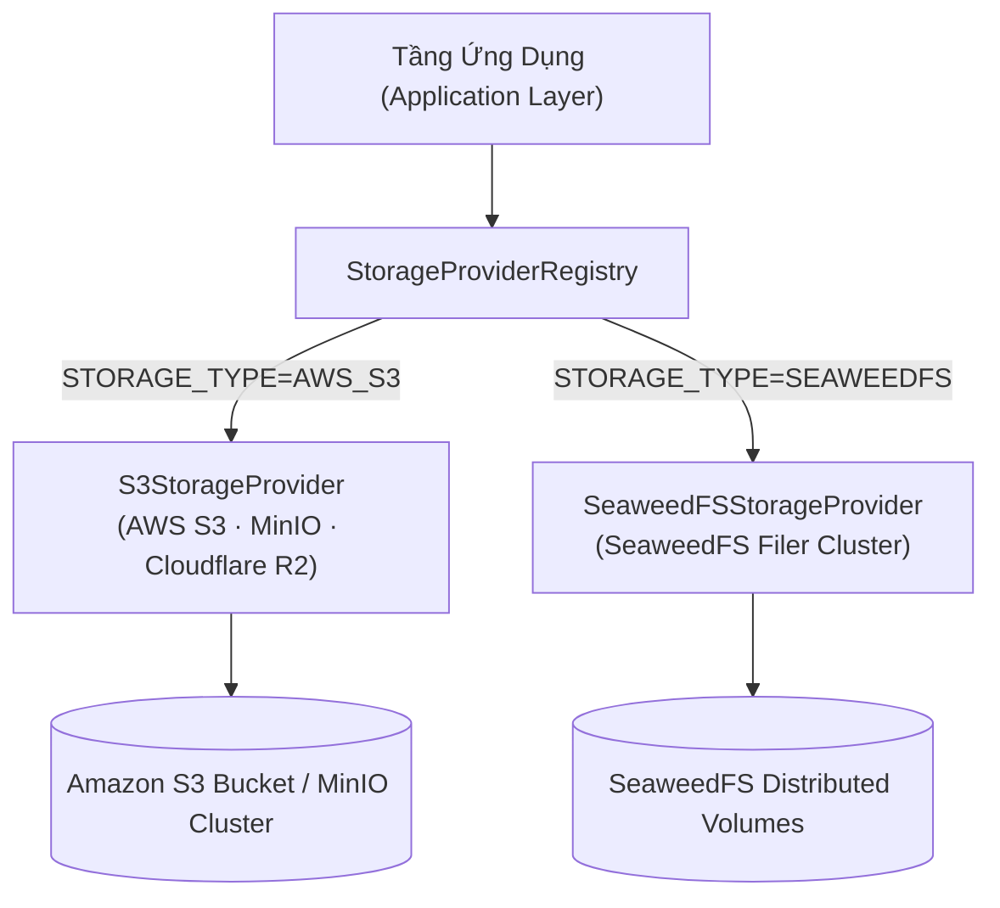

# 02. Các Nhà Cung Cấp Lưu Trữ: S3 & SeaweedFS

> **Phân hệ:** File Service  
> **Chủ đề:** Tích hợp AWS S3 chuẩn hóa, hệ thống lưu trữ phân tán SeaweedFS, và cơ chế chuyển đổi linh hoạt `StorageProviderRegistry`.

---

## 1. Khung Trừu Tượng Hóa Lưu Trữ Đối Tượng

File Service không phụ thuộc cứng vào bất kỳ một nhà cung cấp đám mây cụ thể nào. Toàn bộ thao tác đọc/ghi đều giao tiếp qua giao diện chuẩn `IStorageProvider`:

---

## 2. Chi Tiết `S3StorageProvider` (AWS S3 & Tương Thích S3)

- **Công nghệ nền tảng:** Sử dụng `aioboto3` (bất đồng bộ hoàn toàn) kết hợp `boto3` chính thức của AWS.
- **Khả năng tương thích mở rộng (S3-Compatible):**
  - Thông qua cấu hình `S3_ENDPOINT_URL`, dịch vụ có thể kết nối mượt mà tới:
    - **MinIO:** Cho môi trường kiểm thử cục bộ hoặc Private Cloud nội bộ.
    - **Cloudflare R2:** Cho lưu trữ đám mây không tốn phí băng thông tải ra (Zero Egress Fees).
    - **Ceph / Dell ECS:** Trong hạ tầng trung tâm dữ liệu On-Premise của doanh nghiệp.
- **Tính năng bảo mật:**
  - Tự động kích hoạt mã hóa phía máy chủ (**Server-Side Encryption - SSE-S3 / SSE-KMS**).
  - Kiểm tra tính toàn vẹn tệp bằng mã băm **ETag / MD5 Checksum**.

---

## 3. Chi Tiết `SeaweedFSStorageProvider` (Lưu Trữ Phân Tán Hiệu Năng Cao)

**SeaweedFS** là hệ thống tệp phân tán mã nguồn mở nổi tiếng (thiết kế theo kiến trúc Facebook Haystack):
- **Ưu thế tuyệt đối:** Được tối ưu hóa đặc biệt cho việc lưu trữ hàng triệu tệp tin nhỏ và vừa với mức tiêu thụ bộ nhớ RAM và độ trễ đọc/ghi cực thấp.
- **Giao tiếp Filer REST API:**
  - Sử dụng giao thức HTTP/2 kết nối trực tiếp vào SeaweedFS Filer endpoint (`http://seaweedfs-filer:8333`).
  - Hỗ trợ chính sách nhân bản dữ liệu linh hoạt (Replication Policy, ví dụ: `001` nhân đôi trên cùng rack, `010` nhân đôi trên các datacenter khác nhau).
- **Tự Động Nén Dữ Liệu:** Tích hợp thuật toán nén gzip/zstd trong nhân của SeaweedFS giúp tiết kiệm 40–60% dung lượng đĩa lưu trữ cho các tệp văn bản CSV/JSON.
