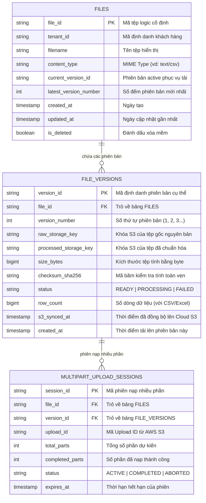

# 03. Kho Siêu Dữ Liệu Tệp (Metadata Repositories)

> **Phân hệ:** File Service  
> **Chủ đề:** Kho lưu trữ siêu dữ liệu trên SAP HANA (`HanaFileMetadataRepository`), schema các bảng quản lý, và phòng chống SQL Injection.

---

## 1. Vai Trò Của Kho Siêu Dữ Liệu (Metadata Store)

Trong kiến trúc lưu trữ đối tượng (Object Storage), các kho lưu trữ như S3 chỉ đóng vai trò là "ổ đĩa chứa byte" (Key-Value Blob Store). S3 không có khả năng:
- Truy vấn lịch sử phiên bản phức tạp theo Tenant.
- Tìm kiếm tệp theo trạng thái đồng bộ (`s3_synced_at`).
- Đảm bảo các giao dịch ACID khi chuyển đổi phiên bản tệp.

Do đó, toàn bộ "bộ não" quản lý trạng thái của File Service được giao phó cho **SAP HANA Cloud / Express** thông qua `HanaFileMetadataRepository` (`app/layer4_frameworks/metadata/hana_file_metadata_repository.py`).

---

## 2. Cấu Trúc 3 Bảng Dữ Liệu Trong SAP HANA



---

## 3. Các Đặc Quyền Thiết Kế Kỹ Thuật

1. **Quản Lý Kết Nối An Toàn Luồng (Thread-Safe Connection Pooling):**
   - Lớp `_PooledHanaConnection` bọc ngoài kết nối `hdbcli`, kết hợp hàng đợi `queue.Queue` và khóa `threading.RLock` đảm bảo nhiều luồng xử lý async/await đồng thời không bao giờ xảy ra xung đột socket CSDL.
2. **Chống Tấn Công SQL Injection Cấp Trường (Schema-Guarded Column Updates):**
   - Để ngăn chặn kẻ tấn công lợi dụng các hàm cập nhật một trường động để truyền mã SQL độc hại, hệ thống sử dụng tập hợp kiểm duyệt an toàn:
   ```python
   # Chỉ cho phép các trường được định nghĩa chính thức trong dataclass
   _ALLOWED_VERSION_UPDATE_FIELDS = frozenset(field.name for field in fields(FileVersionRecord))
   ```
   - Mọi tên cột không nằm trong danh sách này lập tức bị từ chối trước khi ghép vào câu lệnh SQL.
