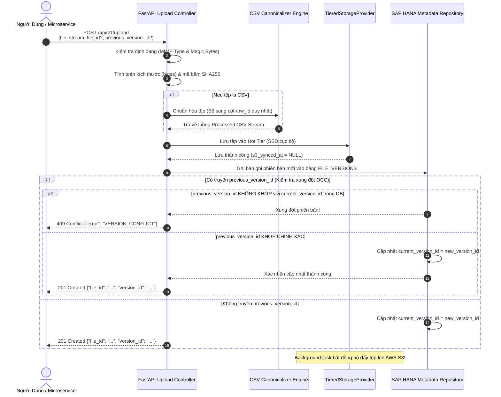

# 01. Tải Lên Trực Tiếp & Quản Lý Phiên Bản (Upload & Versioning)

> **Phân hệ:** File Service  
> **Chủ đề:** API tải lên trực tiếp (`POST /api/v1/upload`), cơ chế tải lên theo phiên bản, và xử lý xung đột đồng thời (OCC).

---

## 1. Hai Kịch Bản Tải Lên (Upload Scenarios)

Endpoint duy nhất `POST /api/v1/upload` hỗ trợ cả hai nhu cầu:

### Kịch Bản 1: Tải Lên Tệp Mới Hoàn Toàn (New File)
- **Tham số:** Không truyền `file_id`.
- **Hành vi:**
  - Hệ thống tự động sinh một `file_id` mới (ví dụ: `file_019dda5c-...`).
  - Cấp phát phiên bản đầu tiên `ver_019dda5d-...` với `version_number = 1`.
  - Thiết lập `current_version_id` trỏ về phiên bản 1 này.

---

### Kịch Bản 2: Tải Lên Phiên Bản Mới Cho Tệp Đã Có (New Version)
- **Tham số:** Truyền kèm `file_id` và `previous_version_id`.
- **Hành vi:**
  - Giữ nguyên `file_id` logic.
  - Tăng `latest_version_number` lên 1 đơn vị (ví dụ: Version 2).
  - Cấp phát `version_id` mới cho lần tải này.

---

## 2. Quy Trình Xử Lý Một Lần Upload



---

## 3. Định Dạng Phản Hồi Chuẩn (Response Shape)

```json
{
  "file_id": "file_019dda5c-9a52-7867-928e-e658849530aa",
  "version_id": "ver_019dda5d-19ef-7ceb-a139-7910a3536f2b",
  "version_number": 2,
  "filename": "Customers_Master_2026.csv",
  "content_type": "text/csv",
  "size_bytes": 15829104,
  "checksum_sha256": "e3b0c44298fc1c149afbf4c8996fb92427ae41e4649b934ca495991b7852b855",
  "row_count": 50000,
  "status": "READY",
  "created_at": "2026-09-03T14:40:00.123456Z"
}
```
