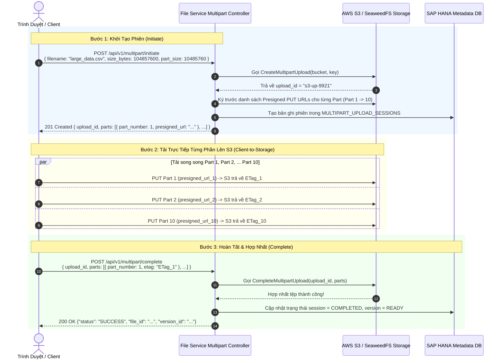

# 02. Tải Lên Nhiều Phần Kèm Presigned URLs (Multipart Upload)

> **Phân hệ:** File Service  
> **Chủ đề:** Tải lên tệp dung lượng lớn (GBs) qua Multipart Upload, ký trước URLs từng phần, và cơ chế ghép nối tệp tự động.

---

## 1. Khi Nào Cần Sử Dụng Multipart Upload?

Khi người dùng cần tải lên các tệp dữ liệu khổng lồ (từ 50MB đến hàng gigabytes như file sao lưu CSDL, tệp video, file nén zip lớn):
- Tải lên một lần (Single-part upload) rất dễ thất bại: Chỉ cần mạng chập chờn ở giây thứ 99, toàn bộ 99% dữ liệu trước đó đều bị mất và phải tải lại từ đầu!
- Gây nghẽn bộ nhớ RAM và băng thông của máy chủ API.

**Presigned Multipart Upload** giải quyết bài toán này:
- Chia tệp thành nhiều phần nhỏ (ví dụ: mỗi phần 10MB).
- Tải các phần lên **song song** (Parallel Uploads) trực tiếp vào AWS S3 / SeaweedFS.
- Nếu một phần bị lỗi mạng, client chỉ cần gửi lại duy nhất phần đó mà không phải tải lại toàn bộ tệp.

---

## 2. Vòng Đời 3 Bước Của Multipart Upload

---

## 3. Cơ Chế Hủy Bỏ An Toàn: `POST /multipart/abort`

Nếu người dùng bấm "Hủy tải lên" giữa chừng hoặc đóng trình duyệt:
- Client gọi: `POST /api/v1/multipart/abort` kèm `upload_id`.
- Hệ thống gửi lệnh `AbortMultipartUpload` sang S3 để xóa sạch toàn bộ các phần dữ liệu dở dang đã tải lên, giúp doanh nghiệp không bị tính phí lưu trữ cho các tệp rác.
- Có tiến trình dọn dẹp định kỳ tự động hủy các phiên upload multipart bị bỏ quên quá 24 giờ.
