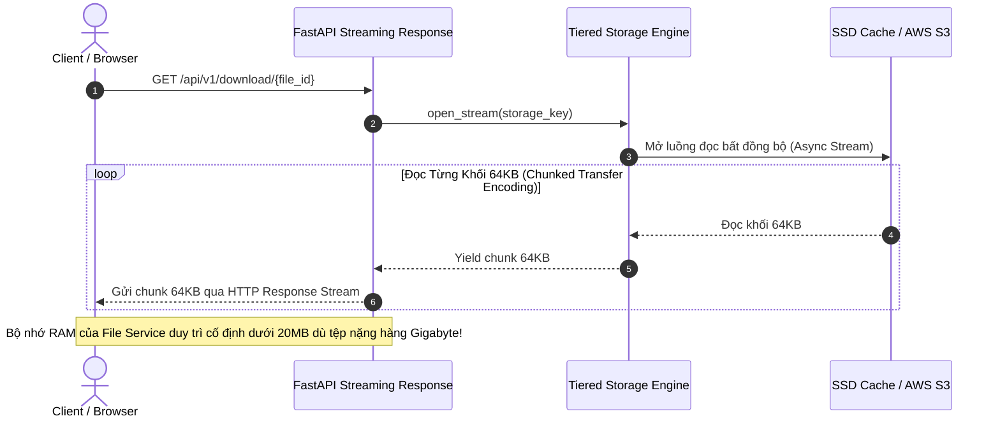

# 03. Tải Xuống & Truyền Phát Dữ Liệu (Download & Streaming)

> **Phân hệ:** File Service  
> **Chủ đề:** Các kịch bản tải xuống tệp (`GET /api/v1/download`), cơ chế truyền phát dữ liệu Chunked Streaming, và Presigned GET URLs.

---

## 1. Các Phương Thức Tải Xuống (Download Modes)

File Service cung cấp các cách tiếp cận linh hoạt tùy theo nhu cầu của ứng dụng:

| Endpoint & Tham Số | Mục Đích Sử Dụng | Hành Vi Hệ Thống |
|---|---|---|
| `GET /download/{file_id}` | Tải phiên bản mới nhất đang sẵn sàng | Trả về tệp thuộc `current_version_id` (phiên bản đã chuẩn hóa). |
| `GET /download/{file_id}?version_id=ver_123` | Tải một phiên bản lịch sử cụ thể | Truy xuất chính xác tệp ứng với `version_id` được chỉ định. |
| `GET /download/{file_id}?format=raw` | Tải tệp gốc nguyên bản chưa qua xử lý | Phục vụ kiểm toán dữ liệu hoặc tải lại định dạng gốc do người dùng tải lên. |
| `GET /presigned-url/{file_id}` | Lấy liên kết tải trực tiếp từ Cloud S3 | Trả về một URL tạm thời có chữ ký số (Time-to-Live, ví dụ: 15 phút). |

---

## 2. Cơ Chế Truyền Phát Dữ Liệu: Chunked Streaming

Một lỗi phổ biến trong các ứng dụng web là dùng lệnh `file.read()` nạp toàn bộ nội dung tệp 1GB vào bộ nhớ RAM trước khi trả về cho client. Nếu có 10 người cùng tải tệp cùng lúc, máy chủ sẽ bị tràn bộ nhớ (Out-Of-Memory - OOM Crash)!

File Service sử dụng cơ chế **Asynchronous Chunked Streaming**:

---

## 3. Quản Lý Header HTTP & Trải Nghiệm Người Dùng

Để tối ưu hóa trải nghiệm tải về trên trình duyệt:
- **`Content-Disposition: attachment; filename="Tên_Tệp_Gốc.csv"`:** Đảm bảo trình duyệt tự động mở hộp thoại lưu tệp với đúng tên tệp ban đầu của người dùng (kể cả tên có dấu tiếng Việt UTF-8 qua định dạng `filename*=UTF-8''...`).
- **`Content-Length` & `Accept-Ranges: bytes`:** Cho phép các trình quản lý download (như IDM, curl) có thể tải tiếp tục (Resume download) khi bị rớt mạng và hiển thị thanh tiến trình % chính xác.
