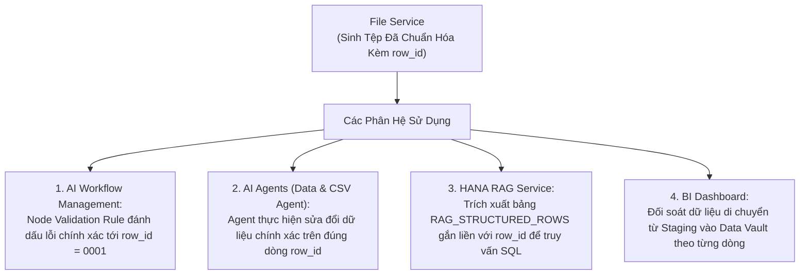

# 04. Chuẩn Hóa & Bổ Sung Cột Định Danh CSV (Row-ID Canonicalization)

> **Phân hệ:** File Service  
> **Chủ đề:** Tính năng tự động chuẩn hóa tệp bảng tính CSV, chèn cột định danh duy nhất `row_id`, và vai trò then chốt đối với toàn bộ hệ sinh thái SimpleMDG.

---

## 1. Vấn Đề Thiếu Khóa Định Danh Dòng Trong Di Chuyển Dữ Liệu

Trong các dự án chuyển đổi và di chuyển dữ liệu tổng thể (Data Migration & Master Data Governance):
- Các tệp CSV do khách hàng hoặc các chi nhánh gửi về thường **không có khóa chính duy nhất** cho từng dòng (hoặc khóa chính bị trùng lặp, bỏ trống).
- Khi hệ thống thực thi kiểm tra chất lượng (Data Validation Rules) và phát hiện ra 5 dòng bị sai định dạng mã số thuế:
  - Làm thế nào để AI Agent hoặc chuyên viên nghiệp vụ chỉ định chính xác dòng nào cần sửa đổi?
  - Nếu chỉ dựa vào số thứ tự dòng (Line Number), khi ai đó thêm hoặc bớt 1 dòng ở đầu tệp, toàn bộ số thứ tự của hàng vạn dòng phía sau sẽ bị lệch hoàn toàn!

---

## 2. Cơ Chế Bổ Sung Cột `row_id` Tự Động (Canonicalization)

Khi người dùng hoặc hệ thống tải lên một tệp CSV:
1. File Service đọc dòng tiêu đề (Header Row).
2. **Kiểm tra sự tồn tại của `row_id`:**
   - Nếu tệp đã có sẵn cột `row_id`: Giữ nguyên.
   - Nếu chưa có: Bộ chuẩn hóa **CSV Canonicalizer Engine** tự động chèn thêm cột `row_id` vào vị trí đầu tiên của bảng dữ liệu.
3. Mỗi dòng dữ liệu được gán một mã định danh bất biến (ví dụ UUID: `row_019dda5c-...`).
4. Hệ thống đếm chính xác tổng số dòng dữ liệu (`row_count`) và ghi nhận vào metadata.

```
Tệp CSV Gốc Của Người Dùng (raw_storage_key):
CustomerName,TaxCode,City
Cong Ty A,0101234567,Ha Noi
Cong Ty B,0309876543,Ho Chi Minh

                ▼ Chuẩn Hóa Tự Động (Canonicalization)

Tệp CSV Đã Xử Lý Được Lưu Vào Kho (processed_storage_key):
row_id,CustomerName,TaxCode,City
row_019dda5c-0001,Cong Ty A,0101234567,Ha Noi
row_019dda5c-0002,Cong Ty B,0309876543,Ho Chi Minh
```

---

## 3. Vai Trò Xương Sống Đối Với Các Phân Hệ Downstream

Cột `row_id` này đóng vai trò như "chứng minh nhân dân" cho từng dòng dữ liệu trong toàn bộ nền tảng:


