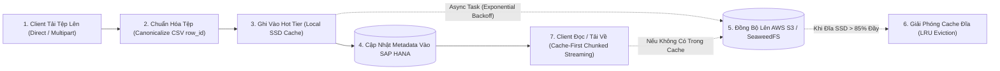

# Tài Liệu Thiết Kế Kiến Trúc: File Service

> **Nền tảng lưu trữ đối tượng phân tầng và quản lý phiên bản tệp doanh nghiệp**  
> *Được xây dựng trên Python, FastAPI, Clean Architecture 4 lớp, hỗ trợ AWS S3, SeaweedFS, SAP HANA Metadata và bộ đệm Hot Tier SSD siêu tốc.*

---

## 📚 Mục Lục Toàn Bộ Tài Liệu Chi Tiết

Tài liệu được phân tách thành 4 phân hệ chuyên sâu theo cấu trúc module hóa:

### 1. [Kiến Trúc Tổng Thể (Architecture)](./01-architecture/)
- [01. Tổng Quan & Các Khái Niệm Cốt Lõi](./01-architecture/01-overview-and-core-concepts.md): Mục đích kiến trúc, quản lý phiên bản (`file_id` vs `version_id`), mô hình lưu trữ Raw vs Processed, và kiểm soát xung đột lạc quan (OCC).
- [02. Topology Hệ Thống & Cổng Giao Tiếp](./01-architecture/02-system-topology.md): Bản đồ liên kết dịch vụ, các tầng lưu trữ Hot vs Cold, và giao tiếp giữa các vi dịch vụ trong hệ sinh thái.
- [03. Kiến Trúc Phân Tầng Clean Architecture](./01-architecture/03-clean-architecture-and-layers.md): Chi tiết 4 tầng Clean Architecture, các Interface cốt lõi và các Use Cases nghiệp vụ.

### 2. [Động Cơ Lưu Trữ Đối Tượng (Storage Engine)](./02-storage-engine/)
- [01. Bộ Lưu Trữ Phân Tầng (Tiered Storage Provider)](./02-storage-engine/01-tiered-storage-provider.md): Bộ điều phối lưu trữ phân tầng, cơ chế ghi đệm Write-Behind bất đồng bộ, và tự động thu hồi dung lượng đĩa (Disk Pressure Eviction).
- [02. Các Nhà Cung Cấp Lưu Trữ: S3 & SeaweedFS](./02-storage-engine/02-s3-and-seaweedfs-providers.md): Tích hợp AWS S3 / MinIO chuẩn hóa, hệ thống lưu trữ phân tán SeaweedFS, và cơ chế chuyển đổi linh hoạt.
- [03. Kho Siêu Dữ Liệu Tệp (Metadata Repositories)](./02-storage-engine/03-metadata-repositories.md): Quản lý trạng thái và phiên bản trên SAP HANA (`FILES`, `FILE_VERSIONS`, `MULTIPART_UPLOAD_SESSIONS`) và phòng chống SQL Injection.

### 3. [Vòng Đời Tệp & Giao Diện API (File Lifecycle & APIs)](./03-file-lifecycle-and-apis/)
- [01. Tải Lên Trực Tiếp & Quản Lý Phiên Bản](./03-file-lifecycle-and-apis/01-direct-and-versioned-uploads.md): API `POST /api/v1/upload`, tải lên phiên bản mới, và xử lý xung đột HTTP 409 Conflict.
- [02. Tải Lên Nhiều Phần Kèm Presigned URLs (Multipart Upload)](./03-file-lifecycle-and-apis/02-presigned-multipart-upload.md): Tải lên tệp dung lượng lớn (hàng GBs) qua Multipart Upload, ký trước URLs từng phần, và hợp nhất tự động.
- [03. Tải Xuống & Truyền Phát Dữ Liệu (Download & Streaming)](./03-file-lifecycle-and-apis/03-download-and-streaming.md): Các chế độ tải tệp (mới nhất, phiên bản lịch sử, tệp gốc raw), cơ chế Chunked Streaming tiết kiệm RAM, và Presigned GET URLs.
- [04. Chuẩn Hóa & Bổ Sung Cột Định Danh CSV (Row-ID Canonicalization)](./03-file-lifecycle-and-apis/04-csv-row-id-canonicalization.md): Tự động bổ sung cột định danh duy nhất `row_id` vào tệp CSV phục vụ đối soát, di chuyển dữ liệu, AI Agent và RAG.

### 4. [Hiệu Năng & Khả Năng Vận Hành (Performance & Observability)](./04-performance-and-observability/)
- [01. Động Cơ Giám Sát Hiệu Năng (Performance Monitoring)](./04-performance-and-observability/01-performance-monitoring-engine.md): Đo lường chi tiết Execution Time, Memory Peak, CPU, nhật ký xoay vòng hàng ngày Daily JSONL và các API thống kê.
- [02. Tính Bền Bỉ & Khả Năng Chống Chịu Lỗi](./04-performance-and-observability/02-resilience-and-disk-pressure.md): Cơ chế thử lại Exponential Backoff khi đồng bộ tệp lên S3, và chu trình tắt dịch vụ an toàn (Graceful Drain & Shutdown).

---

## 🚀 Sơ Đồ Quy Trình Quản Lý Vòng Đời Tệp

