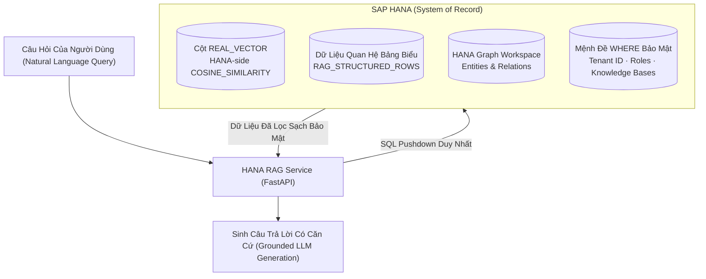

# 01. Tổng Quan & Cốt Lõi SAP HANA (Overview & HANA-First Core)

> **Phân hệ:** HANA RAG Service  
> **Chủ đề:** Mục đích kiến trúc, triết lý SAP HANA as System of Record, cột `REAL_VECTOR` và mô hình Dual Workloads.

---

## 1. Bối Cảnh & Động Lực (Context & Motivation)

Trong các giải pháp RAG (Retrieval-Augmented Generation) thông thường trên thị trường:
- Doanh nghiệp thường phải trích xuất dữ liệu từ hệ thống ERP/CSDL chính, đẩy sang một CSDL vector độc lập (như Pinecone, Milvus, Qdrant, Chroma).
- **Hệ quả tiêu cực:** 
  1. *Phân mảnh dữ liệu (Data Sprawl):* Dữ liệu nhạy cảm bị nhân bản sang nhiều nơi, khó quản lý vòng đời và kiểm toán (Audit Trail).
  2. *Lệch pha bảo mật:* Cơ chế phân quyền nghiêm ngặt của SAP (Role-Based Access Control - RBAC, Tenant Isolation) bị mất khi dữ liệu sang CSDL vector ngoài.
  3. *Không kết hợp được dữ liệu quan hệ:* Khi câu hỏi đòi hỏi vừa tính toán số liệu (ví dụ: *"Tổng chi phí mua sắm quý 3 của nhà cung cấp X là bao nhiêu?"*) vừa tìm kiếm nội dung hợp đồng, các CSDL vector thuần túy hoàn toàn thất bại.

---

## 2. Triết Lý Thiết Kế: SAP HANA As System Of Record

**HANA RAG Service** giải quyết triệt để bài toán trên bằng cách biến **SAP HANA** thành kho lưu trữ duy nhất và tối cao (Single System of Record) cho toàn bộ chu trình RAG:
- Lưu trữ tài liệu gốc, cấu trúc Knowledge Bases, lịch sử Ingestion Jobs.
- Lưu trữ các Semantic Chunks và vector nhúng trong cột chuyên dụng **`REAL_VECTOR`**.
- Lưu trữ dữ liệu bảng tính có cấu trúc (CSV, XLSX) thành các dòng dữ liệu quan hệ chuẩn (`RAG_STRUCTURED_ROWS`).
- Lưu trữ đồ thị thực thể tri thức trong **HANA Graph Workspace** (`RAG_GRAPH_WORKSPACE`).
- Đẩy toàn bộ phép toán so khớp vector `COSINE_SIMILARITY` trực tiếp xuống tầng Database Engine của SAP HANA.



---

## 3. Lợi Thế Của `REAL_VECTOR` & SQL Pushdown

1. **Bảo Mật Tức Thì Ngay Tại Tầng Lưu Trữ (Zero Data Leakage):**
   - Bộ lọc Tenant ID, vai trò người dùng (Roles), và danh sách Knowledge Bases được nhúng trực tiếp thành các điều kiện `WHERE` trong câu truy vấn SQL cùng với phép so sánh cosine:
   ```sql
   SELECT TOP 5 CHUNK_ID, CONTENT, COSINE_SIMILARITY(EMBEDDING, :query_vector) AS SCORE
   FROM RAG_CHUNKS
   WHERE TENANT_ID = :tenant_id
     AND KNOWLEDGE_BASE_ID IN (:allowed_kb_ids)
     AND ROLE_LEVEL <= :user_role_level
   ORDER BY SCORE DESC;
   ```
2. **Loại Bỏ Độ Trễ Mạng (Zero Network Hop for Filtering):**
   - Thay vì kéo hàng ngàn vector về RAM của ứng dụng rồi mới lọc quyền, HANA thực hiện lọc và xếp hạng vector ngay tại bộ nhớ trong (In-memory computing) của DB.

---

## 4. Kiến Trúc Hai Chế Độ Tải (Dual Workloads: API vs WORKER)

Dịch vụ được thiết kế để triển khai thành **2 loại container độc lập** từ cùng một image mã nguồn:

| Chế Độ (`APP_MODE`) | Trách Nhiệm & Vai Trò | Môi Trường Mạng |
|---|---|---|
| **`APP_MODE=API`** | - Tiếp nhận các request tìm kiếm và hỏi đáp qua RESTful API / SSE Stream.<br/>- Đảm bảo độ trễ thấp (< 500ms cho bước retrieval).<br/>- Cung cấp giao diện Console quản trị trực quan tại `/demo`. | Cổng HTTP mở cho Client / Gateway nội bộ. |
| **`APP_MODE=WORKER`** | - Chạy tiến trình ngầm chuyên xử lý Ingestion Jobs.<br/>- Đọc tệp, gọi OCR Docling cho file PDF scan, bóc tách bảng tính Excel/CSV lớn.<br/>- Sinh vector embedding theo lô (batch) và ghi dữ liệu hàng loạt vào SAP HANA. | Không mở cổng web công khai, tự động kéo job từ bảng `RAG_INGESTION_JOBS`. |

Việc tách biệt này đảm bảo khi có người dùng tải lên tài liệu PDF 500 trang để nhúng, tiến trình Worker có thể chiếm dụng 100% CPU/RAM để OCR và embed mà **không làm chậm trễ** bất kỳ câu hỏi tra cứu nào của người dùng trên tiến trình API.
