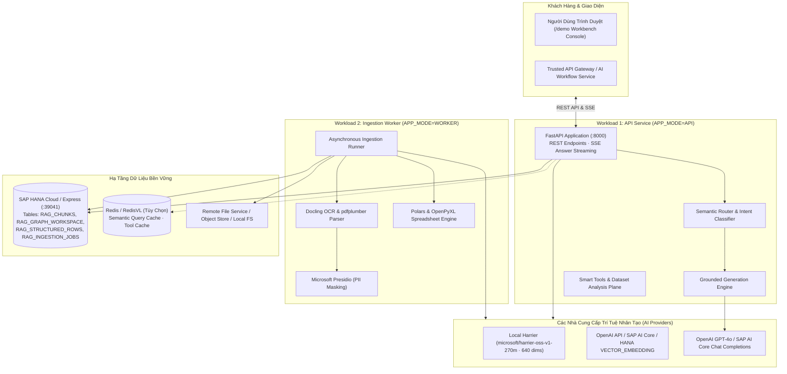

# 02. Topology Hệ Thống & Cổng Giao Tiếp (System Topology)

> **Phân hệ:** HANA RAG Service  
> **Chủ đề:** Bản đồ liên kết dịch vụ, các công nghệ nhúng, nhà cung cấp LLM, và hạ tầng lưu trữ.

---

## 1. Sơ Đồ Topology Mạng Toàn Diện

---

## 2. Bảng Lựa Chọn Nhà Cung Cấp Embeddings (Duy Nhất Một Provider Hoạt Động)

Hệ thống tuân thủ nguyên tắc: **Chỉ có đúng một nhà cung cấp Embedding được cấu hình tại một thời điểm** cho toàn bộ các khâu Ingestion, Retrieval, Smart Tools và Dataset Analysis:

| Nhà Cung Cấp Embedding | Model Mặc Định | Số Chiều (Dimensions) | Đặc Điểm Vận Hành |
|---|---|---|---|
| **Local HuggingFace (Mặc định)** | `microsoft/harrier-oss-v1-270m` | `640` | Chạy trực tiếp trên CPU/GPU của container bằng thư viện `sentence-transformers`. Không tốn chi phí API, dữ liệu không rời khỏi hạ tầng nội bộ. |
| **OpenAI Hosted** | `text-embedding-3-small` / `large` | `1536` hoặc `3072` | Độ chính xác ngữ nghĩa cao, gọi qua kết nối HTTPS ra ngoài. |
| **SAP AI Core** | Nhúng qua SAP AI Launchpad | Tùy model cấu hình | Tuân thủ chính sách bảo mật nội bộ của hệ sinh thái đám mây SAP BTP. |
| **HANA Native AI** | `VECTOR_EMBEDDING()` | Tùy model HANA | Tính toán trực tiếp bên trong tiến trình của SAP HANA. |

---

## 3. Các Thư Viện Xử Lý Chuyên Sâu Tích Hợp

- **`spaCy` (`en_core_web_lg`):** Trích xuất thực thể có tên (NER), phân tích cú pháp phụ thuộc (Dependency Parsing) phục vụ cho **GraphRAG-lite** và làm bộ phân loại thực thể cho PII Masking.
- **`pdfplumber` & Docling:** Phân tích tài liệu PDF phức tạp; tự động nhận diện tài liệu dạng ảnh quét (scanned documents) để kích hoạt Docling OCR.
- **`bm25s`:** Thuật toán BM25 viết bằng Python/Rust siêu nhanh, dùng để xếp hạng lại (Rerank) từ khóa chính xác trên tập ứng viên vector.
- **`Microsoft Presidio`:** Bộ lọc nhận diện và che giấu thông tin định danh cá nhân nhạy cảm (Tên, Số điện thoại, Email, Số thẻ, Địa chỉ) TRƯỚC KHI tạo vector hoặc lưu vào DB.
- **`Polars` & `OpenPyXL` & `Calamine`:** Xử lý và đọc streaming bảng tính Excel/CSV tốc độ cao với mức tiêu thụ RAM tối thiểu.
