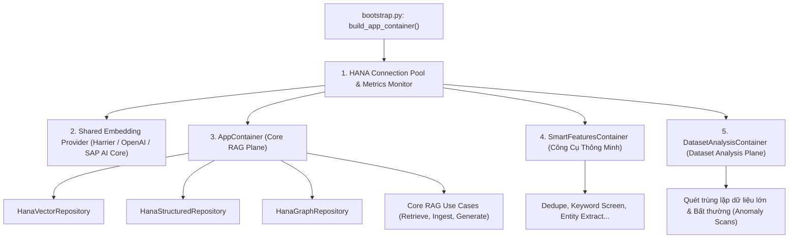

# 03. Kiến Trúc Clean Architecture & Composition Containers

> **Phân hệ:** HANA RAG Service  
> **Chủ đề:** 4 tầng Clean Architecture, cấu trúc Container DI trong `bootstrap.py`, và cơ chế lắp ráp hạ tầng.

---

## 1. Mô Hình Clean Architecture 4 Lớp Trong HANA RAG

Hệ thống được tổ chức phân tầng chặt chẽ tại thư mục `app/`:

```
app/
├── layer1_domain/       # Pure Entities, Value Objects, Domain Exceptions, Interfaces
├── layer2_application/  # Use Cases, RAG Orchestration, Tool Executors, Rerankers
├── layer3_adapters/     # REST Controllers, DTOs, Response Serializers
└── layer4_frameworks/   # HANA Repositories, Embedding Providers, Redis, Docling OCR
```

### 1.1. Layer 1: Domain Core (`layer1_domain/`)
- **Entities:**
  - `Document`: Siêu dữ liệu tài liệu gốc (ID, Name, Hash, ContentType, KnowledgeBaseIDs).
  - `Chunk`: Phân đoạn ngữ nghĩa mang vector embedding, parent context ID, vị trí trang.
  - `StructuredRow`: Dòng dữ liệu quan hệ trích xuất từ bảng tính CSV/XLSX.
  - `GraphEntity` & `GraphRelation`: Các đỉnh và cạnh cho mạng lưới tri thức đồ thị.
  - `IngestionJob`: Trạng thái tiến trình nạp tài liệu (PENDING, PROCESSING, COMPLETED, FAILED).
- **Value Objects:**
  - `RetrievalRoute`: Quyết định luồng đi (`HYBRID_VECTOR` vs `STRUCTURED_SQL`).
  - `SearchFilters`: Bộ lọc an toàn (Tenant ID, Knowledge Base IDs, User Roles).

---

### 1.2. Layer 2: Application Core (`layer2_application/`)
- Chứa toàn bộ các Use Case nghiệp vụ chính:
  - **Nhóm Retrieval:** `RetrieveChunksUseCase`, `HybridRerankUseCase`, `GraphRAGQueryUseCase`, `StructuredSQLPushdownUseCase`.
  - **Nhóm Ingestion:** `IngestDocumentUseCase`, `ParseFileUseCase`, `ChunkDocumentUseCase`, `MaskPIIUseCase`.
  - **Nhóm Generation:** `GenerateAnswerUseCase`, `VerifyClaimsUseCase`, `StreamAnswerSSEUseCase`.
  - **Nhóm Smart Tools:** `MatchDedupeUseCase`, `KeywordScreenUseCase`, `ExtractEntitiesUseCase`.

---

### 1.3. Layer 3: Interface Adapters (`layer3_adapters/`)
- Cung cấp các FastAPI Router tiếp nhận HTTP request:
  - `/api/v1/ingestions`: Đăng ký tài liệu, tải lên tệp, theo dõi tiến độ SSE.
  - `/api/v1/retrieval`: Tra cứu ngữ nghĩa, tìm kiếm tương đồng vector, truy vấn bảng biểu.
  - `/api/v1/generation`: Sinh câu trả lời có căn cứ trích dẫn nguồn (Grounded answers).
  - `/api/v1/tools`: Kích hoạt các công cụ phân tích thông minh (Smart Tools).

---

### 1.4. Layer 4: Frameworks & Drivers (`layer4_frameworks/`)
- Hiện thực hóa các giao tiếp kỹ thuật cụ thể:
  - `HanaConnectionPool`: Quản lý kết nối tới SAP HANA.
  - `HanaVectorRepository`: Thực thi câu lệnh SQL với hàm `COSINE_SIMILARITY`.
  - `HanaGraphRepository`: Quản lý và truy vấn `RAG_GRAPH_WORKSPACE`.
  - `HarrierEmbeddingService` / `OpenAIEmbeddingService`: Tính toán vector embedding.
  - `PresidioPIIService`: Che giấu dữ liệu nhạy cảm.

---

## 2. Điểm Khởi Tạo Tập Trung: Composition Root (`bootstrap.py`)

Tệp [`bootstrap.py`](file:///C:/Users/Public/Documents/Project/github-proj/solace-root/data-migration/apps/backend/hana-rag-service/bootstrap.py) đóng vai trò là Composition Root duy nhất khởi tạo và kết nối toàn bộ hệ thống qua các Container DI lồng nhau:



### Ưu Điểm Của Thiết Kế Container Lồng Nhau:
- **Tái Sử Dụng Connection Pool:** Cả 3 phân hệ (Core RAG, Smart Tools, Dataset Analysis) cùng chia sẻ một connection pool tối ưu tới SAP HANA, không gây cạn kiệt số lượng kết nối tối đa của DB.
- **Duy Nhất Một Bộ Nhúng:** Đảm bảo cùng một mô hình và số chiều vector embedding được áp dụng thống nhất từ lúc nạp tài liệu cho đến khi tra cứu, tránh lỗi lệch vector space.
- **Bật Tắt Tính Năng Theo Cấu Hình (Feature Toggling):** Các phân hệ như `SmartFeatures` hay `DatasetAnalysis` có thể được bật/tắt độc lập thông qua biến môi trường mà không ảnh hưởng tới phân hệ Core RAG.
