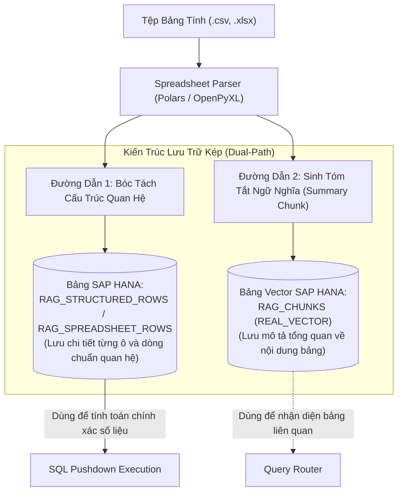

# 02. Xử Lý Bảng Tính & Dữ Liệu Có Cấu Trúc (Spreadsheets & Structured Rows)

> **Phân hệ:** HANA RAG Service  
> **Chủ đề:** Bứt phá khỏi giới hạn RAG truyền thống — Quản lý bảng tính CSV/XLSX bằng dữ liệu quan hệ và SQL Pushdown.

---

## 1. Hạn Chế Nghiêm Trọng Của RAG Truyền Thống Với Bảng Biểu

Trong các hệ thống RAG thông thường:
- Khi gặp một file Excel hoặc CSV có 50,000 dòng, hệ thống thường làm phẳng (flatten) từng dòng hoặc từng cụm dòng thành các đoạn văn bản:
  ```text
  "Dòng 1: Mã vật tư là M001, Giá là 50 USD, Số lượng tồn là 120 chiếc..."
  "Dòng 2: Mã vật tư là M002, Giá là 80 USD, Số lượng tồn là 15 chiếc..."
  ```
- Sau đó cắt nhỏ thành các Text Chunks và nhồi vào CSDL Vector.

### Hậu quả tai hại:
1. **Ảo giác số liệu (Hallucination on Numbers):** Khi người dùng hỏi: *"Tổng giá trị tồn kho của các mặt hàng loại A là bao nhiêu?"*, vector search chỉ bốc được ngẫu nhiên 5–10 chunk liên quan nhất. LLM phải tự tính toán trên dữ liệu thiếu hụt ➔ Câu trả lời hoàn toàn sai lệch.
2. **Không hỗ trợ toán tử tập hợp:** Không thể thực hiện các phép toán cơ bản như `SUM`, `AVG`, `COUNT DISTINCT`, `MAX`, `MIN`, hoặc lọc điều kiện chính xác (`WHERE Price > 100`).

---

## 2. Giải Pháp Đột Phá Của HANA RAG Service

Hệ thống áp dụng kiến trúc **Dual-Path Storage** (Lưu trữ kép) cho bảng tính và dữ liệu có cấu trúc:



---

## 3. Các Tính Năng Xử Lý Bảng Tính Nâng Cao

1. **Xử Lý Tiêu Đề Đa Tầng (Multi-Level Headers):**
   - Hỗ trợ các file Excel phức tạp có tiêu đề gộp ô (Merge Cells, ví dụ tầng 1: "Doanh Thu 2026", tầng 2: "Q1", "Q2", "Q3").
   - Parser tự động ghép nối thành tên cột chuẩn: `Doanh Thu 2026_Q1`.
2. **Loại Bỏ Vùng Rác & Sheet Ẩn:**
   - Tự động nhận diện và bỏ qua các sheet bị ẩn (Hidden Sheets), các dòng/cột bị bôi đen hoặc các ô chú thích không chứa dữ liệu.
3. **Đại Diện Kết Quả Zero-Count Hợp Lệ:**
   - Khi truy vấn: *"Có bao nhiêu hóa đơn quá hạn trên 90 ngày của nhà cung cấp XYZ?"*, nếu kết quả đếm là `0`, hệ thống coi đó là một câu trả lời chính xác có căn cứ, chứ không kết luận sai là "Không tìm thấy thông tin trong tài liệu".
