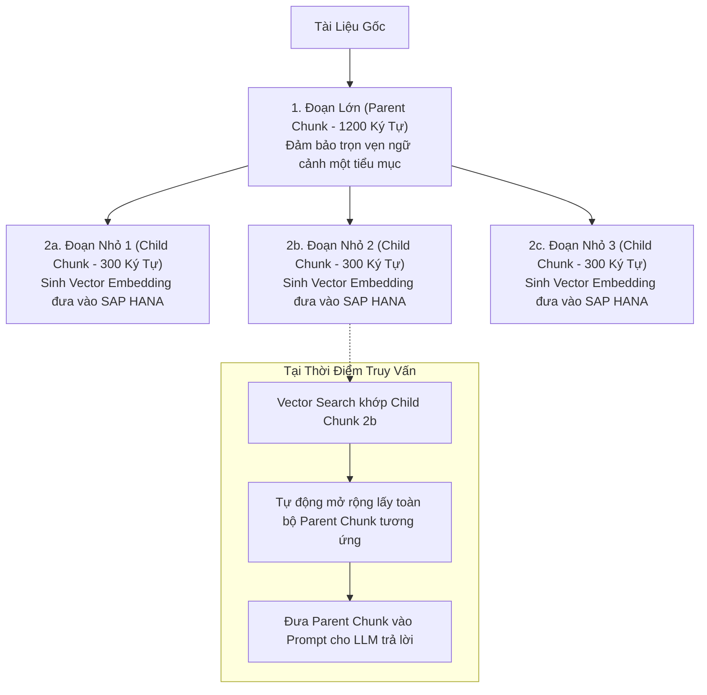

# 03. Phân Đoạn Ngữ Nghĩa, Che Giấu PII & Xử Lý Tệp Lớn

> **Phân hệ:** HANA RAG Service  
> **Chủ đề:** Kỹ thuật Parent-Child Chunking, bảo mật PII tại chỗ với Microsoft Presidio, và cơ chế Streaming tệp dung lượng lớn.

---

## 1. Kỹ Thuật Phân Đoạn Ngữ Nghĩa: Parent-Child Chunking

Một bài toán nan giải trong RAG là sự đánh đổi về kích thước phân đoạn (Chunk Size):
- **Nếu Chunk quá nhỏ (100–200 ký tự):** Vector search tìm kiếm rất chính xác, nhưng khi đưa vào cho LLM thì bị thiếu ngữ cảnh xung quanh, khiến LLM không hiểu trọn vẹn ý nghĩa.
- **Nếu Chunk quá lớn (1500–2000 ký tự):** Đủ ngữ cảnh cho LLM, nhưng vector embedding bị loãng (diluted), làm giảm độ chính xác của phép so khớp Cosine Similarity.

### Giải Pháp: Parent-Child Context Linking
Hệ thống tạo ra một cấu trúc phân cấp gồm 2 lớp phân đoạn:



---

## 2. Bảo Mật Dữ Liệu: Che Giấu PII Tại Chỗ (In-Flight PII Masking)

Doanh nghiệp chịu ràng buộc pháp lý khắt khe về bảo vệ dữ liệu cá nhân (GDPR, Nghị định 13/2023/NĐ-CP). Dữ liệu nhạy cảm một khi đã bị biến thành vector embedding và lưu vào CSDL thì rất khó thu hồi hoặc xóa chọn lọc.

Hệ thống tích hợp **Microsoft Presidio** kết hợp mô hình ngôn ngữ `spaCy`:
- **Nguyên tắc "Pre-Embed Masking":** Việc nhận diện và che giấu PII diễn ra **TRƯỚC KHI** chuỗi văn bản được gửi sang bộ sinh embedding và **TRƯỚC KHI** ghi vào SAP HANA.

```
Văn bản gốc: "Giám đốc Nguyễn Văn A, CCCD số 012345678912, email a.nguyen@example.com ký duyệt."
       │
       ▼ (Qua Presidio Anonymizer)
Văn bản an toàn: "Giám đốc [PERSON], CCCD số [NATIONAL_ID], email [EMAIL] ký duyệt."
       │
       ▼ (Gửi sang Harrier / OpenAI để sinh Vector và lưu DB)
```

- **Các thực thể được bảo vệ tự động:** Họ và tên (`PERSON`), Số CMND/CCCD/Hộ chiếu, Số thẻ tín dụng (`CREDIT_CARD`), Địa chỉ IP, Số điện thoại (`PHONE_NUMBER`), Địa chỉ Email.

---

## 3. Xử Lý Tệp Dung Lượng Lớn (Massive-File Streaming)

Khi người dùng nạp một tài liệu kỹ thuật 500 trang hoặc bảng dữ liệu CSV 100MB:
- Hệ thống không bao giờ đọc toàn bộ tệp vào RAM cùng một lúc (tránh lỗi Out-Of-Memory).
- Thay vào đó, bộ nạp sử dụng **Streaming Ingestion Pipeline**:
  - Đọc dữ liệu theo từng khối (Chunks of bytes/pages).
  - Phân đoạn và tạo vector theo từng lô nhỏ (Mini-batches, ví dụ 32 chunks/lần).
  - Sử dụng câu lệnh `INSERT ... VALUES` hàng loạt tối ưu hóa của `hdbcli` để ghi thẳng vào SAP HANA.
  - Cập nhật tiến độ phần trăm sau mỗi lô được nạp thành công.
