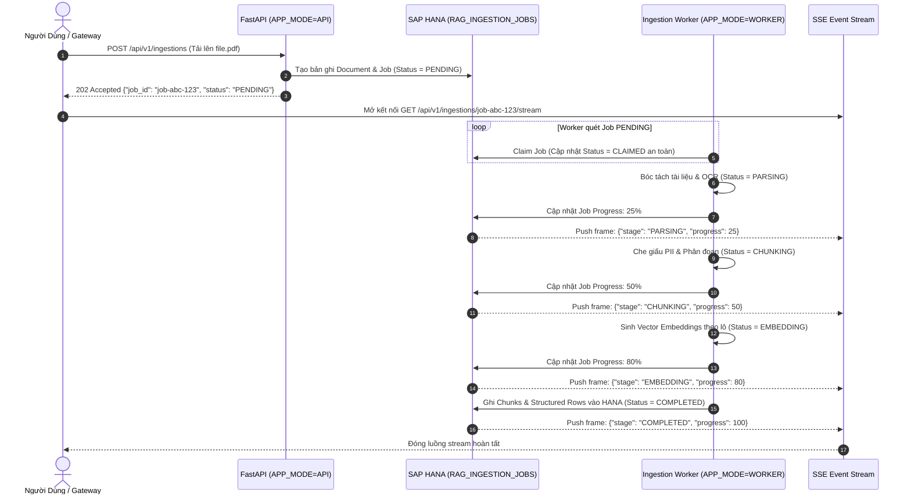

# 04. Vòng Đời Tác Vụ Nạp Liệu & SSE Streaming (Job Lifecycle)

> **Phân hệ:** HANA RAG Service  
> **Chủ đề:** Quy trình nạp liệu bất đồng bộ qua Ingestion Worker, bảng `RAG_INGESTION_JOBS`, và luồng sự kiện SSE Status Streaming.

---

## 1. Kiến Trúc Xử Lý Nạp Liệu Bất Đồng Bộ (Async Job Engine)

Việc nạp một tài liệu lớn bao gồm nhiều công đoạn tốn thời gian: tải tệp, quét virus, OCR, che giấu PII, phân đoạn, gọi mô hình sinh embedding và ghi vào CSDL. Nếu thực hiện đồng bộ trong một HTTP request thông thường:
- Request sẽ bị timeout bởi Gateway hoặc Load Balancer (thường giới hạn 30–60 giây).
- Làm tắc nghẽn tài nguyên của tiến trình Web API.

Do đó, hệ thống áp dụng cơ chế **Asynchronous Worker-Driven Ingestion**:



---

## 2. Các Trạng Thái Của Ingestion Job

| Trạng Thái | Ý Nghĩa Thực Thi |
|---|---|
| `PENDING` | Yêu cầu đã được ghi nhận vào CSDL, đang nằm trong hàng đợi chờ Worker nhận. |
| `CLAIMED` | Một Worker đã nhận việc (sử dụng cơ chế khóa phân tán hoặc update có điều kiện để chống tranh chấp). |
| `PARSING` | Đang đọc tệp, trích xuất text hoặc kích hoạt Docling OCR. |
| `CHUNKING` | Đang phân đoạn thành các Parent-Child chunks và che giấu thông tin PII. |
| `EMBEDDING`| Đang tính toán vector nhúng với mô hình Harrier hoặc OpenAI. |
| `INDEXING` | Đang ghi dữ liệu hàng loạt vào bảng `RAG_CHUNKS` và cập nhật `RAG_GRAPH_WORKSPACE`. |
| `COMPLETED`| Nạp liệu thành công 100%, tài liệu đã sẵn sàng để truy vấn. |
| `FAILED` | Gặp sự cố không thể phục hồi (file hỏng, lỗi mạng); ghi nhận chi tiết lỗi vào cột `ERROR_MESSAGE`. |

---

## 3. Luồng Theo Dõi Thời Gian Thực: Server-Sent Events (SSE)

Thay vì bắt trình duyệt phải liên tục gửi request thăm dò (Short-polling) gây lãng phí băng thông:
- Client mở một kết nối **Server-Sent Events (SSE)** duy nhất tới endpoint:
  ```http
  GET /api/v1/ingestions/{job_id}/stream
  ```
- Máy chủ sẽ liên tục đẩy các bản tin JSON qua kết nối này mỗi khi trạng thái hoặc tỷ lệ phần trăm tiến độ thay đổi:
  ```json
  event: progress
  data: {"job_id": "job-abc-123", "stage": "EMBEDDING", "progress_pct": 75.0, "message": "Đang nhúng lô 3/4..."}
  ```
- Giao diện người dùng lập tức cập nhật thanh trạng thái (Progress Bar) mượt mà và trực quan.
