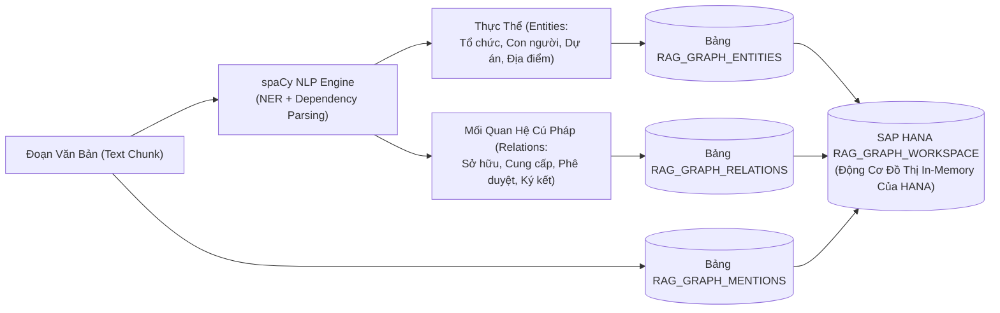

# 03. Đồ Thị Tri Thức Nhẹ: GraphRAG-lite (HANA Graph Workspace)

> **Phân hệ:** HANA RAG Service  
> **Chủ đề:** Tích hợp GraphRAG không tốn chi phí LLM bằng `spaCy`, và cấu trúc đồ thị `RAG_GRAPH_WORKSPACE` trong SAP HANA.

---

## 1. Thách Thức Của GraphRAG Truyền Thống

GraphRAG (Retrieval-Augmented Generation dựa trên Đồ Thị Tri Thức) là bước tiến lớn giúp AI hiểu được các mối quan hệ đa bậc giữa các thực thể (ví dụ: *Công ty A sở hữu Công ty B, Công ty B cung cấp linh kiện cho Dự án C ➔ Hỏi: Công ty A có liên hệ gì với Dự án C?*).

Tuy nhiên, các triển khai GraphRAG thông thường (như Microsoft GraphRAG) có nhược điểm chí mạng:
- Phải gọi LLM đắt tiền (GPT-4o) để đọc từng câu trong tài liệu và sinh bộ ba thực thể: `(Chủ thể - Mối quan hệ - Khách thể)`.
- **Hệ quả:** Chi phí API tăng vọt gấp 30–50 lần và thời gian nạp tài liệu bị kéo dài từ vài phút lên vài tiếng đồng hồ.

---

## 2. Giải Pháp Sáng Tạo: GraphRAG-lite

HANA RAG Service triển khai mô hình **GraphRAG-lite**:
- **Trích xuất cục bộ bằng NLP (Local Dependency Parsing):** Sử dụng thư viện mã nguồn mở `spaCy (en_core_web_lg)` chạy trên CPU cục bộ để phân tích cú pháp phụ thuộc và bóc tách thực thể có tên (NER).
- **Chi phí LLM bằng 0:** Hoàn toàn không tốn bất kỳ một token API nào cho bước bóc tách đồ thị.
- **Tốc độ cực cao:** Xử lý hàng trăm trang tài liệu trong vài giây.



---

## 3. Duyệt Đồ Thị 1-Hop / 2-Hop Trong SAP HANA

HANA hỗ trợ sẵn tính năng **SAP HANA Graph Engine** tích hợp trong nhân:
1. Khi có câu hỏi liên quan đến một thực thể (ví dụ: *"Nhà cung cấp AcroCorp"*):
   - Hệ thống tìm kiếm đỉnh gốc `AcroCorp` trong bảng `RAG_GRAPH_ENTITIES`.
2. Truy vấn đồ thị 1-hop hoặc 2-hop để tìm toàn bộ các thực thể liên quan và các tài liệu chứa mối quan hệ đó:
   ```sql
   -- Duyệt đồ thị cấu trúc tức thì trong HANA Graph Workspace
   SELECT TARGET_ENTITY, RELATION_TYPE, CHUNK_ID
   FROM "RAG_GRAPH_WORKSPACE"
   WHERE SOURCE_ENTITY = 'AcroCorp';
   ```
3. Kết quả đồ thị được đưa vào làm một nguồn bằng chứng độc lập, hòa trộn cùng kết quả Vector Search qua RRF.
