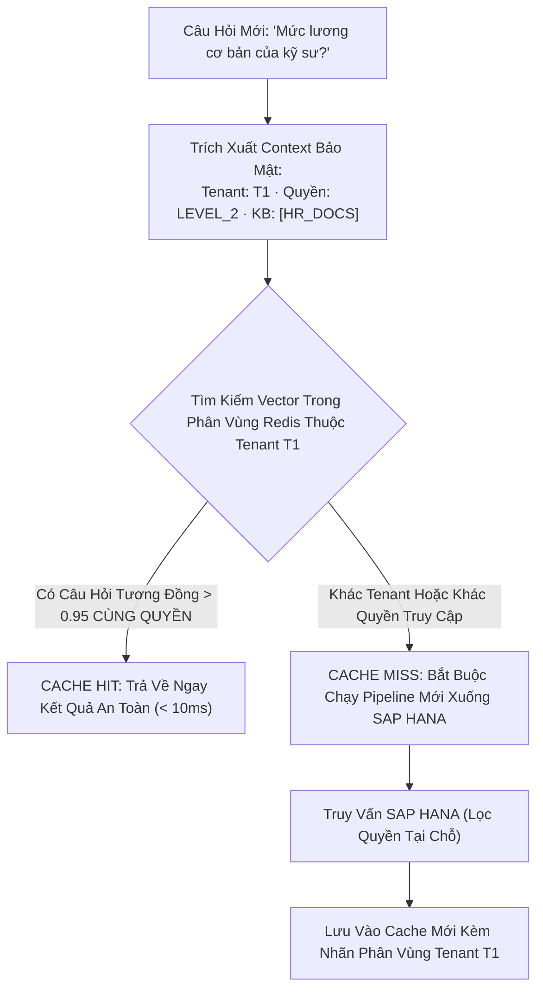

# 04. Bộ Nhớ Đệm Ngữ Nghĩa & Chống Rò Rỉ Tenant (Semantic Caching)

> **Phân hệ:** HANA RAG Service  
> **Chủ đề:** Tăng tốc truy vấn với Redis Semantic Cache, và nguyên tắc bảo mật tuyệt đối chống rò rỉ dữ liệu đa người thuê (No Tenant Bleed).

---

## 1. Cơ Chế Bộ Nhớ Đệm Ngữ Nghĩa (Semantic Caching)

Trong môi trường doanh nghiệp, có rất nhiều câu hỏi lặp lại với các cách diễn đạt tương đồng:
- Người dùng 1: *"Quy định thanh toán công tác phí năm 2026 như thế nào?"*
- Người dùng 2: *"Chính sách thanh toán chi phí đi công tác năm 2026?"*

Nếu sử dụng cache từ khóa thông thường (Exact Key-Value Cache), hai câu trên sẽ bị coi là khác nhau và hệ thống phải lặp lại toàn bộ quy trình tìm kiếm và gọi LLM tốn kém.

Hệ thống tích hợp **Redis / RedisVL Semantic Cache**:
- Tính toán vector embedding của câu hỏi mới.
- So khớp với các vector câu hỏi đã được cache trong Redis.
- Nếu khoảng cách tương đồng Cosine vượt ngưỡng an toàn (ví dụ: $\text{similarity} \ge 0.95$), hệ thống lập tức trả về kết quả đã lưu trong bộ đệm trong thời gian dưới **10 mili-giây** và tiết kiệm 100% chi phí gọi LLM.

---

## 2. Nguyên Tắc Sống Còn: Chống Rò Rỉ Đa Người Thuê (No Tenant Bleed)

Trong hệ thống đa khách hàng (Multi-tenancy), rủi ro lớn nhất của Semantic Cache là: Người dùng của Công ty A đặt câu hỏi và nhận được câu trả lời trích xuất từ tài liệu mật của Công ty B!

Để ngăn chặn tuyệt đối hiện tượng này, cấu trúc khóa định danh của Cache Entry được mã hóa nghiêm ngặt:

```text
CACHE_KEY = SHA256(
    tenant_id          + ":" +
    sorted(kb_ids)     + ":" +
    user_role_level    + ":" +
    query_vector_hash  + ":" +
    flags_state
)
```



### Quy Tắc Kiểm Soát Nghiêm Ngặt:
- **Tenant Isolation:** Cache của Tenant này hoàn toàn tàng hình đối với Tenant khác.
- **RBAC Role Gating:** Một nhân viên bình thường (Role: `STAFF`) không bao giờ được phép trúng (HIT) vào kết quả cache do một Giám đốc (Role: `DIRECTOR`) tạo ra, kể cả khi họ gõ câu hỏi giống hệt nhau.
- **AUTHORITATIVE FALLBACK:** Redis chỉ đóng vai trò bộ đệm tạm thời; SAP HANA luôn là nguồn dữ liệu chân lý duy nhất (System of Record).
