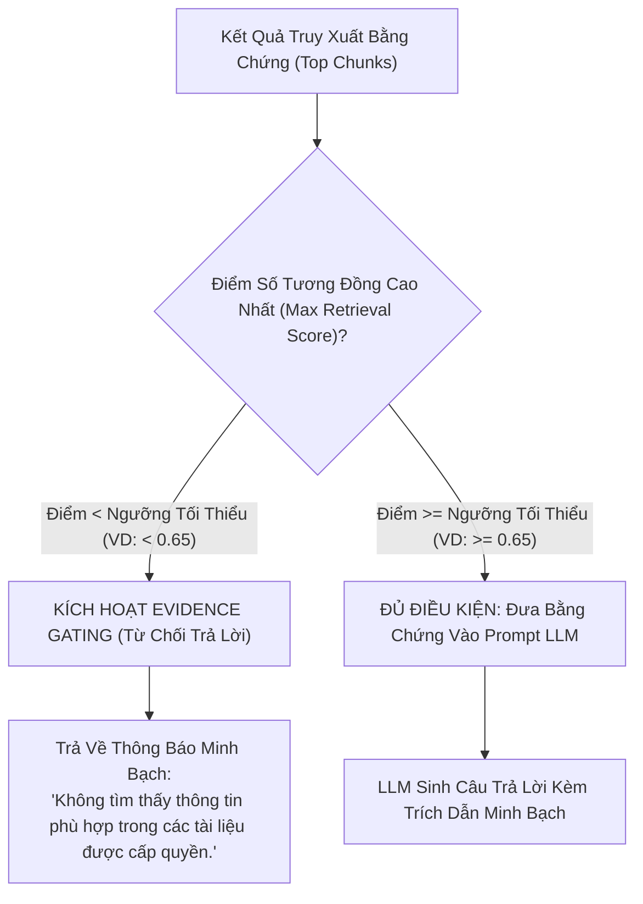

# 01. Kiểm Soát Bằng Chứng & Trích Dẫn Nguồn (Evidence Gating)

> **Phân hệ:** HANA RAG Service  
> **Chủ đề:** Cơ chế chặn ảo giác bằng Low-Score Gating, và chuẩn hóa trích dẫn nguồn (Citations).

---

## 1. Cơ Chế Chặn Ảo Giác Bằng Ngưỡng Điểm: Low-Score Gating

Một trong những vấn đề nghiêm trọng nhất của các hệ thống AI trong môi trường doanh nghiệp là **Ảo giác (Hallucination)** — khi tài liệu nội bộ hoàn toàn không có thông tin nhưng LLM vẫn tự ý "sáng tạo" ra một câu trả lời nghe có vẻ thuyết phục.

Hệ thống áp dụng cơ chế kiểm soát nghiêm ngặt **Low-Score Evidence Gating**:



### Lợi Ích Doanh Nghiệp:
- Bảo vệ doanh nghiệp khỏi các rủi ro pháp lý và sai phạm quy trình do làm theo hướng dẫn "bịa" của mô hình AI.
- Xây dựng niềm tin vững chắc cho người dùng: Khi AI trả lời thì chắc chắn có căn cứ trong tài liệu nội bộ; khi không có thì thông báo rõ ràng.

---

## 2. Hệ Thống Trích Dẫn Nguồn Minh Bạch (Citations & Source Guides)

Mọi câu trả lời sinh ra từ HANA RAG Service đều đi kèm danh mục tài liệu tham chiếu chi tiết:

```json
{
  "answer": "Quy trình thanh toán công tác phí yêu cầu nộp hóa đơn VAT trong vòng 7 ngày làm việc [1]. Chi phí ăn uống tối đa là 500,000 VND/ngày [2].",
  "citations": [
    {
      "index": 1,
      "document_id": "doc-policy-2026",
      "document_name": "Chinh_sach_cong_tac_phi_2026.pdf",
      "page_number": 14,
      "chunk_id": "chk-9912",
      "quote": "Cán bộ công nhân viên có trách nhiệm nộp đầy đủ hóa đơn tài chính hợp lệ trong thời hạn 07 ngày làm việc kể từ ngày kết thúc chuyến công tác."
    },
    {
      "index": 2,
      "document_id": "doc-policy-2026",
      "document_name": "Chinh_sach_cong_tac_phi_2026.pdf",
      "page_number": 15,
      "chunk_id": "chk-9915",
      "quote": "Định mức phụ cấp lưu trú và tiền ăn áp dụng mức tối đa không quá 500,000 đồng/người/ngày."
    }
  ],
  "confidence_score": 0.92,
  "limitations": "Chính sách này không áp dụng cho các chuyến công tác tại thị trường nước ngoài."
}
```

- **Tính Năng Chống Chối Bỏ:** Người dùng có thể bấm trực tiếp vào ký hiệu `[1]`, `[2]` trên giao diện để mở ngay trang tài liệu PDF gốc và xem đoạn văn bản tương ứng được bôi vàng.
