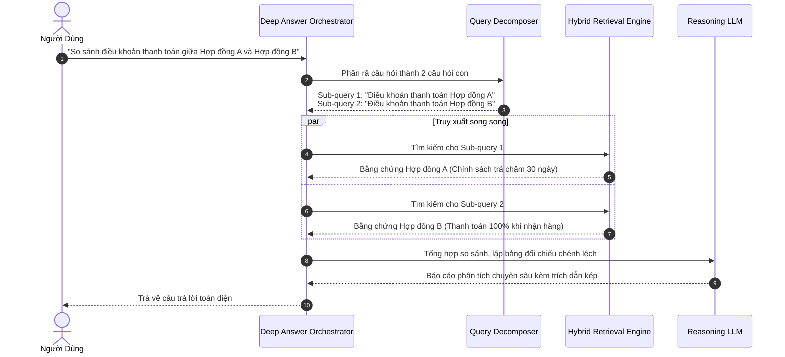

# 02. Hai Chế Độ Trả Lời: Fast Answer vs. Deep Answer

> **Phân hệ:** HANA RAG Service  
> **Chủ đề:** Tối ưu hóa trải nghiệm người dùng với chế độ Trả Lời Nhanh (Fast Answer) và Tổng Hợp Chuyên Sâu (Deep Answer).

---

## 1. Sự Khác Biệt Giữa Hai Nhu Cầu Doanh Nghiệp

Người dùng doanh nghiệp thường có hai phong cách tương tác rất khác nhau:
1. **Tra cứu nhanh (Factoid Lookups):** Cần câu trả lời ngay lập tức trong 1–2 giây (*"Hạn nộp báo cáo thuế tháng này là ngày mấy?", "Mã vật tư của thép phi 10 là gì?"*).
2. **Tổng hợp báo cáo chiến lược (Deep Analytical Synthesis):** Cần hệ thống đọc 5 hợp đồng khác nhau, so sánh điều khoản phạt chậm tiến độ, phát hiện các điểm mâu thuẫn và đề xuất phương án đàm phán tối ưu.

Hệ thống cung cấp hai chế độ sinh câu trả lời tùy chọn qua trường `generation_mode`:

| Tiêu Chí | Chế Độ Nhanh (Fast Answer) | Chế Độ Chuyên Sâu (Deep Answer) |
|---|---|---|
| **Thời gian phản hồi** | **< 1.5 giây** (Single-shot) | **5 – 15 giây** (Multi-hop Reasoning) |
| **Số lần truy xuất** | 1 lần truy xuất (Top 5 Chunks) | Đa lượt truy xuất (Multi-turn retrieval) |
| **Mô hình AI sử dụng** | GPT-4o-mini hoặc Harrier Rerank | GPT-4o / Claude 3.5 Sonnet cao cấp |
| **Mục đích phù hợp** | Tra cứu nhanh số liệu, định nghĩa, quy định | So sánh văn bản, đối soát hợp đồng, tóm tắt báo cáo |

---

## 2. Quy Trình Vận Hành Chế Độ Deep Answer

---

## 3. Khả Năng Nhận Diện Mâu Thuẫn Văn Bản (Conflict Detection)

Trong chế độ **Deep Answer**, nếu hệ thống phát hiện hai tài liệu có hiệu lực cùng lúc nhưng quy định trái ngược nhau (ví dụ: Quy chế năm 2024 ghi hạn mức 500k, nhưng Phụ lục ban hành tháng 3/2026 nâng lên 800k):
- Hệ thống tự động làm nổi bật cảnh báo mâu thuẫn văn bản (**Policy Conflict Alert**).
- Ưu tiên tài liệu có ngày hiệu lực mới nhất hoặc cấp ban hành cao hơn, đồng thời giải thích rõ cho người dùng.
