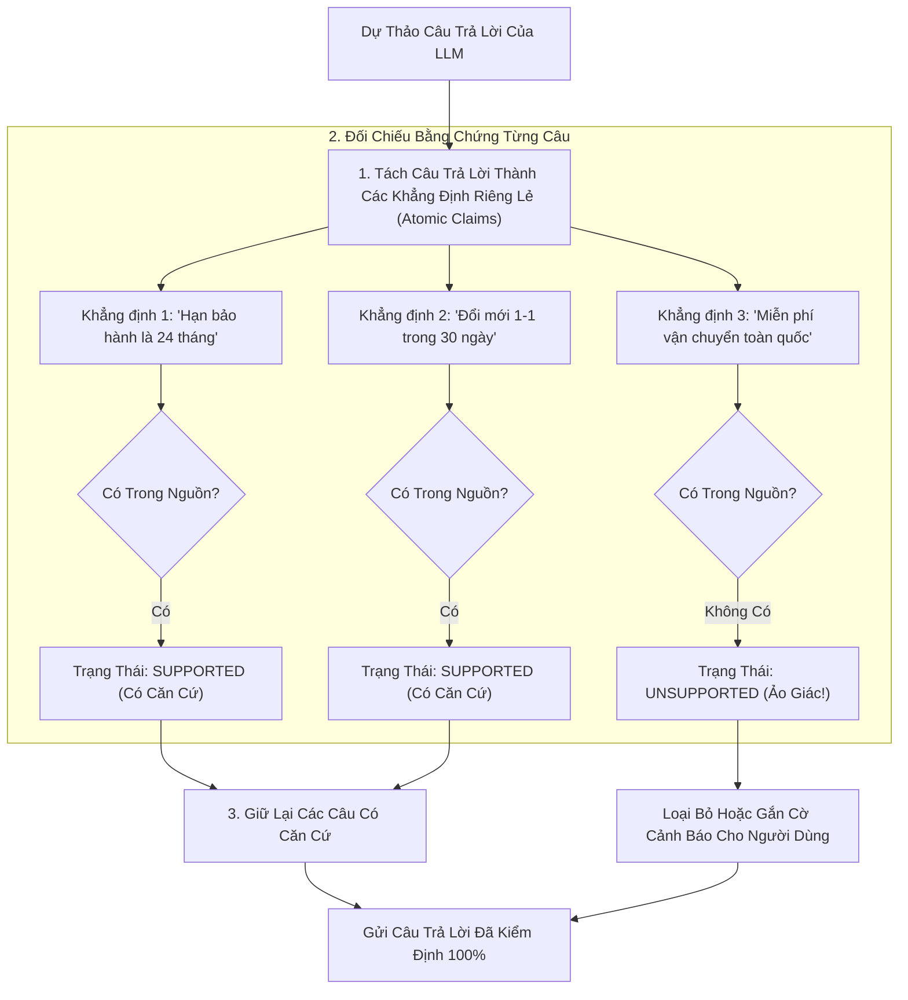

# 03. Thẩm Định Luận Điểm & Truyền Phát SSE (Claim Verification & Streaming)

> **Phân hệ:** HANA RAG Service  
> **Chủ đề:** Quy trình thẩm định từng câu khẳng định (Claim Verification) và truyền phát token thời gian thực qua Server-Sent Events (SSE).

---

## 1. Thẩm Định Luận Điểm Tự Động (Claim Support Verification)

Để đảm bảo mức độ tin cậy tuyệt đối cho các quyết định kinh doanh quan trọng, hệ thống bổ sung tầng kiểm định thứ hai: **Claim Support Verification**.

Sau khi LLM chính sinh xong dự thảo câu trả lời, một module thẩm định độc lập sẽ thực hiện kiểm tra chéo:



### 3 Trạng Thái Thẩm Định:
- **`SUPPORTED` (Được Chứng Thực):** Câu khẳng định có căn cứ trực tiếp trong đoạn trích dẫn nguồn.
- **`UNSUPPORTED` (Không Có Căn Cứ):** Tài liệu không hề nhắc tới điều này ➔ Lập tức gắn nhãn cảnh báo hoặc tự động biên tập lại.
- **`CONTRADICTED` (Mâu Thuẫn Trực Tiếp):** Câu khẳng định trái ngược hoàn toàn với tài liệu ➔ Hủy bỏ câu trả lời và báo lỗi.

---

## 2. Truyền Phát Câu Trả Lời Thời Gian Thực: SSE Streaming

Để mang lại trải nghiệm tương tác trực tiếp mượt mà cho người dùng:
- Endpoint hỗ trợ luồng truyền phát:
  ```http
  POST /api/v1/generation/stream
  ```
- Dữ liệu được đẩy về theo định dạng Server-Sent Events (SSE) chuẩn:

```text
event: citations
data: [{"index": 1, "document_name": "Quy_che_2026.pdf", "page": 5}]

event: token
data: {"text": "Quy "}

event: token
data: {"text": "trình "}

event: token
data: {"text": "thanh toán..."}

event: done
data: {"confidence_score": 0.95, "total_tokens": 142}
```

- Nhờ việc phát `event: citations` trước, giao diện người dùng có thể hiển thị danh sách tài liệu tham khảo ngay lập tức trong khi các chữ của câu trả lời tiếp tục xuất hiện dần dần trên màn hình.
