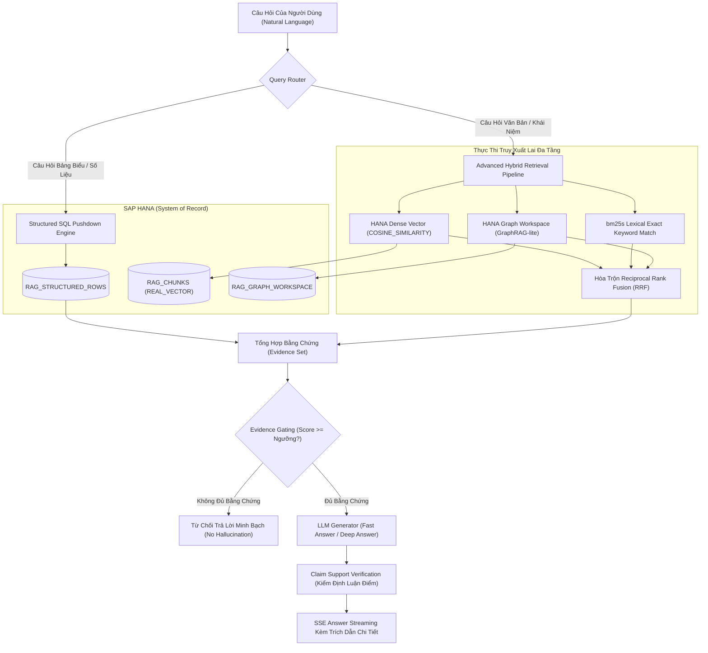

# Tài Liệu Thiết Kế Kiến Trúc: HANA RAG Service

> **Nền tảng RAG cấp doanh nghiệp đặt SAP HANA làm Trung Tâm Chân Lý (System of Record)**  
> *Lưu trữ vector nhúng `REAL_VECTOR`, truy vấn SQL Pushdown bảng biểu, đồ thị tri thức GraphRAG-lite, và sinh câu trả lời có căn cứ trích dẫn minh bạch.*

---

## 📚 Mục Lục Toàn Bộ Tài Liệu Chi Tiết

Tài liệu được phân tách thành 5 phân hệ chuyên sâu theo cấu trúc module hóa:

### 1. [Kiến Trúc Tổng Thể (Architecture)](./01-architecture/)
- [01. Tổng Quan & Cốt Lõi SAP HANA](./01-architecture/01-overview-and-hana-core.md): Động lực, triết lý SAP HANA as System of Record, cột `REAL_VECTOR`, phép toán `COSINE_SIMILARITY` đẩy thẳng xuống DB, và mô hình Dual Workloads (API vs WORKER).
- [02. Topology Hệ Thống & Cổng Giao Tiếp](./01-architecture/02-system-topology.md): Bản đồ dịch vụ, bảng chọn nhà cung cấp Embeddings (Harrier, OpenAI, SAP AI Core), tích hợp `spaCy`, `Docling`, `bm25s`, Presidio.
- [03. Kiến Trúc Clean Architecture & Composition Containers](./01-architecture/03-clean-architecture-and-containers.md): 4 tầng Clean Architecture và Composition Root trong `bootstrap.py` (`AppContainer`, `SmartFeaturesContainer`, `DatasetAnalysisPlane`).

### 2. [Quy Trình Nhập Liệu & Tiền Xử Lý (Ingestion Pipeline)](./02-ingestion-pipeline/)
- [01. Bóc Tách Đa Định Dạng Tài Liệu](./02-ingestion-pipeline/01-multi-format-parsing.md): Xử lý PDF (pdfplumber + Docling OCR fallback), DOCX, TXT, MD, JSON, và từ chối an toàn các file cũ (`.doc`, `.xls`).
- [02. Xử Lý Bảng Tính & Dữ Liệu Có Cấu Trúc](./02-ingestion-pipeline/02-spreadsheets-and-structured-tables.md): Kiến trúc Dual-Path cho CSV & XLSX — lưu thành hàng quan hệ chuẩn trong HANA (`RAG_STRUCTURED_ROWS`), không ép thành chunks vô nghĩa.
- [03. Phân Đoạn Ngữ Nghĩa, Che Giấu PII & Streaming Tệp Lớn](./02-ingestion-pipeline/03-chunking-pii-masking-and-streaming.md): Kỹ thuật Parent-Child Context Linking, lọc thông tin nhạy cảm PII bằng Microsoft Presidio trước khi embed, và xử lý streaming tệp hàng trăm MB.
- [04. Vòng Đời Tác Vụ Nạp Liệu & SSE Streaming](./02-ingestion-pipeline/04-worker-and-job-lifecycle.md): Quản lý tác vụ ngầm qua bảng `RAG_INGESTION_JOBS`, quy trình Claim Job của Worker, và luồng sự kiện Server-Sent Events (SSE).

### 3. [Bộ Máy Truy Xuất Dữ Liệu Lai (Retrieval Engine)](./03-retrieval-engine/)
- [01. Định Tuyến Truy Vấn & SQL Pushdown](./03-retrieval-engine/01-query-routing-and-sql-pushdown.md): Phân loại ý định số liệu (Structured) vs ngữ nghĩa (Unstructured), sinh SQL Pushdown tham số hóa an toàn trên SAP HANA in-memory.
- [02. Tìm Kiếm Vector & Tái Xếp Hạng Lai (Hybrid Rerank)](./03-retrieval-engine/02-dense-vector-and-hybrid-rerank.md): So khớp vector 2 giai đoạn, tái xếp hạng từ khóa chính xác qua `bm25s`, thuật toán Reciprocal Rank Fusion (RRF), và kỹ thuật HyDE.
- [03. Đồ Thị Tri Thức Nhẹ: GraphRAG-lite](./03-retrieval-engine/03-graphrag-lite.md): Bóc tách thực thể và quan hệ bằng `spaCy` NLP (chi phí LLM bằng 0), duyệt quan hệ 1-hop / 2-hop trong `RAG_GRAPH_WORKSPACE` của SAP HANA.
- [04. Bộ Nhớ Đệm Ngữ Nghĩa & Chống Rò Rỉ Tenant](./03-retrieval-engine/04-semantic-caching.md): Redis Semantic Cache dưới 10ms, cấu trúc khóa phân vùng bảo mật tuyệt đối chống Tenant Bleed.

### 4. [Sinh Câu Trả Lời Có Căn Cứ (Grounded Generation)](./04-grounded-generation/)
- [01. Kiểm Soát Bằng Chứng & Trích Dẫn Nguồn](./04-grounded-generation/01-evidence-gating-and-citations.md): Low-Score Gating chống ảo giác, từ chối trả lời nếu thiếu bằng chứng tin cậy, chuẩn hóa trích dẫn nguồn số trang chi tiết (`[1]`, `[2]`).
- [02. Hai Chế Độ Trả Lời: Fast Answer vs. Deep Answer](./04-grounded-generation/02-fast-vs-deep-answer-modes.md): Chế độ tra cứu nhanh Factoid (< 1.5s) vs Chế độ tổng hợp báo cáo chuyên sâu đa nguồn (Multi-hop Reasoning) có nhận diện mâu thuẫn văn bản.
- [03. Thẩm Định Luận Điểm & Truyền Phát SSE](./04-grounded-generation/03-claim-verification-and-sse-streaming.md): Thẩm định từng câu khẳng định (`SUPPORTED` vs `UNSUPPORTED`) và truyền phát token thời gian thực qua Server-Sent Events.

### 5. [Bộ Công Cụ Thông Minh & Nền Tảng (Smart Tools & Platform)](./05-smart-tools-and-platform/)
- [01. Danh Mục Các Công Cụ Thông Minh (Smart Tools Catalog)](./05-smart-tools-and-platform/01-smart-tools-catalog.md): Triết lý "Mechanism, not policy", vỏ bọc `ToolResult`, công cụ phát hiện bản ghi trùng lặp `match/dedupe` (RapidFuzz + Vector), `keyword-screen`, `extract`, `classify`.
- [02. Bảo Mật Doanh Nghiệp & Độ Bền Vững](./05-smart-tools-and-platform/02-security-and-resilience.md): Nguyên tắc Fail-Closed cô lập Tenant, chống Callback SSRF, Circuit Breakers cho dịch vụ lưu trữ tệp, khung đo lường Evaluation Harness và Prometheus Metrics.

---

## 🚀 Sơ Đồ Kiến Trúc Luồng Truy Xuất & Xử Lý

