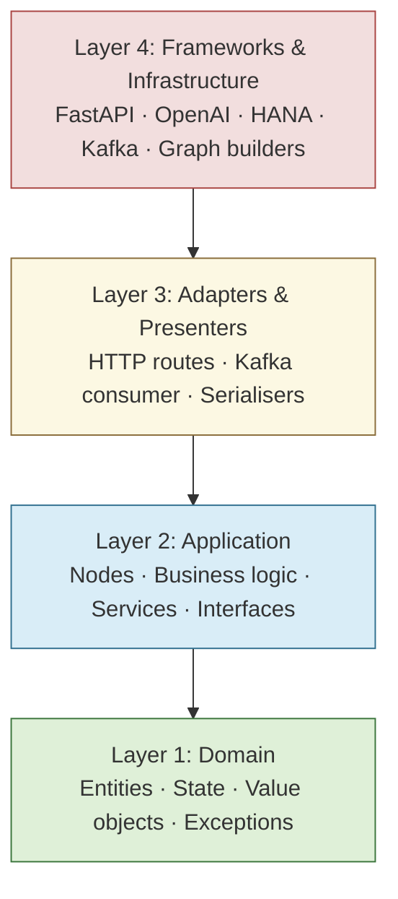
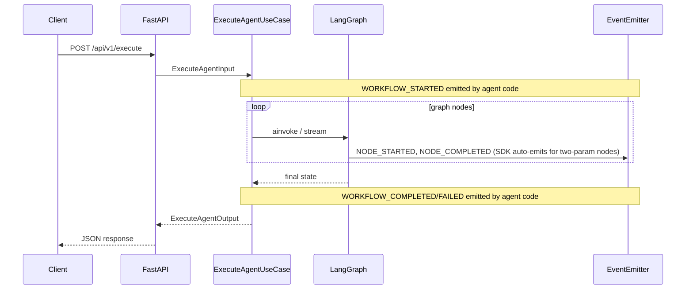

# 01 — Overview

[← Docs home](../README.md) | [SDK root](../../README.md)

---

## What is the Agent SDK?

The Agent SDK is a Python framework for building production-ready AI workflow agents on LangGraph, FastAPI, and SAP BTP. It takes care of all the infrastructure plumbing — HTTP serving, Kafka/Event Mesh consumption, checkpointing, service registry, and dependency injection — so that agent authors only write task-specific code.

You declare your tools or graph nodes. The SDK handles everything else.

---

## Four-Layer Architecture

The SDK follows a strict four-layer Clean Architecture. Each layer has a defined dependency direction: outer layers depend on inner layers; inner layers never depend on outer layers.

| Layer | Your code | SDK code |
|---|---|---|
| **L1 Domain** | `state.py` — extend `AgentBaseState` with your fields | `AgentBaseState`, `TenantContext`, `HitlInterruptPayload`, exceptions |
| **L2 Application** | `nodes.py` — plain functions `(state, deps) → partial_update` | `ExecuteAgentUseCase`, `ResumeAgentUseCase`, `AgentDiscoveryService`, event scope |
| **L3 Adapters** | Usually empty for simple agents | FastAPI routes, Kafka consumer loop, serialisers |
| **L4 Frameworks** | `build_graph()` — wire nodes with a builder | `AgentGraphBuilder`, `FlowGraphBuilder`, `ToolAgentBuilder`, `OpenAIService`, `HanaCheckpointSaver` |

See the full module map: [Reference → Architecture](../03-building-agents/clean-architecture-tutorial.md).

---

## Capability Matrix

| Capability | Tool Agent | Graph Agent | HITL Agent | Custom |
|---|---|---|---|---|
| Automatic tool loop | ✓ | ✓ | ✓ | depends |
| Custom graph topology | — | ✓ | ✓ | ✓ |
| Human-in-the-loop | — | — | ✓ | ✓ |
| Pre/post nodes | ✓ | ✓ | ✓ | ✓ |
| Checkpointing required | — | — | ✓ | optional |

---

## Feature Highlights

| Feature | What it gives you |
|---|---|
| **Minimal tool agents** | `ToolAgentBuilder` + `@tool` — declare tools, get a running agent with zero graph code |
| **Fluent graph building** | `AgentGraphBuilder` fluent API for custom node wiring and topologies |
| **Config-driven flows** | `FlowGraphBuilder` declarative flow definitions from registry configuration |
| **HITL / resume** | `interrupt()` runtime + `interrupt_before` compile-time; stateless resume via `POST /api/v1/resume` |
| **Dual run modes** | `SERVER` (FastAPI + uvicorn on port 36000) or `CONSUMER` (Kafka or SAP Event Mesh) |
| **Event mesh** | `MESSAGING_MODE=mock\|local\|sap` — automatic publisher/consumer wiring; `NODE_STARTED`/`NODE_COMPLETED`/`TOOL_SELECTED` emitted by the SDK; lifecycle events (`WORKFLOW_STARTED/COMPLETED/FAILED`) are emitted by agent code; optional push-gateway REST fan-out via `PUSH_GATEWAY_URL` |
| **Checkpointing** | `MemorySaver` for development; `HanaCheckpointSaver` (SAP HANA) for production |
| **Multi-agent orchestration** | `AgentDiscoveryService` discovers sub-agents at runtime; `AgentCallCoordinator` auto-handles the AGENT_CALL interrupt loop with retry |
| **Context budget management** | `ContextBudgetManager` prevents context window overflow with five compaction strategies |
| **Service registry / health** | Auto-register + heartbeat on startup; `/health`, `/ready`, `/api/v1/info` endpoints |
| **Multi-tenancy** | Built-in `TenantContext` threading for per-tenant isolation |
| **Deployment** | Local, Docker, SAP BTP Cloud Foundry (VCAP credential auto-load) |

---

## How the Run Lifecycle Works

If a node calls `interrupt()`, the graph pauses and returns an `interrupted=true` response. The client resumes by calling `POST /api/v1/resume` with the interrupt payload. See [Building Agents → HITL](../03-building-agents/README.md#hitl).

---

## Next Steps

- **Get running now** → [02 — Quick Start](../02-quickstart/README.md)
- **Understand state and nodes** → [Core Concepts](../01-overview/core-concepts.md)
- **Choose a builder** → [03 — Building Agents](../03-building-agents/README.md)
- **Full architecture details** → [Building Agents → Clean Architecture Tutorial](../03-building-agents/clean-architecture-tutorial.md)

---

[← Docs home](../README.md) | [SDK root](../../README.md)
