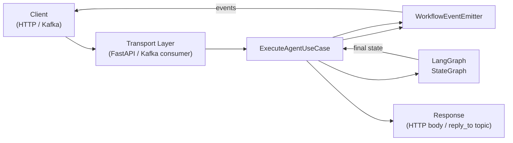

# Core Concepts

[← Overview](README.md) | [Docs home](../README.md)

## When to use this page

Read this before writing your first node or extending `AgentBaseState`. It covers the six building blocks every agent author touches: state, nodes, tools, builders, the DI container, and transport state.

---

## Request Lifecycle



The SDK mental model in one sentence: **the transport receives a message, maps it into `AgentBaseState`, runs a LangGraph `StateGraph`, and returns `formatted_response`**.

---

## State

Every graph runs against a **state dict** — a `TypedDict` that is passed into each node and updated by the node's return value.

### `AgentBaseState`

All SDK agents share a common base state importable from `agent_sdk`:

```python
class AgentBaseState(TypedDict, total=False):
    message: str                  # incoming user message
    conv_id: str                  # thread ID used by LangGraph checkpointer
    user_id: str
    tenant_id: str
    source: str                   # request origin label (e.g. "api", "kafka")
    correlation_id: Optional[str]
    trace_id: Optional[str]
    transport_state: str          # IDLE / RECEIVED / PROCESSING / COMPLETED / ERROR
    parameters: dict              # arbitrary extra parameters
    error: Optional[str]
    error_code: Optional[str]
    formatted_response: Optional[dict]  # written by format_response_node
    input_guard_result: Optional[dict]
    output_guard_result: Optional[dict]
    permission_context: Any
    tenant_context: Optional[TenantContext]
```

All fields are optional (`total=False`), so you only populate what your graph needs.

Extend it for custom state:

```python
from agent_sdk import AgentBaseState

class MyState(AgentBaseState, total=False):
    intermediate_result: str
    retry_count: int
```

### `ToolAgentState`

`ToolAgentBuilder` uses `ToolAgentState`, which extends `AgentBaseState` with LangChain message list semantics:

```python
class ToolAgentState(AgentBaseState, total=False):
    messages: Annotated[list, add_messages]  # append-only via LangGraph reducer
    tool_results: list[dict]
```

The `add_messages` reducer means returning `{"messages": [new_msg]}` from a node **appends** to the list rather than replacing it.

### Custom state for `AgentGraphBuilder`

```python
builder = AgentGraphBuilder(state_schema=MyState)
```

---

## Nodes

A **node** is a plain Python function or async coroutine that receives the current state and returns a partial update dict:

```python
def my_node(state: MyState) -> dict:
    return {"intermediate_result": state["message"].upper()}

async def async_node(state: MyState) -> dict:
    result = await some_async_call(state["message"])
    return {"intermediate_result": result}
```

The SDK supports both sync and async node functions. Prefer `async def` for I/O-bound nodes.

### Dependency injection in nodes

`AgentGraphBuilder` supports a second parameter `deps` for injecting shared services without globals:

```python
def enrichment_node(state: MyState, deps: dict) -> dict:
    db = deps["db"]
    row = db.fetch(state["user_id"])
    return {"intermediate_result": row["value"]}

builder = AgentGraphBuilder(deps={"db": my_db_client}, state_schema=MyState)
builder.add_node("enrich", enrichment_node)
```

When the graph is compiled, the builder detects the two-parameter signature and wraps the function automatically. Single-parameter nodes (`state` only) are passed through unwrapped.

> **Lifecycle events:** Only two-parameter nodes wrapped by `AgentGraphBuilder` automatically emit `NODE_STARTED` / `NODE_COMPLETED` events. Single-parameter nodes do not. `FlowGraphBuilder` wraps all configured steps regardless of signature.

---

## Tools

A **tool** is a Python function exposed to the LLM as a callable capability. Decorate it with `@tool` (re-exported from `langchain_core`):

```python
from agent_sdk import tool

@tool
def search_knowledge_base(query: str) -> list[str]:
    """Search the internal knowledge base for documents matching the query."""
    return my_kb.search(query)
```

The function signature becomes the tool schema. The docstring is the description the LLM reads to decide when to call the tool.

**`call_*` naming and automatic `BUSINESS_DATA` classification:** When using `default_tool_factory` with `AgentDiscoveryService`, each discovered sub-agent gets a tool whose name starts with `call_` (e.g., `call_invoice_agent`). `ToolAgentBuilder` detects this prefix and automatically marks the corresponding tool-result messages as `PayloadType.BUSINESS_DATA` before passing the message history to `ContextBudgetManager.compact()`. This ensures sub-agent responses are never dropped or summarised during context compaction.

---

## Builders

Three builder classes cover the common graph shapes.

| Builder | Abstraction | Controls |
|---------|------------|---------|
| `ToolAgentBuilder` | Highest — drop in tools | Full tool-calling loop pre-wired |
| `AgentGraphBuilder` | Medium — fluent graph API | Explicit nodes, edges, conditionals |
| `FlowGraphBuilder` | Config-driven — `FlowConfig` | Sequential steps with `condition` / `router` |

See [04-features/builders.md](../04-features/builders.md) for detailed API and when to choose each.

---

## Container and run modes

`run_agent` builds an **app container** (a dependency injection container) and starts the process in one of two modes:

### SERVER mode (`APP_MODE=SERVER`)

A `FastAPI` application served by `uvicorn` on `SERVER_HOST:SERVER_PORT` (default `0.0.0.0:36000`). Exposes:

- `POST /api/v1/execute` — run the agent
- `POST /api/v1/resume` — resume after a HITL interrupt
- `GET  /health`, `/ready`, `/api/v1/info`

### CONSUMER mode (`APP_MODE=CONSUMER`)

An `aiokafka` consumer loop that reads from `KAFKA_REQUEST_TOPIC` and publishes results to `KAFKA_RESPONSE_TOPIC`. The agent logic is identical; only the transport layer changes.

> **Note:** In SERVER mode, `build_app_container` wires a `publisher` but does **not** start a consumer loop. In CONSUMER mode, both `publisher` and `consumer` are auto-wired.

### `TenantContext`

Every request carries tenant, user, and conversation identifiers. The SDK populates `AgentBaseState.tenant_context` automatically from the incoming request:

```python
@dataclass
class TenantContext:
    tenant_id: str
    user_id: str
    conv_id: str
    source: str = "api"
    correlation_id: Optional[str] = None
    metadata: Dict[str, Any] = field(default_factory=dict)
```

Your nodes can read `state["tenant_context"]` without any extra setup.

---

## Transport state and request/response shapes

### Transport state machine

`transport_state` is a string field in `AgentBaseState` that tracks lifecycle position:

| Value | Meaning |
|-------|---------|
| `IDLE` | No active execution |
| `RECEIVED` | Request accepted, not yet processed |
| `PROCESSING` | Graph is executing |
| `COMPLETED` | Execution finished successfully |
| `ERROR` | Execution failed |

`ToolAgentBuilder` sets `PROCESSING` at the start of the graph and `COMPLETED` in the `format_response` node. If you write a custom graph, update `transport_state` in the same way. The `TransportState` enum in `agent_sdk` maps these string values.

### Request shape (`/api/v1/execute`)

```json
{
  "message": "your instruction",
  "conv_id": "conv-abc",
  "user_id": "user-123",
  "tenant_id": "tenant-456",
  "parameters": {}
}
```

### Response shape

```json
{
  "status": "COMPLETED",
  "formatted_response": {
    "content": "final LLM text",
    "tool_results": [
      {"tool": "tool_name", "result": "..."}
    ]
  }
}
```

`formatted_response` is populated by the `format_response` node (or your equivalent).

---

## Read next

- [Builders deep dive](../04-features/builders.md) — full API for all three builder classes
- [HITL](../04-features/hitl.md) — pausing and resuming graph execution
- [Transports](../04-features/transports.md) — SERVER vs CONSUMER mode in detail
- [DI Cookbook](../03-building-agents/dependency-injection-cookbook.md) — customising the container

---

[← Overview](README.md) | [Docs home](../README.md)
