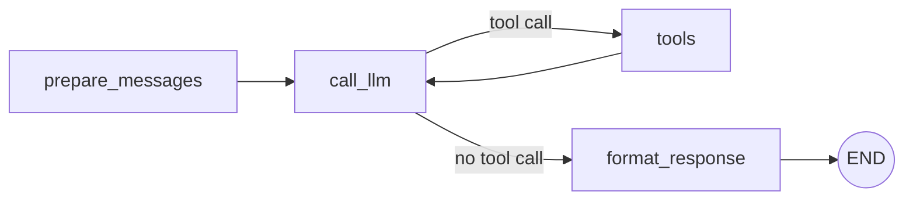
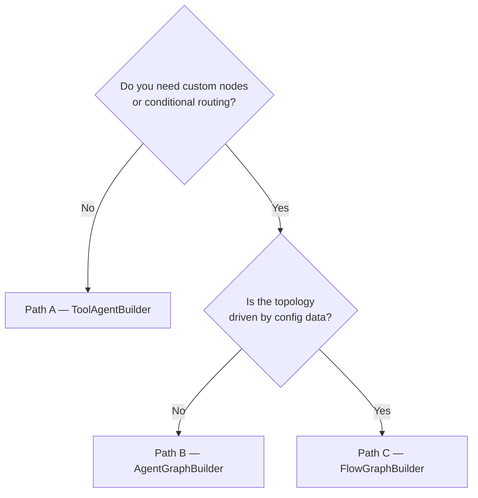

# Choose Your Builder

[← Quick Start](README.md) | [Docs home](../README.md)

---

The SDK provides three builder classes. Each trades simplicity for control. Start with **Path A** unless your use case requires something it cannot express.

---

## Decision table

| | Path A — `ToolAgentBuilder` | Path B — `AgentGraphBuilder` | Path C — `FlowGraphBuilder` |
|---|---|---|---|
| **What you provide** | A list of tools and a system prompt | Node functions and explicit edges | A `FlowConfig` data object and a `NodeTypeRegistry` |
| **Graph topology** | Fixed: prepare → LLM → tools loop → format | Any topology you define | Sequential steps with optional condition/router nodes |
| **Custom nodes** | Pre/post nodes only (before prepare, after format) | Full control — any node anywhere | Nodes are registered types; topology is data-driven |
| **Best for** | Most agents — tool-calling, single or multi-tool | Agents with validation, routing, or non-linear flows | Agents whose flow topology is loaded from config or a database |
| **Lines of code** | ~10 | ~30–60 | ~30 + config |

---

## Path A — `ToolAgentBuilder`

Use this when your agent calls one or more tools in a loop until the LLM decides it is done.

```python
from agent_sdk import ToolAgentBuilder, make_openai_service, run_agent, tool

@tool
def my_tool(query: str) -> str:
    """Do something useful."""
    return f"result for {query}"

builder = ToolAgentBuilder(
    llm_service=make_openai_service(),
    tools=[my_tool],
    system_prompt="You are a helpful assistant.",
)
run_agent(agent_graph=builder.compile())
```

`ToolAgentBuilder` builds this graph automatically:



**Optional extensions:**
- `pre_nodes` — run custom steps *before* `prepare_messages` (e.g. input validation, auth check).
- `post_nodes` — run custom steps *after* `format_response` (e.g. audit logging, output enrichment).
- `context_budget` — attach a `ContextBudgetManager` to prevent context window overflow.

Reference example: `examples/minimal_tool_agent.py`

---

## Path B — `AgentGraphBuilder`

Use this when you need nodes the tool loop cannot express: a guardrail before the LLM, conditional routing between branches, or a non-linear topology.

```python
from agent_sdk import AgentGraphBuilder, make_openai_service, run_agent
from agent_sdk import ToolAgentState, END, tools_condition

async def classify_intent(state, deps):
    # return {"intent": "delegate"} or {"intent": "reject"}
    ...

async def call_llm(state, deps):
    ...

builder = AgentGraphBuilder(state_schema=ToolAgentState)
builder.set_entry_point("classify_intent")
builder.add_node("classify_intent", classify_intent)
builder.add_node("call_llm", call_llm)
builder.add_conditional_edges(
    "classify_intent",
    lambda state: state["intent"],
    {"delegate": "call_llm", "reject": END},
)
builder.add_edge("call_llm", END)
run_agent(agent_graph=builder.compile())
```

Node functions follow the signature `(state, deps) -> partial_state_update`. The `deps` dict carries shared services (LLM client, DB connection) injected by the DI container.

`AgentGraphBuilder` also re-exports LangGraph symbols so you never import `langgraph` directly: `END`, `tools_condition`, `ToolNode`, `StateGraph`.

Reference example: `examples/convenient_tool_agent.py`  
Full API: [Reference → API Reference — AgentGraphBuilder](../05-reference/api-reference.md#agentgraphbuilder)

---

## Path C — `FlowGraphBuilder`

Use this when the graph topology is driven by data — for example, a flow definition loaded from JSON, YAML, or a database — rather than hard-coded Python edges.

```python
from agent_sdk import FlowGraphBuilder, NodeTypeRegistry
from agent_sdk.layer1_domain.entities.flow_config import FlowConfig, StepConfig

registry = NodeTypeRegistry()
registry.register("greet", greet_fn)
registry.register("validate", validate_fn)

flow = FlowConfig(
    agent_type="my_agent",
    flow_type="main",
    steps=[
        StepConfig(id="greet", type="greet"),
        StepConfig(id="validate", type="validate"),
    ],
)

builder = FlowGraphBuilder(registry=registry)
compiled = builder.build(flow)
run_agent(agent_graph=compiled)
```

The `FlowConfig` and `StepConfig` dataclasses can be serialised to/from JSON or YAML. This means the agent's topology can change without redeploying Python code.

Reference example: `examples/flow_graph_example.py`  
Full details: [Features → Builders](../04-features/builders.md)

---

## Which one should I start with?



**When in doubt, start with Path A.** You can always add pre/post nodes for simple extensions, and migrate to Path B only when the topology truly cannot be expressed within the tool loop.

---

## Consistent builder names across the docs

Wherever you see these path labels in the SDK documentation, they always mean the same thing:

| Label | Builder class |
|---|---|
| Path A — Minimal | `ToolAgentBuilder` |
| Path B — Custom graph | `AgentGraphBuilder` |
| Path C — Declarative flow | `FlowGraphBuilder` |

---

## Next steps

- **Write your first Path A agent** → [First Agent](first-agent.md)
- **Browse examples by path** → [Examples Roadmap](examples-roadmap.md)
- **Deep dive on builders** → [03 — Building Agents](../03-building-agents/README.md)
- **Full builder API** → [Reference → API Reference](../05-reference/api-reference.md)

---

[← Quick Start](README.md) | [Docs home](../README.md)
