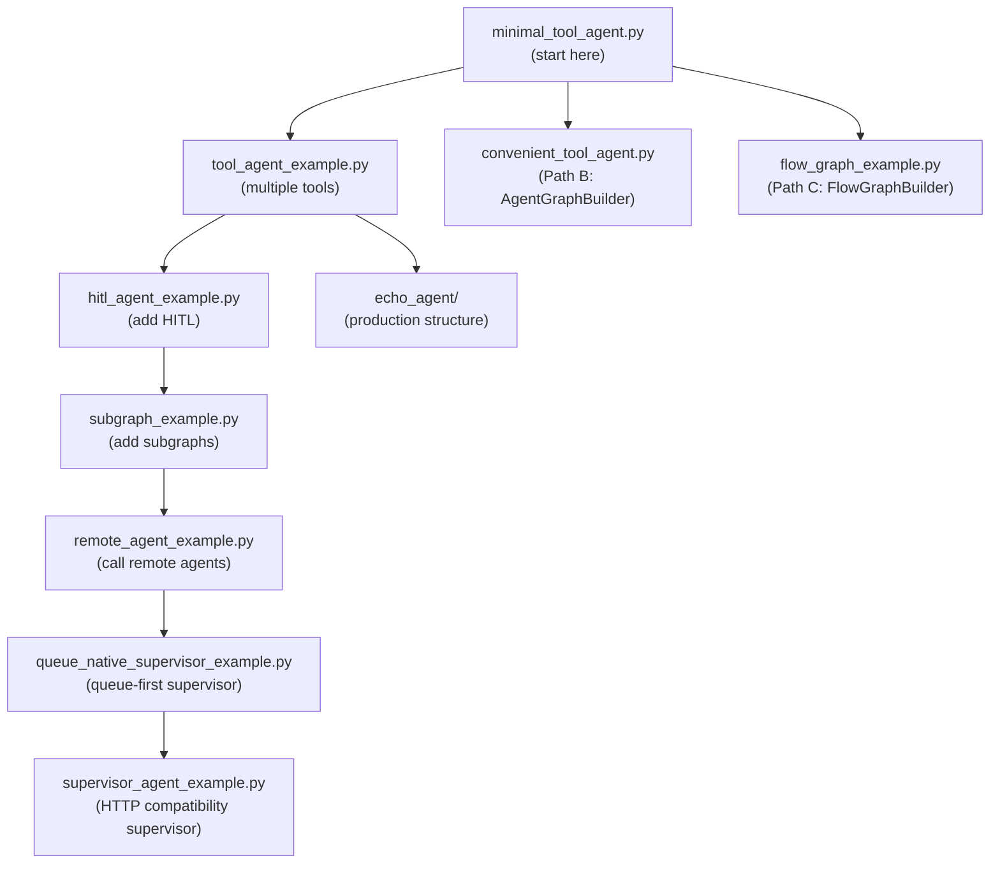

# Examples Roadmap

[← Quick Start](README.md) | [Docs home](../README.md)

---

Every example in the `examples/` directory is runnable. This page groups them by learning stage so you know which one to read next.

---

## Start here

If you are new to the SDK, read these two examples in order:

| Example | What you learn |
|---|---|
| `examples/minimal_tool_agent.py` | **Path A — `ToolAgentBuilder`**: the lowest-boilerplate path. One tool, one file, running HTTP server. Start here. |
| `examples/tool_agent_example.py` | **Path A — multiple tools**: shows how the tool loop handles more than one callable. |

---

## Explore the builder paths

Once you are comfortable with the minimal example, explore the other builder paths:

| Example | Builder path | What you learn |
|---|---|---|
| `examples/convenient_tool_agent.py` | Path B — `AgentGraphBuilder` | Manual node and edge wiring; same topology as Path A but fully explicit |
| `examples/flow_graph_example.py` | Path C — `FlowGraphBuilder` | Declarative config-driven flow; `FlowConfig`, `StepConfig`, `NodeTypeRegistry` |

---

## Add platform features

These examples add one SDK feature on top of a basic agent. Read them when you need that specific feature.

| Example | Feature | What you learn |
|---|---|---|
| `examples/hitl_agent_example.py` | Human-in-the-Loop | `interrupt()`, `interrupt_before`, stateless resume via `/api/v1/resume`, `HitlInterruptPayload` |
| `examples/subgraph_example.py` | Subgraphs | `add_subgraph()` (shared state) and `add_mapped_subgraph()` (different state schemas) |
| `examples/kafka_consumer_example.py` | CONSUMER mode | SAP Event Mesh-native consumer path; queue-first execute / delegation / correlated resume flow; `reply_to`, `reply_queue`, `MESSAGING_MODE` |
| `examples/context_budget_example.py` | Context budget | `ContextBudgetManager` compaction strategies for long-running conversations |

---

## Multi-agent orchestration

Read these after you are comfortable with HITL:

| Example | What you learn |
|---|---|
| `examples/remote_agent_example.py` | `RemoteAgentTool`, `AGENT_CALL` interrupt, `IAgentRegistry` — calling a remote sub-agent from a tool |
| `examples/queue_native_supervisor_example.py` | Queue-first supervisor orchestration — registry `QueueMetadata`, `AsyncAgentDelegator`, `MessageReactionRouter`, `correlation_threads` |
| `examples/supervisor_agent_example.py` | HTTP compatibility supervisor — `AgentCallCoordinator`, `AgentDiscoveryService`, `AgentCapability` |

---

## Reference application

`examples/echo_agent/` is a **multi-file reference application** — the same structure used in production agents. Read it after the single-file examples when you want to see a layered direct-completion node that uses injected `openai_service`. Keep using the single-file `ToolAgentBuilder` examples as the canonical path for tool-calling agents.

| File | What it shows |
|---|---|
| `main.py` | Thin entry point; calls `create_agent_app(container)` |
| `bootstrap.py` | Composition root; wires DI, checkpointer, optional HANA connection, and `openai_service` |
| `app/layer2_application/echo_nodes.py` | Layer 2 direct-completion node using `get_chat_completion(...)` plus HITL node |
| `app/layer4_frameworks/graph/echo_graph_builder.py` | Graph built in its own module via `build_echo_graph()` |
| `app/layer4_frameworks/config/app_config.py` | Agent-specific `Settings` subclass |

Full walkthrough: [Examples — echo_agent reference app](../examples.md#echo_agent--reference-application)

---

## Annotated walkthroughs

Each example above has a detailed annotated walkthrough in [examples.md](../examples.md) — code snippets, what each construct does, and "read next" pointers.

---

## Learning path summary

---

## Next steps

- **Follow the first-agent walkthrough** → [First Agent](first-agent.md)
- **Understand the builder paths** → [Choose Your Builder](choose-your-builder.md)
- **Read annotated walkthroughs** → [examples.md](../examples.md)
- **Build with custom nodes** → [03 — Building Agents](../03-building-agents/README.md)

---

[← Quick Start](README.md) | [Docs home](../README.md)
