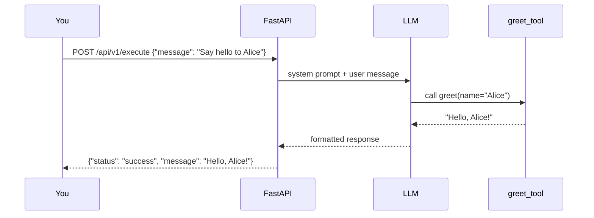

# Your First Agent

[← Quick Start](README.md) | [Docs home](../README.md)

---

This page walks you through building and running the smallest possible agent — one tool, one file, no prior knowledge of LangGraph or clean architecture required.

---

## Prerequisites

- Python ≥ 3.12
- SDK installed: `pip install -e ".[dev]"` from the `agent-sdk/` directory
- An OpenAI API key

---

## Step 1 — Write a tool

A **tool** is a plain Python function decorated with `@tool`. The docstring becomes the description the LLM reads when deciding whether to call the tool.

```python
from agent_sdk import tool

@tool
def greet(name: str) -> str:
    """Return a greeting for the given name."""
    return f"Hello, {name}!"
```

That is all. No classes, no inheritance, no configuration.

---

## Step 2 — Build the agent

Pass your tool to `ToolAgentBuilder`. It wires the full request cycle for you: prepare the messages, call the LLM, run the tool, format the response.

```python
from agent_sdk import ToolAgentBuilder, make_openai_service, run_agent

def main() -> None:
    builder = ToolAgentBuilder(
        llm_service=make_openai_service(),   # reads OPENAI_API_KEY from env
        tools=[greet],
        system_prompt="You are a helpful assistant.",
    )
    run_agent(agent_graph=builder.compile())

if __name__ == "__main__":
    main()
```

`make_openai_service()` reads your `OPENAI_API_KEY` from the environment — you never import `openai` or `langchain_openai` directly.

`run_agent(...)` starts a FastAPI + uvicorn server on port 36000. You do not need to configure a web server.

---

## Step 3 — Run it

```bash
OPENAI_API_KEY=sk-... python my_agent.py
```

You should see:

```
INFO:     Application startup complete.
INFO:     Uvicorn running on http://0.0.0.0:36000
```

---

## Step 4 — Call the agent

```bash
curl -X POST http://localhost:36000/api/v1/execute \
     -H 'Content-Type: application/json' \
     -d '{"message": "Say hello to Alice", "conv_id": "conv-1"}'
```

Successful response:

```json
{
  "status": "success",
  "message": "Hello, Alice!",
  "session_id": "9f1a2b3c-4d5e-6f7a-8b9c-0d1e2f3a4b5c",
  "interrupted": false,
  "interrupt_payload": null,
  "agent_data": {},
  "error": null,
  "error_code": null,
  "correlation_id": null,
  "duration_ms": 312.4
}
```

---

## What just happened



The SDK wired every step of that cycle from a 10-line file. You only wrote the tool function and the three-line builder call.

---

## Try it without an API key

You can run the `minimal_tool_agent.py` example with no external services using mock mode:

```bash
INFRA_MODE=mock MESSAGING_MODE=mock python examples/minimal_tool_agent.py
```

`INFRA_MODE=mock` uses an in-memory checkpointer instead of SAP HANA.  
`MESSAGING_MODE=mock` replaces Kafka with a no-op console transport.

This lets you explore the full request/response cycle on a laptop without any cloud credentials.

---

## Full example file

The canonical single-file example is `examples/minimal_tool_agent.py`. Read it alongside this guide — it shows the same pattern used in production agents.

---

## Next steps

- **Understand what the SDK is doing** → [SDK Mental Model](mental-model.md)
- **Compare all three builder paths** → [Choose Your Builder](choose-your-builder.md)
- **Browse all examples** → [Examples Roadmap](examples-roadmap.md)
- **Add tools and custom nodes** → [03 — Building Agents](../03-building-agents/README.md)

---

[← Quick Start](README.md) | [Docs home](../README.md)
