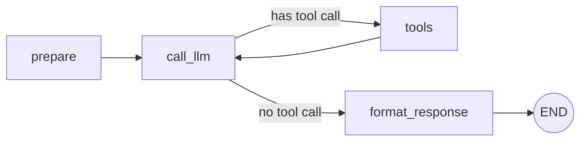
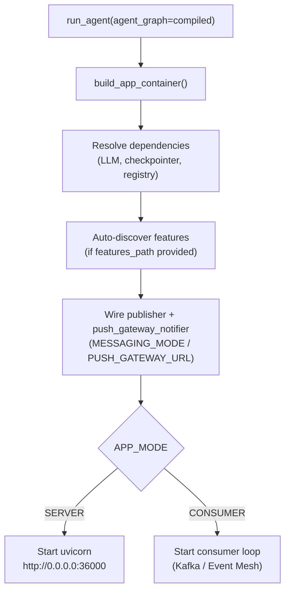

# SDK Mental Model

[← Quick Start](README.md) | [Docs home](../README.md)

---

Reading this page first helps everything else make sense. It explains what an agent *is*, what the SDK takes care of for you, and what you still need to write yourself.

---

## What is an agent?

An **agent** is a program that:

1. Receives a text message from a user or another system.
2. Decides — using an LLM — what to do next: answer directly, call a function, or ask for human approval.
3. Executes the decision and loops until the task is complete.
4. Returns a structured response.

The SDK handles steps 2, 3, and 4. You supply step 1's message format and the functions the LLM is allowed to call (the **tools**).

---

## What is a graph?

Internally the SDK represents an agent as a **graph** — a set of named steps (nodes) connected by edges. Execution flows through those nodes in order.



The graph above is exactly what `ToolAgentBuilder` builds for you. You will never write it by hand unless you need a custom topology.

---

## What does the SDK handle for you?

| What the SDK does | Why it matters |
|---|---|
| Builds the LangGraph graph | You describe what you want; the builder wires the nodes |
| Starts a FastAPI + uvicorn server | One call to `run_agent()` and the HTTP server is running |
| Wires Kafka or SAP Event Mesh | Set `MESSAGING_MODE` — no broker code to write |
| Connects to a checkpointer | Set `INFRA_MODE` — required for HITL / multi-turn state |
| Emits workflow events | `WORKFLOW_STARTED`, `NODE_COMPLETED`, etc. fire automatically |
| Registers the agent + heartbeat | Service registry and health endpoints (`/health`, `/ready`) are automatic |
| Reads credentials from the environment | `OPENAI_API_KEY`, `HANA_HOST`, etc. — no hardcoded secrets |

---

## What you still write

| Your code | Where it lives |
|---|---|
| **Tools** — plain Python functions decorated with `@tool` | Anywhere; imported into the builder |
| **State** (optional) — a `TypedDict` with your agent's fields | `app/layer1_domain/state.py` in a real project |
| **Nodes** (optional) — functions that read state and return a partial update | `app/layer2_application/nodes.py` |
| **Graph wiring** (optional) — only when `ToolAgentBuilder` is not enough | `app/layer4_frameworks/graph.py` |
| **Bootstrap / DI** — wiring dependencies for a multi-file project | `bootstrap.py` |

For most agents, you only need tools and a system prompt.

---

## The four-layer architecture (briefly)

SDK code is organised in four layers. Your code follows the same pattern:

```
Layer 1 (Domain)       — data shapes: state, entities, value objects
Layer 2 (Application)  — business logic: nodes, use cases, services
Layer 3 (Adapters)     — HTTP/Kafka boundary: routes, serialisers
Layer 4 (Frameworks)   — infrastructure: builders, OpenAI, HANA, config
```

**The rule:** every layer only imports from the layers *below* it. A node in Layer 2 never imports FastAPI (Layer 4). This keeps your business logic testable without spinning up a server.

For a one-file script this structure is invisible — everything is inline. As your agent grows, splitting it into these layers makes it much easier to maintain and test.

Full architecture details: [01 — Overview](../01-overview/README.md).

---

## How `run_agent` starts the server



You do not need to call any of these steps yourself. Pass the compiled graph; `run_agent` does the rest.

---

## Vocabulary reference

| Term | Plain meaning |
|---|---|
| **Tool** | A Python function the LLM can call by name |
| **Node** | A step in the graph; receives state, returns a partial state update |
| **State** | A dict (TypedDict) that carries all data through the graph |
| **Graph** | The set of nodes and edges that defines the agent's execution flow |
| **Builder** | An SDK class that constructs the graph for you |
| **Checkpointer** | Saves graph state between turns; required for HITL and multi-turn conversations |
| **Transport** | How the agent receives requests — HTTP (`SERVER`) or message broker (`CONSUMER`) |
| **HITL** | Human-in-the-Loop — pausing the graph to wait for human approval before continuing |
| **DI / container** | Dependency injection — a dictionary of shared services (LLM client, DB connection) passed into nodes |

---

## Next steps

- **Write your first agent** → [First Agent](first-agent.md)
- **Choose the right builder for your use case** → [Choose Your Builder](choose-your-builder.md)
- **Browse all examples** → [Examples Roadmap](examples-roadmap.md)

---

[← Quick Start](README.md) | [Docs home](../README.md)
