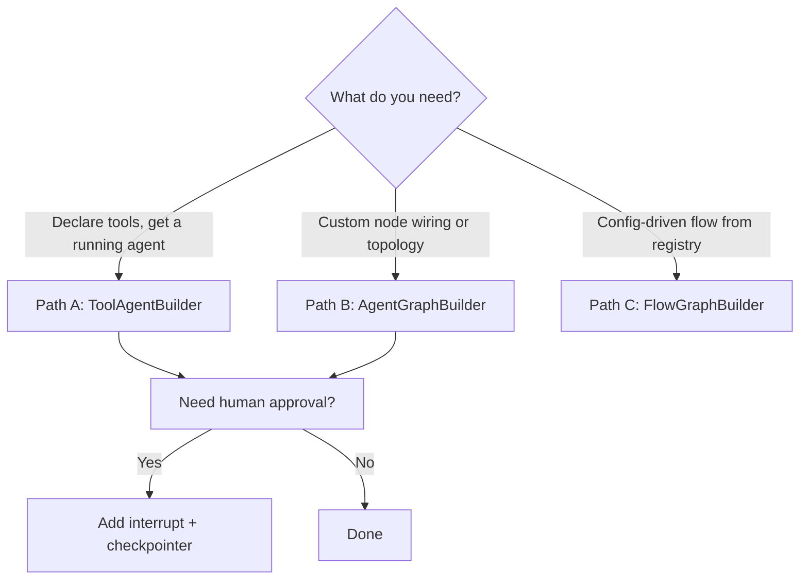
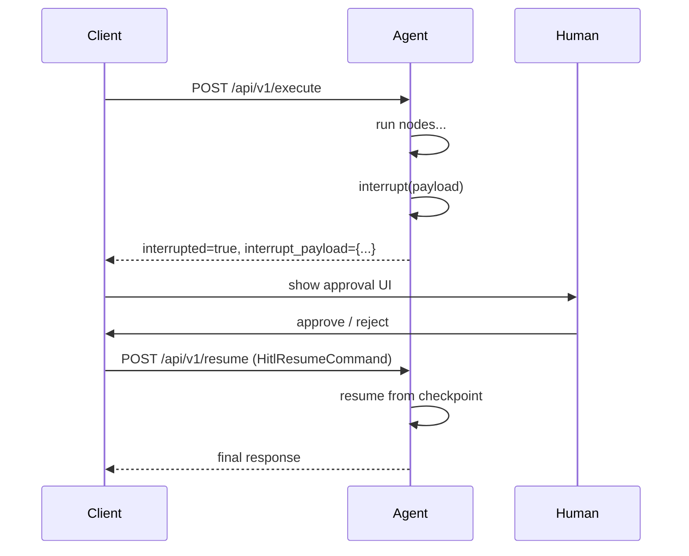

# 03 — Building Agents

[← Docs home](../README.md) | [SDK root](../../README.md)

---

## Contents

- [Choose your builder path](#choose-your-builder-path)
- [Path A — ToolAgentBuilder](#path-a--toolagentbuilder)
- [Path B — AgentGraphBuilder](#path-b--agentgraphbuilder)
- [Path C — FlowGraphBuilder](#path-c--flowgraphbuilder)
- [HITL — Human-in-the-Loop](#hitl)
- [Subgraphs](#subgraphs)
- [Clean-Architecture Tutorial](#clean-architecture-tutorial)

### Dedicated architecture guides

| Guide | What it covers |
|---|---|
| [clean-architecture-tutorial.md](clean-architecture-tutorial.md) | End-to-end walk-through: what each layer does, workflow automation examples, composition root |
| [layer-by-layer-guide.md](layer-by-layer-guide.md) | Layer 1–4 rules, SDK symbols, dependency table |
| [agent-project-template.md](agent-project-template.md) | Copy-paste project scaffold and bootstrap pattern |
| [architecture-rules-and-anti-patterns.md](architecture-rules-and-anti-patterns.md) | What belongs where, common mistakes, enforcement checklist |
| [dependency-injection-cookbook.md](dependency-injection-cookbook.md) | Custom LLM, logger/monitor, database client, and `local_tools` recipes |

---

## Choose Your Builder Path



| I want to… | Builder |
|---|---|
| Declare tools, skip graph code | `ToolAgentBuilder` |
| Wire nodes manually, add conditional edges | `AgentGraphBuilder` |
| Define a flow in configuration | `FlowGraphBuilder` |
| Embed one graph inside another | `AgentGraphBuilder.add_subgraph()` |
| Add human approval before a node | Any builder + `interrupt()` |

---

## Path A — ToolAgentBuilder

The simplest path. You declare tools; the SDK creates the tool-calling loop.

```python
from agent_sdk import ToolAgentBuilder, make_openai_service, run_agent, tool

@tool
def lookup_order(order_id: str) -> dict:
    """Look up an order by ID."""
    return {"order_id": order_id, "status": "SHIPPED"}

builder = ToolAgentBuilder(
    llm_service=make_openai_service(),
    tools=[lookup_order],
    system_prompt="You are an order management assistant.",
)
run_agent(agent_graph=builder.compile())
```

### Pre/post nodes

Inject middleware before or after the tool loop:

```python
from agent_sdk import input_guard_node, output_guard_node

builder = ToolAgentBuilder(
    llm_service=make_openai_service(),
    tools=[lookup_order],
    system_prompt="...",
    pre_nodes=[("input_guard", input_guard_node)],
    post_nodes=[("output_guard", output_guard_node)],
)
```

Full API: [builders.md](../04-features/builders.md)

---

## Path B — AgentGraphBuilder

For agents that need custom node wiring, conditional edges, or complex topologies.

```python
from agent_sdk import AgentGraphBuilder, AgentBaseState, run_agent, build_app_container

class MyState(AgentBaseState, total=False):
    enriched_data: dict

async def enrich_node(state: MyState, deps: dict) -> dict:
    db = deps["db"]
    data = await db.fetch(state["parameters"].get("id"))
    return {"enriched_data": data}

async def process_node(state: MyState, deps: dict) -> dict:
    result = f"Processed: {state['enriched_data']}"
    return {"agent_result": result}

builder = AgentGraphBuilder(state_schema=MyState, deps={})
builder.add_node("enrich", enrich_node)
builder.add_node("process", process_node)
builder.add_edge("enrich", "process")
builder.set_entry_point("enrich")
graph = builder.compile()

container = build_app_container(agent_graph=graph, extra_dependencies={"db": my_db})
```

### Conditional edges

```python
def route(state: MyState) -> str:
    return "process" if state.get("enriched_data") else "error"

builder.add_conditional_edges("enrich", route, {"process": "process", "error": "error_node"})
```

### add_node_if

Add a node to the graph conditionally (only when a feature flag or config condition is met):

```python
builder.add_node_if(condition=settings.enable_enrichment, name="enrich", fn=enrich_node)
```

### add_mapped_subgraph

Fan out over a list of items, running a subgraph for each:

```python
builder.add_mapped_subgraph(name="per_item", subgraph=item_graph, input_key="items")
```

Full API: [builders.md](../04-features/builders.md)

---

## Path C — FlowGraphBuilder

For config-driven agents whose topology is defined at runtime from a registry.

```python
from agent_sdk import FlowGraphBuilder, build_app_container

flow_builder = FlowGraphBuilder(registry=my_registry, deps={}, checkpointer=my_checkpointer)
graph = flow_builder.build(flow_config=my_flow_config)
container = build_app_container(agent_graph=graph)
```

Full API: [builders.md](../04-features/builders.md)

---

## HITL — Human-in-the-Loop {#hitl}

HITL lets the agent pause mid-run and wait for human input before continuing.



### Requirements

1. Graph must be compiled with a checkpointer.
2. `build_app_container` must receive `agent_graph` so `ResumeAgentUseCase` is wired.

### Minimal HITL example

```python
from agent_sdk import (
    AgentGraphBuilder, AgentBaseState, interrupt,
    InterruptType, HitlInterruptPayload,
    build_app_container, run_agent,
)
from langgraph.checkpoint.memory import MemorySaver

class ApprovalState(AgentBaseState, total=False):
    approval_result: str

async def request_approval_node(state: ApprovalState, deps: dict) -> dict:
    interrupt(HitlInterruptPayload(
        interrupt_type=InterruptType.GENERIC,
        data={"message": "Please approve this action"},
    ))
    return {}

async def execute_action_node(state: ApprovalState, deps: dict) -> dict:
    return {"agent_result": "Action executed after approval"}

checkpointer = MemorySaver()
builder = AgentGraphBuilder(state_schema=ApprovalState, deps={})
builder.add_node("request_approval", request_approval_node)
builder.add_node("execute_action", execute_action_node)
builder.add_edge("request_approval", "execute_action")
builder.set_entry_point("request_approval")
graph = builder.compile(checkpointer=checkpointer)

container = build_app_container(agent_graph=graph)
```

Full guide: [04-features/hitl.md](../04-features/hitl.md)

---

## Subgraphs

Embed a compiled subgraph as a node inside a parent graph:

```python
# Build and compile the subgraph
sub_builder = AgentGraphBuilder(state_schema=MyState, deps={})
sub_builder.add_node("step_a", step_a_node)
sub_builder.add_node("step_b", step_b_node)
sub_builder.add_edge("step_a", "step_b")
sub_builder.set_entry_point("step_a")
subgraph = sub_builder.compile()

# Embed in parent
parent_builder = AgentGraphBuilder(state_schema=MyState, deps={})
parent_builder.add_subgraph("my_subgraph", subgraph)
parent_builder.add_node("after", after_node)
parent_builder.add_edge("my_subgraph", "after")
parent_builder.set_entry_point("my_subgraph")
graph = parent_builder.compile()
```

See: `examples/subgraph_example.py`

---

## Clean-Architecture Tutorial

This tutorial walks through building a production-quality agent using the SDK's clean architecture pattern. It uses three generic workflow automation agents as examples: `request-planner-agent`, `task-executor-agent`, and `workflow-coordinator-agent`.

### Recommended project structure

```
my-agent/
├── app/
│   ├── layer1_domain/
│   │   └── state.py          # AgentBaseState subclass — data only
│   ├── layer2_application/
│   │   ├── nodes.py          # Graph node functions — (state, deps) -> update
│   │   └── services.py       # Business logic, Protocol ports
│   ├── layer3_adapters/      # Usually empty; only for custom routes/presenters
│   └── layer4_frameworks/
│       ├── config/           # Pydantic settings
│       └── graph/
│           └── my_graph.py   # build_graph() using a builder
├── bootstrap.py              # Composition root — wire DI container
├── main.py                   # Entry point — calls run_agent
└── .env
```

### Layer 1 — Domain: state only

```python
# app/layer1_domain/state.py
from agent_sdk import AgentBaseState

class WorkflowState(AgentBaseState, total=False):
    workflow_id: str
    steps_completed: list[str]
    result_payload: dict
```

No imports from LangGraph, LangChain, FastAPI, or any external framework. This layer is pure Python.

### Layer 2 — Application: nodes and business logic

```python
# app/layer2_application/nodes.py
from app.layer1_domain.state import WorkflowState

async def validate_input_node(state: WorkflowState, deps: dict) -> dict:
    logger = deps["logger"]
    if not state.get("parameters", {}).get("workflow_id"):
        return {"error": "workflow_id is required", "error_code": "WF_001"}
    logger.info("Input validated", workflow_id=state["parameters"]["workflow_id"])
    return {"workflow_id": state["parameters"]["workflow_id"]}

async def execute_workflow_node(state: WorkflowState, deps: dict) -> dict:
    workflow_service = deps["workflow_service"]
    result = await workflow_service.execute(state["workflow_id"])
    return {"result_payload": result, "steps_completed": ["execute"]}
```

Nodes receive `deps` — the DI container dict. They never import framework packages directly.

### Layer 4 — Frameworks: graph wiring

```python
# app/layer4_frameworks/graph/my_graph.py
from agent_sdk import AgentGraphBuilder
from app.layer1_domain.state import WorkflowState
from app.layer2_application.nodes import validate_input_node, execute_workflow_node

def build_graph(deps: dict):
    builder = AgentGraphBuilder(state_schema=WorkflowState, deps=deps)
    builder.add_node("validate", validate_input_node)
    builder.add_node("execute", execute_workflow_node)
    builder.add_edge("validate", "execute")
    builder.set_entry_point("validate")
    return builder.compile()
```

### Composition root: bootstrap.py

```python
# bootstrap.py
from agent_sdk import build_app_container
from app.layer4_frameworks.graph.my_graph import build_graph
from my_module import WorkflowService

def create_container():
    workflow_service = WorkflowService()
    graph = build_graph(deps={"workflow_service": workflow_service})
    return build_app_container(
        agent_graph=graph,
        extra_dependencies={"workflow_service": workflow_service},
    )
```

### Entry point: main.py

```python
# main.py
from agent_sdk import run_agent
from bootstrap import create_container

if __name__ == "__main__":
    container = create_container()
    run_agent(agent_graph=container["agent_graph"])
```

### Why this structure?

- **Layer 2 nodes are plain Python functions** — test them without spinning up LangGraph or FastAPI.
- **Layer 4 is the only place that imports LangGraph** — if you switch graph libraries, only Layer 4 changes.
- **`bootstrap.py` is the only place where dependencies are wired** — easy to swap implementations for tests.
- **Supervisor pattern**: For multi-agent supervisors, the supervisor's application layer uses a `Protocol` port for calling sub-agents. The Layer 4 delegate implements the protocol using `AgentCallCoordinator`. This boundary keeps the business logic framework-free.

---

## Next Steps

- [Features](../04-features/README.md) — add checkpointing, remote agents, context budget
- [Features → Builders](../04-features/builders.md) — full builder API reference
- [Features → HITL](../04-features/hitl.md) — HITL patterns in depth
- [Building Agents → Clean Architecture Tutorial](clean-architecture-tutorial.md) — layer rules, module map, DI container keys

---

[← Docs home](../README.md) | [SDK root](../../README.md)
