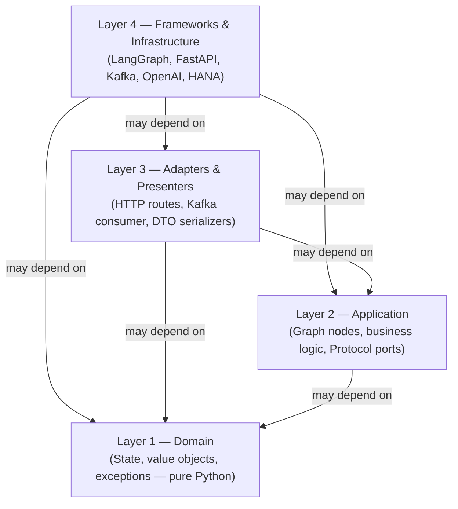
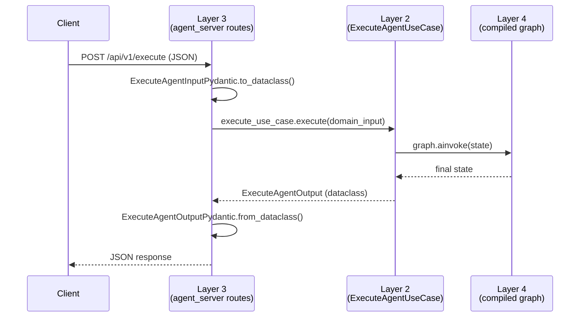
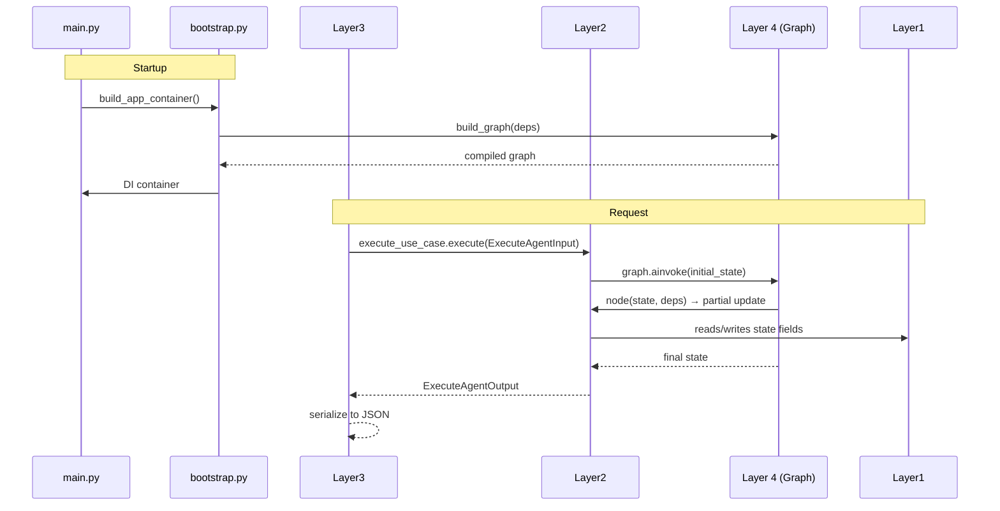

# Clean-Architecture Tutorial for Agent SDK

[← Building Agents](README.md) | [Layer-by-Layer Guide →](layer-by-layer-guide.md)

---

This tutorial walks through the four-layer clean-architecture pattern used by every agent built on the SDK. Each rule is grounded in a concrete example drawn from three generic workflow automation agents: `request-planner-agent`, `task-executor-agent`, and `workflow-coordinator-agent`. You can find runnable public examples under `apps/backend/agent/agent-sdk/examples/`.

> **New here?** If you just want a project scaffold to copy, go to [agent-project-template.md](agent-project-template.md). Come back here when you want to understand *why* the template looks the way it does.

---

## Why four layers?

The SDK enforces a strict, one-directional dependency rule:



**The dependency arrow never points inward.** Layer 1 does not know Layer 2 exists; Layer 2 does not know FastAPI exists.

This gives you three concrete benefits:

1. **Testable nodes** — because Layer 2 nodes are plain Python functions, you can call them in a unit test without starting a server or connecting to a broker.
2. **Swappable infrastructure** — if you replace LangGraph with a different orchestrator, you only touch Layer 4. The nodes in Layer 2 are unchanged.
3. **Explicit wiring** — all dependencies are assembled once in `bootstrap.py` and injected through `deps`. There are no hidden globals.

---

## What is a 'dependency'?

A dependency is any external resource or service your application logic needs but shouldn't create itself. Examples include:

- **LLM services** — e.g. `OpenAIService` that wraps the OpenAI client
- **Configuration** — e.g. `settings` loaded from environment variables
- **External tools / agents** — e.g. `delegates` that call downstream agents
- **Infrastructure** — e.g. `checkpointer` for LangGraph state persistence

**Why does this matter?**

- **Decoupling** — Layer 2 defines *what* it needs (a `Protocol` or abstract type), not *how* it is implemented. You can swap the real `OpenAIService` for a stub without touching a single node.
- **Testability** — because dependencies are passed in, unit tests can inject fakes or mocks. No HTTP calls, no database writes, no side effects.

**Dependency Rule of Thumb**: If you need to import a third-party package (like `httpx`, `openai`, or `langgraph`) to use it, it's a dependency that belongs in Layer 4 and should be injected into Layer 2.

> **Note:** Pydantic is a special case: it is allowed in Layer 3 for DTOs, but should otherwise stay in Layer 4.

---

## The five structural pieces

Every agent produced with the SDK has exactly five structural pieces:

| Piece | File | Role |
|---|---|---|
| State | `app/layer1_domain/state.py` | Data only — defines what the graph carries |
| Nodes | `app/layer2_application/nodes.py` | Business logic — plain functions, no frameworks |
| Graph assembly | `app/layer4_frameworks/graph/` | Wires nodes into a compiled LangGraph |
| Composition root | `bootstrap.py` | Builds the DI container; the only place deps are wired |
| Entry point | `main.py` | Calls `create_agent_app(container)` and exits |

Layer 3 is covered by the SDK's built-in adapters and is usually an empty directory in agent projects. The tutorial explains when a project adds its own Layer 3 code.

---

## Layer 1 — Domain: state and nothing else

Layer 1 holds your agent's graph state — and only that.

**Rule:** Layer 1 files may import from the Python standard library and from `agent_sdk.layer1_domain`. No other imports are allowed.

```python
# app/layer1_domain/state.py (planner agent)
from agent_sdk import AgentBaseState

class RequestPlannerState(AgentBaseState, total=False):
    documented_nodes: dict
    workflow_plan: dict
    missing_inputs: list[str]
    validation_errors: list[str]
    planner_notes: str
```

`AgentBaseState` is itself a `TypedDict` that provides the transport-level fields every agent needs (`message`, `session_id`, `formatted_response`, etc.). You extend it with fields specific to your agent.

**What belongs in Layer 1:**
- State type definition (extend `AgentBaseState` or `ToolAgentState`)
- Domain value objects and enums
- Custom exception classes

**What does NOT belong in Layer 1:**
- LangGraph, LangChain, FastAPI, httpx, pydantic-settings — any external package
- Business logic of any kind
- Imports from Layers 2, 3, or 4

---

## Layer 2 — Application: nodes and business logic

Layer 2 is where your agent's intelligence lives. Graph nodes are the primary entry point, but Layer 2 also holds helper functions, validation logic, formatting helpers, and Protocol ports for services the application needs.

**Rule:** Layer 2 may import from Layer 1 and from interfaces declared in the same layer. It must never import from Layer 3, Layer 4, or any framework package (LangGraph, httpx, pydantic, etc.).

### Node signature

Every node follows the same contract:

```python
def my_node(state: dict, deps: dict) -> dict:
    ...
```

Or its async equivalent. The function receives the current graph state and the dependency map, and returns a *partial state update* — a dict containing only the keys that changed.

### Planner agent example

```python
# request-planner-agent: app/layer2_application/nodes.py

def load_catalog_node(state: dict, deps: dict) -> dict:
    catalog_dir = Path(deps["catalog_dir"])
    load_catalog = deps["load_catalog"]
    catalog = load_catalog(catalog_dir)
    return {"documented_nodes": catalog}   # partial update — only what changed

async def build_plan_node(state: dict, deps: dict) -> dict:
    svc = deps.get("openai_service")
    catalog = state.get("documented_nodes", {})
    workflow_request = state.get("message", "")
    result = await run_planner(workflow_request, catalog, svc)
    return {
        "workflow_plan": result.get("plan", {}),
        "missing_inputs": result.get("missing_inputs", []),
        "planner_notes": result.get("planner_notes", ""),
    }

def format_builder_response(state: dict, deps: dict) -> dict:
    missing = state.get("missing_inputs", [])
    validation_errors = state.get("validation_errors", [])
    status = "needs_input" if (missing or validation_errors) else "plan_ready"
    agent_result = {
        "content": f"Workflow plan status: {status}",
        "status": status,
        "missing_inputs": missing or validation_errors,
        "plan": state.get("workflow_plan", {}),
    }
    return {"agent_result": agent_result}
```

Notice:
- No LangGraph import anywhere in this file
- `deps["openai_service"]` is injected — the node does not create it
- Each node returns only the keys it updates

### Executor agent — validation and formatting helpers

The executor agent shows that Layer 2 can also contain pure helper functions that are not nodes:

```python
# task-executor-agent: app/layer2_application/nodes.py

def format_agent_response(
    validation_errors: list[str],
    workflow_schema: dict | None,
    missing_inputs: list[str],
) -> dict:
    if missing_inputs:
        return {"status": "needs_input", "missing_inputs": missing_inputs, ...}
    if validation_errors:
        return {"status": "validation_failed", "validation_errors": validation_errors, ...}
    return {"status": "workflow_ready", "workflow_schema": workflow_schema, ...}

def format_response_node(state: dict, deps: dict) -> dict:
    result = format_agent_response(
        validation_errors=state.get("validation_errors") or [],
        workflow_schema=state.get("workflow_schema"),
        missing_inputs=state.get("missing_inputs") or [],
    )
    return {"agent_result": result}
```

`format_agent_response` is a pure Python function. It takes primitives, returns a dict. No state, no deps, no framework. This makes it trivially testable.

### Coordinator agent — Protocol ports

For agents that call external services (such as other agents), Layer 2 declares a *Protocol* that describes the interface without naming the concrete implementation:

```python
# workflow-coordinator-agent: app/layer2_application/ports.py
from typing import Any, Dict, Protocol, runtime_checkable

@runtime_checkable
class SubAgentDelegate(Protocol):
    async def call(self, payload: Dict[str, Any]) -> Any: ...
```

The node depends on this Protocol:

```python
async def call_builder_node(state: dict, deps: dict) -> dict:
    delegate: SubAgentDelegate = deps["builder_delegate"]
    payload = build_builder_request(state)
    response = await delegate.call(payload)
    return {"builder_response": response}
```

The concrete implementation of `SubAgentDelegate` lives in Layer 4 — the node never imports it.

---

## Layer 3 — Adapters and Presenters: mostly SDK-owned

Layer 3 is the translation layer between the outside world and your application. It maps HTTP requests into `ExecuteAgentInput` dataclasses, calls use-cases, and serializes `ExecuteAgentOutput` back into HTTP responses.

**For most agent projects, Layer 3 is empty.** The SDK provides two complete adapters:

| Adapter | Transport | What it does |
|---|---|---|
| `agent_server` (SERVER mode) | HTTP (FastAPI) | Exposes `/api/v1/execute`, `/api/v1/resume`, `/api/v1/info` |
| `agent_consumer` (CONSUMER mode) | Kafka / EventMesh | Consumes messages, calls `execute_agent`, publishes reply |

### How the SDK's SERVER adapter works



The route handler in `agent_sdk/layer3_adapters/presenters/agent_server/v1/routes.py` follows a strict pattern:

```python
@router.post("/execute", response_model=ExecuteAgentOutputPydantic)
async def execute(payload: ExecuteAgentInputPydantic):
    domain_input = payload.to_dataclass(ExecuteAgentInput)   # DTO → domain object
    domain_output = await exec_uc.execute(domain_input)       # call use case
    return ExecuteAgentOutputPydantic.from_dataclass(domain_output)  # domain → DTO
```

This is the DTO-to-use-case translation pattern. If you write a custom Layer 3 route, follow the same structure.

### When to add custom Layer 3 code

You only need to add code in `app/layer3_adapters/` if:

1. You need a **custom HTTP endpoint** that isn't covered by `/execute` / `/resume` / `/info` (e.g., a webhook receiver from a third-party system).
2. You need a **custom output presenter** that transforms the response payload beyond what the standard `formatted_response` structure provides (e.g., streaming SSE, binary serialization).

If neither applies, leave `app/layer3_adapters/` empty or omit it.

**What belongs in Layer 3:**
- Pydantic DTOs (request/response models for your custom endpoints)
- Custom route handlers that call Layer 2 use cases
- Output formatters / serializers for non-standard transports

**What does NOT belong in Layer 3:**
- Business logic (belongs in Layer 2)
- Database clients, LangGraph builders (belongs in Layer 4)
- State type definitions (belongs in Layer 1)

---

## Layer 4 — Frameworks and Infrastructure: graph assembly and concrete implementations

Layer 4 is where LangGraph, OpenAI, Kafka, HANA, and httpx are used. It is the only layer permitted to import external packages.

**Your main Layer 4 task is graph assembly** — wiring your Layer 2 nodes into a compiled LangGraph using one of the SDK builders.

### Planner agent example

```python
# request-planner-agent: app/layer4_frameworks/graph/planner_graph.py
from agent_sdk import AgentGraphBuilder
from app.layer1_domain.state import RequestPlannerState
from app.layer2_application.nodes import (
    build_plan_node, format_planner_response,
    load_catalog_node, validate_plan_node,
)

def build_planner_graph(openai_service=None, catalog_dir=None):
    deps = {"catalog_dir": Path(catalog_dir), "load_catalog": load_catalog}
    if openai_service is not None:
        deps["openai_service"] = openai_service

    builder = AgentGraphBuilder(deps=deps, state_schema=RequestPlannerState)
    builder.add_node("load_catalog", load_catalog_node)
    builder.add_node("build_plan", build_plan_node)
    builder.add_node("validate_plan", validate_plan_node)
    builder.add_node("format_response", format_planner_response)
    builder.set_entry_point("load_catalog")
    builder.add_edge("load_catalog", "build_plan")
    builder.add_edge("build_plan", "validate_plan")
    builder.add_edge("validate_plan", "format_response")
    return builder.compile()
```

The graph factory function accepts dependencies as arguments, not as globals. This makes it easy to swap `openai_service` for a stub in tests.

### Executor agent — deps-based factory

The executor agent uses a slightly different pattern: it accepts a full `deps` dict and merges defaults, so callers do not need to know which keys are required:

```python
# task-executor-agent: app/layer4_frameworks/graph/executor_graph.py
def build_executor_graph(deps=None):
    deps = deps or {}
    if "load_catalog" not in deps:
        deps["load_catalog"] = load_catalog  # inject default

    builder = AgentGraphBuilder(deps=deps, state_schema=TaskExecutorState)
    (builder
        .add_node("load_catalog", load_catalog_node)
        .add_node("generate_schema", generate_schema_node)
        .add_node("validate_schema", validate_schema_node)
        .add_node("format_response", format_response_node)
        .set_entry_point("load_catalog")
        .add_edge("load_catalog", "generate_schema")
        .add_edge("generate_schema", "validate_schema")
        .add_edge("validate_schema", "format_response")
    )
    return builder.compile()
```

The method-chaining style is equivalent to calling each method separately — choose whichever reads more clearly.

### Coordinator agent — delegate implementation

The coordinator's `SubAgentDelegate` Protocol (declared in Layer 2) is implemented in Layer 4:

```python
# workflow-coordinator-agent: app/layer4_frameworks/delegates/remote_agent_delegate.py
class RemoteAgentDelegate:
    def __init__(self, tool) -> None:
        self._tool = tool

    async def call(self, payload: dict) -> Any:
        return await self._tool.ainvoke(payload)
```

`RemoteAgentDelegate` satisfies `SubAgentDelegate` because it implements `async def call(self, payload)`. The Protocol check is structural — no import of the Protocol class is needed in the delegate file.

### Configuration: `agent_sdk.Settings`

Every agent project must define a `Settings` class in Layer 4 that **subclasses** `agent_sdk.Settings`. Subclassing is mandatory — it inherits the SDK-wide configuration fields for HANA, OpenAI, Broker, and other infrastructure, ensuring all SDK components are correctly initialised.

```python
# app/layer4_frameworks/config/app_config.py
from agent_sdk import Settings as _BaseSettings

class Settings(_BaseSettings):
    CUSTOM_TIMEOUT: int = 30

settings = Settings()
```

The `as _BaseSettings` alias avoids a name collision — without it, `class Settings(Settings)` would reference itself. It also prevents shadowing the module-level `settings` singleton created at the bottom of the file.

Add any project-specific environment variables as typed fields on your `Settings` subclass. `pydantic-settings` will populate them from the environment (or a `.env` file) automatically.

---

## Clean Architecture in Practice: The Dependency Flow

The following two examples show the full end-to-end wiring for the most common extension points.

### Example 1 — Adding a custom service

**1. Declare the Protocol in Layer 2:**

```python
# app/layer2_application/ports.py
from typing import Protocol

class CustomService(Protocol):
    def process(self, data: dict) -> dict: ...
```

**2. Implement the concrete class in Layer 4:**

```python
# app/layer4_frameworks/delegates/custom_service.py
class ConcreteCustomService:
    def process(self, data: dict) -> dict:
        return {**data, "processed": True}
```

**3. Consume the service via the `deps` dictionary in Layer 2:**

```python
# app/layer2_application/nodes.py
from app.layer2_application.ports import CustomService

def my_node(state, deps):
    svc: CustomService = deps["custom_service"]
    return svc.process(state["payload"])
```

Wire `ConcreteCustomService` into `deps` inside `bootstrap.py` (see next section).

---

### Example 2 — Consuming a custom config parameter

**1. Add the field to `Settings` in Layer 4:**

```python
# app/layer4_frameworks/config/app_config.py
from agent_sdk import Settings as _BaseSettings

class Settings(_BaseSettings):
    CUSTOM_TIMEOUT: int = 30

settings = Settings()
```

**2. Pass the value as a primitive in `bootstrap.py`:**

```python
# bootstrap.py
from app.layer4_frameworks.config.app_config import settings

def build_app_container() -> dict:
    deps = {"timeout": settings.CUSTOM_TIMEOUT}
    ...
```

**3. Receive the primitive in Layer 2:**

```python
# app/layer2_application/nodes.py
def my_node(state, deps):
    timeout = deps["timeout"]
    ...
```

Layer 2 never imports `settings`. It receives values as primitives from the `deps` dictionary.

---

## The composition root: `bootstrap.py`

`bootstrap.py` is the one place in the codebase that is *allowed* to import from all layers simultaneously. Its job is to build the DI container by:

1. Creating infrastructure objects (registry, checkpointer, delegates).
2. Calling the graph factory with those objects.
3. Passing the graph and extra dependencies to `build_app_container`.

```python
# workflow-coordinator-agent: bootstrap.py
from agent_sdk import build_app_container as _sdk_build_app_container
from agent_sdk import create_checkpointer, HttpAgentRegistry
from app.layer4_frameworks.config.app_config import settings
from app.layer4_frameworks.graph.coordinator_graph import build_coordinator_graph

def build_app_container() -> dict:
    registry = HttpAgentRegistry()
    planner_agent_type = "request-planner"
    executor_agent_type = "task-executor"
    planner_delegate = _build_remote_agent_delegate(planner_agent_type, registry)
    executor_delegate = _build_remote_agent_delegate(executor_agent_type, registry)
    checkpointer = create_checkpointer(settings)

    deps = {
        "custom_service": planner_delegate,
        "timeout": settings.CUSTOM_TIMEOUT,
    }

    graph = build_coordinator_graph(
        planner_delegate=planner_delegate,
        executor_delegate=executor_delegate,
        checkpointer=checkpointer,
    )

    return _sdk_build_app_container(
        agent_graph=graph,
        extra_dependencies={"settings": settings, **deps},
    )
```

The resulting container dict contains the compiled graph, all injected dependencies, and the auto-discovered use cases (`execute_agent`, `resume_agent`, `get_agent_info`).

**Rules for `bootstrap.py`:**
- The only file that imports from every layer simultaneously
- Never called from inside the `app/` package
- Must not contain business logic — only wiring

> For a full reference on what you can pass in `extra_dependencies` and how to access it in nodes, see [dependency-injection-cookbook.md](dependency-injection-cookbook.md).

---

## The entry point: `main.py`

`main.py` is as thin as possible. It delegates everything to `bootstrap.py` and the SDK runner:

```python
# Standard SERVER mode main.py pattern (see examples/echo_agent/main.py for a full runnable example)
import uvicorn
from bootstrap import build_app_container
from app.layer4_frameworks.config.app_config import settings

def create_app():
    from agent_sdk import create_agent_app
    container = build_app_container()
    return create_agent_app(container)

app = create_app()

if __name__ == "__main__":
    uvicorn.run("main:app", host="0.0.0.0", port=settings.SERVER_PORT, reload=True)
```

`create_agent_app(container)` assembles the FastAPI application from the container. For CONSUMER mode agents, set `APP_MODE=CONSUMER` and call `run_agent()` — it will call `run_consumer_agent(container)` automatically. You may also call `run_consumer_agent(container)` directly if you have already built the container yourself.

**Rules for `main.py`:**
- Must not contain any business logic
- Must not build the graph or instantiate services
- Calls only `build_app_container()` and `create_agent_app()` / `run_agent()`
- For CONSUMER mode: set `APP_MODE=CONSUMER` and use `run_agent()`, or call `run_consumer_agent(container)` directly

---

## Putting it all together: the request lifecycle



---

## Next steps

| What to read next | Why |
|---|---|
| [layer-by-layer-guide.md](layer-by-layer-guide.md) | Full SDK symbol map, import rules table, and all available hooks per layer |
| [agent-project-template.md](agent-project-template.md) | Copy-paste scaffold for a new agent project |
| [architecture-rules-and-anti-patterns.md](architecture-rules-and-anti-patterns.md) | Common mistakes and how to spot them in code review |
| [04-features/README.md](../04-features/README.md) | Add checkpointing, HITL, remote-agent calls, and workflow events |

---

[← Building Agents](README.md) | [Layer-by-Layer Guide →](layer-by-layer-guide.md)
