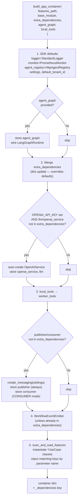

# DI Cookbook — Customising the Dependency Injection Container

[← Building Agents](README.md) | [Docs home](../README.md)

## When to use this page

Read this when you need to swap out a default dependency (LLM, logger, database) or inject a new one into your agent's use cases and graph nodes. It covers how `build_app_container` works, and provides copy-paste recipes for the three most common customisations.

---

## Container Assembly Flow



---

## `build_app_container` signature

```python
from agent_sdk import build_app_container

container = build_app_container(
    features_path=None,          # path to extra feature packages (optional)
    base_module=None,            # base import path for features_path (optional)
    extra_dependencies=None,     # dict[str, Any] — override or augment defaults
    agent_graph=None,            # compiled LangGraph graph (optional)
    local_tools=None,            # list of @tool callables (optional)
)
```

### The `extra_dependencies` contract

`extra_dependencies` is a `dict[str, Any]`. Each key is the exact name the SDK (or your use-case constructors) use to look up the dependency.

| Key | Expected interface | Default |
|---|---|---|
| `logger` | `ILogger` | `StandardLogger` |
| `monitor` | `IMonitor` | `PrometheusMonitor` |
| `agent_registry` | `IAgentRegistry` | `HttpAgentRegistry` |
| `llm` | LangChain `BaseChatModel` | `ChatOpenAI` (if `OPENAI_API_KEY` set) |
| `openai_service` | `ILLMService` | `OpenAIService` (if `OPENAI_API_KEY` set) |
| `publisher` | `IMessagePublisher` | Selected by `MESSAGING_MODE` |
| `consumer` | `IMessageConsumer` | Selected by `MESSAGING_MODE` |
| `shared_state_repository` | `ISharedStateRepository` | `HanaSharedStateRepository` when HANA is configured; otherwise absent |
| `agent_delegator` | `IAgentDelegator` | `AsyncAgentDelegator` when queue publishing + registry metadata are available |
| `message_reaction_router` | queue reaction router | `MessageReactionRouter` in CONSUMER mode |
| `push_gateway_notifier` | push notifier | `ConsolePushGatewayNotifier` (mock) / `HttpPushGatewayNotifier` (if `PUSH_GATEWAY_URL`) / no-op |
| `workflow_event_emitter` | `IWorkflowEventEmitter` | `WorkflowEventEmitter(publisher, logger, push_gateway_notifier)` |
| `input_guard` | `IInputGuard` | *(absent — guard disabled)* |
| `output_guard` | `IOutputGuard` | *(absent — guard disabled)* |
| *(any custom key)* | any object | *(absent — use-case receives it if parameter name matches)* |

To override a default, pass the replacement under the same key. To inject a new dependency, add a new key — your use-case `__init__` receives it automatically if the parameter name matches.

### Queue-first dependency notes

- `agent_registry` is still the canonical bootstrap key. Queue-native delegation, registration discovery, and HTTP compatibility helpers all expect that name.
- `shared_state_repository` is optional but recommended for queue-first agents that need cross-message continuity or parent/sub-agent state exchange.
- `message_reaction_router` owns queue envelope dispatch (`execute`, `resume`, orchestration events, and custom handlers). Keep broker-specific subscription code out of agent nodes.

---

## Recipe 1: Custom LLM (Azure OpenAI)

```python
from __future__ import annotations
from typing import Any, Optional
from langchain_openai import AzureChatOpenAI
from openai import AsyncAzureOpenAI
from agent_sdk import build_app_container


class AzureOpenAIService:
    def __init__(
        self,
        azure_endpoint: str,
        api_key: str,
        api_version: str = "2024-02-01",
        deployment_name: str = "gpt-4o",
        temperature: float = 0.01,
    ) -> None:
        self._azure_endpoint = azure_endpoint
        self._api_key = api_key
        self._api_version = api_version
        self._deployment_name = deployment_name
        self._temperature = temperature
        self._async_client: Optional[AsyncAzureOpenAI] = None
        self._chat_client: Optional[AzureChatOpenAI] = None

    def _get_async_client(self) -> AsyncAzureOpenAI:
        if self._async_client is None:
            self._async_client = AsyncAzureOpenAI(
                azure_endpoint=self._azure_endpoint,
                api_key=self._api_key,
                api_version=self._api_version,
            )
        return self._async_client

    async def get_chat_completion(self, system_prompt, user_prompt, json_mode=True, repeat_user_prompt=None):
        client = self._get_async_client()
        messages = [
            {"role": "system", "content": system_prompt},
            {"role": "user", "content": user_prompt},
        ]
        response = await client.chat.completions.create(
            model=self._deployment_name,
            temperature=self._temperature,
            messages=messages,
            response_format={"type": "json_object"} if json_mode else None,
        )
        return response.choices[0].message.content

    def get_chat_client(self) -> AzureChatOpenAI:
        if self._chat_client is None:
            self._chat_client = AzureChatOpenAI(
                azure_endpoint=self._azure_endpoint,
                api_key=self._api_key,
                api_version=self._api_version,
                azure_deployment=self._deployment_name,
                temperature=self._temperature,
            )
        return self._chat_client


azure_service = AzureOpenAIService(
    azure_endpoint="https://my-resource.openai.azure.com/",
    api_key="...",
    deployment_name="gpt-4o",
)

container = build_app_container(
    agent_graph=graph,
    extra_dependencies={
        "openai_service": azure_service,
        "llm": azure_service.get_chat_client(),
    },
)
```

**Why both `openai_service` and `llm`?** `openai_service` is for use cases or nodes that call `OpenAIService.get_chat_completion(...)` directly. That convenience method is additive on the SDK's `OpenAIService`; it is not part of the required `ILLMService` contract. `llm` remains the raw LangChain `BaseChatModel` injected into `ToolAgentBuilder` and other tool-calling flows. Providing both prevents the SDK from auto-creating an `OpenAIService` while keeping the standard tool-calling path unchanged.

---

## Recipe 2: Custom Logger / Monitor

### Structured JSON logger

```python
import json, sys
from datetime import datetime, timezone
from agent_sdk import build_app_container


class JsonLogger:
    def __init__(self, service_name: str = "agent") -> None:
        self._service = service_name

    def _emit(self, level: str, message: str, **kwargs) -> None:
        record = {
            "timestamp": datetime.now(timezone.utc).isoformat(),
            "level": level,
            "service": self._service,
            "message": message,
            **kwargs,
        }
        print(json.dumps(record), file=sys.stdout, flush=True)

    def info(self, message: str, **kwargs) -> None:
        self._emit("INFO", message, **kwargs)

    def error(self, message: str, **kwargs) -> None:
        self._emit("ERROR", message, **kwargs)

    def warning(self, message: str, **kwargs) -> None:
        self._emit("WARNING", message, **kwargs)

    def debug(self, message: str, **kwargs) -> None:
        self._emit("DEBUG", message, **kwargs)


container = build_app_container(
    agent_graph=graph,
    extra_dependencies={"logger": JsonLogger(service_name="my-agent")},
)
```

### Datadog / OpenTelemetry monitor

```python
from agent_sdk import build_app_container


class DatadogMonitor:
    def __init__(self, prefix: str = "agent_sdk") -> None:
        from datadog import initialize, statsd
        initialize()
        self._statsd = statsd
        self._prefix = prefix

    def track(self, metric: str, value: float) -> None:
        self._statsd.gauge(f"{self._prefix}.{metric}", value)


container = build_app_container(
    agent_graph=graph,
    extra_dependencies={"monitor": DatadogMonitor(prefix="my_agent")},
)
```

---

## Recipe 3: Custom Database Client

Inject a database client so your graph nodes can access it without using globals. The key name is arbitrary — it just has to match the parameter name in your use-case or node function.

### SAP HANA example

```python
import hdbcli.dbapi as hana
from agent_sdk import AgentBaseState, AgentGraphBuilder, build_app_container, run_agent


class HanaClient:
    def __init__(self, host: str, port: int, user: str, password: str) -> None:
        self._conn = hana.connect(address=host, port=port, user=user, password=password)

    def fetch_one(self, sql: str, params: tuple = ()) -> dict | None:
        cursor = self._conn.cursor()
        cursor.execute(sql, params)
        row = cursor.fetchone()
        if row is None:
            return None
        cols = [desc[0] for desc in cursor.description]
        return dict(zip(cols, row))


async def lookup_user_node(state: AgentBaseState, deps: dict) -> dict:
    db: HanaClient = deps["db"]
    row = db.fetch_one("SELECT display_name FROM USERS WHERE user_id = ?", (state["user_id"],))
    display_name = row["DISPLAY_NAME"] if row else state["user_id"]
    return {"message": f"Hello, {display_name}! {state['message']}"}


builder = AgentGraphBuilder(state_schema=AgentBaseState, deps={})
builder.add_node("lookup_user", lookup_user_node)
graph = builder.compile()

db_client = HanaClient(host="my-hana-host.example.com", port=443, user="AGENT_USER", password="...")

container = build_app_container(
    agent_graph=graph,
    extra_dependencies={"db": db_client},
)
```

### Resolver-aware graph nodes

`AgentGraphBuilder` now supports three compatible node styles:

- `def node(state)` — raw state only
- `def node(state, deps)` — raw state plus the original dependency dict
- `def node(state, state_resolver, dependency_resolver)` — raw state plus SDK resolver helpers

The builder injects resolver helpers by parameter name, so existing `(state)` and `(state, deps)` nodes keep working unchanged.

```python
from agent_sdk import AgentBaseState, AgentGraphBuilder


def load_customer_node(state: AgentBaseState, state_resolver, dependency_resolver) -> dict:
    db = dependency_resolver.db
    tenant_id = state_resolver.tenant_context.tenant_id if state_resolver.tenant_context else "default"
    metadata = state_resolver.metadata
    uploaded_file_ids = metadata.uploaded_file_ids if metadata else []

    customer = db.fetch_one(
        "SELECT display_name FROM CUSTOMERS WHERE tenant_id = ? AND id = ?",
        (tenant_id, state["user_id"]),
    )
    return {
        "customer_name": customer["DISPLAY_NAME"] if customer else state["user_id"],
        "uploaded_file_ids": uploaded_file_ids,
    }


graph = (
    AgentGraphBuilder(state_schema=AgentBaseState, deps={"db": db_client})
    .add_node("load_customer", load_customer_node)
    .set_entry_point("load_customer")
    .compile()
)
```

### Extending `StateResolver` in a base-agent

The SDK `StateResolver` only knows about SDK-owned fields such as `metadata`, `tenant_context`, `shared_state`, `context_snapshot`, and `uploaded_file_ids`. When a base-agent needs business-specific helpers, subclass the SDK resolver locally and compose those accessors on top of the shared SDK behavior instead of importing base-agent code back into the SDK.

```python
from agent_sdk import StateResolver, ensure_state_resolver


class BaseAgentStateResolver(StateResolver):
    @property
    def plan(self):
        value = self.get("plan")
        if value is None:
            return None
        return PlanDefinition.from_mapping(value)

    @property
    def review_result(self):
        value = self.get("review_result")
        if value is None:
            return None
        return ReviewResult.from_mapping(value)


def ensure_base_agent_state_resolver(state) -> BaseAgentStateResolver:
    base = ensure_state_resolver(state)
    if isinstance(base, BaseAgentStateResolver):
        return base
    return BaseAgentStateResolver(base._value)
```

Use this pattern when the base-agent wants richer business semantics while still reusing the SDK's generic `StateResolver`, `dependency resolver`, and `ensure_definition` helpers.

### Shared-state injection for queue-first agents

Use a shared-state repository when a queue-driven parent agent needs durable state across retries, resumes, or sub-agent hand-offs.

```python
from agent_sdk import (
    AgentBaseState,
    AgentGraphBuilder,
    StateResolver,
    build_app_container,
)


def load_shared_context(state: AgentBaseState, state_resolver: StateResolver, deps: dict) -> dict:
    repository = deps["shared_state_repository"]
    record = repository.load(state_resolver.shared_state_key or "")
    if record is None:
        return {}
    return {
        "shared_state": record.state,
        "shared_state_version": record.version,
    }


container = build_app_container(
    agent_graph=graph,
    extra_dependencies={
        "shared_state_repository": my_repo,
    },
)
```

The SDK auto-wires `HanaSharedStateRepository` when HANA settings are present, but explicit injection remains the preferred override for tests and custom persistence backends.

### Queue-native delegation wiring

When you want queue-native sub-agent calls, inject `agent_delegator` instead of calling `AgentCallCoordinator` directly from node code.

```python
container = build_app_container(
    agent_graph=graph,
    extra_dependencies={
        "agent_registry": registry,
        "publisher": publisher,
    },
)

delegator = container["agent_delegator"]
router = container.get("message_reaction_router")
```

`AsyncAgentDelegator` publishes `agent.request.agent` envelopes using registry queue metadata. `AgentCallCoordinator` remains the compatibility path when you intentionally keep HTTP-based sub-agent execution.

### Using `local_tools` for runtime-loaded tools

`local_tools` is a list of `@tool` callables passed to `build_app_container`. The SDK stores them under the `worker_tools` key in the container, making them available to use cases that accept `worker_tools` in their constructor:

```python
from agent_sdk import tool, build_app_container

@tool
def lookup_catalog(sku: str) -> str:
    """Return product details for a SKU."""
    return f"Product {sku}: $9.99"

container = build_app_container(
    agent_graph=graph,
    local_tools=[lookup_catalog],
)
```

When `tool_registry` is available, the SDK also registers those `local_tools` through `ToolRegistrar` and stores the resulting IDs in `registered_tool_ids` for agent lifecycle registration.

### Registering `@tool` callables for executor services

Use `ToolRegistrar` directly when the caller is not a worker agent and should not inject the tool through `worker_tools`:

```python
from agent_sdk import ToolRegistrar, tool
from agent_sdk.layer4_frameworks.registry import HttpToolRegistry

@tool
def summarize(text: str) -> str:
    """Summarize the given text."""
    return text[:100]

registry = HttpToolRegistry()
registrar = ToolRegistrar(registry)
tool_ids = await registrar.register_tools(
    tools=[summarize],
    owner_kind="executor_service",
    owner_name="executor-runtime",
    owner_version="1.0.0",
)
# tool_ids -> {"summarize": "tool-abc123"}
```

The same `summarize` function can still be passed to worker-agent `local_tools` without modification.

---

## Combining all customisations

```python
container = build_app_container(
    agent_graph=graph,
    extra_dependencies={
        "openai_service": azure_service,
        "llm": azure_service.get_chat_client(),
        "logger": JsonLogger(service_name="my-agent"),
        "monitor": DatadogMonitor(prefix="my_agent"),
        "db": HanaClient(host="my-hana-host.example.com", port=443, user="AGENT_USER", password="..."),
    },
)
```

---

## Read next

- [Architecture tutorial](clean-architecture-tutorial.md) — composition root patterns and `bootstrap.py` placement
- [Core Concepts](../01-overview/core-concepts.md) — node dependency injection via `(state, deps)` signatures
- [Testing and troubleshooting](../05-reference/testing-and-troubleshooting.md) — replacing dependencies in tests

---

[← Building Agents](README.md) | [Docs home](../README.md)
