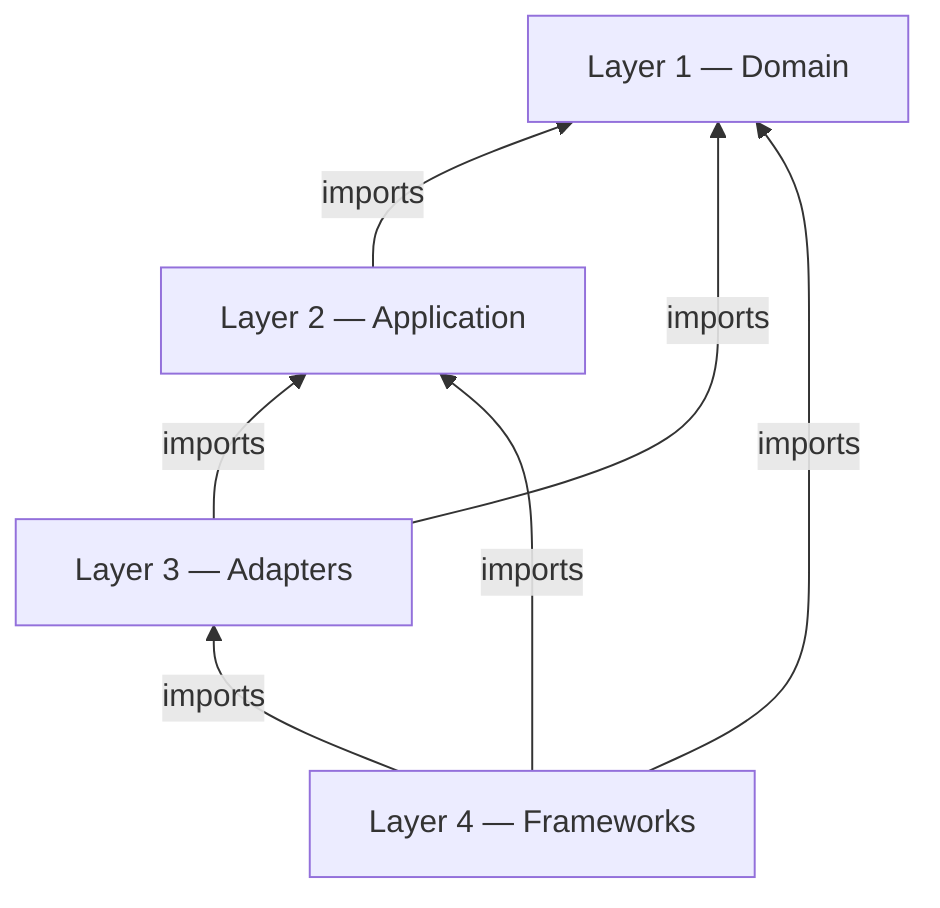
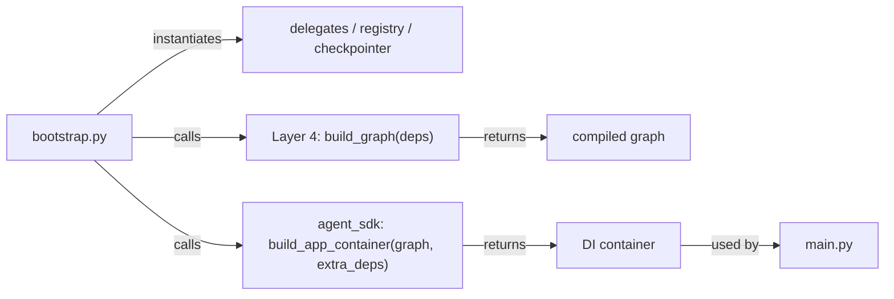

# Layer-by-Layer Guide

[← Clean-Architecture Tutorial](clean-architecture-tutorial.md) | [← Building Agents](README.md)

---

This guide is the detailed reference for the four-layer architecture. Use it to answer questions like "where does this code belong?" and "which imports are allowed here?"

---

## Dependency direction (the one rule that matters)



Outer layers depend on inner layers. Inner layers never depend on outer layers. `bootstrap.py` is a composition-root exception — it wires all layers at startup.

---

## Import rules table

| Layer | May import from | Must NOT import from |
|---|---|---|
| Layer 1 (Domain) | Python stdlib only | Layers 2, 3, 4; all third-party packages |
| Layer 2 (Application) | Layer 1, own Protocol interfaces | Layers 3, 4; LangGraph, LangChain, httpx, pydantic, openai, tiktoken |
| Layer 3 (Adapters) | Layers 1, 2; FastAPI, Pydantic (for DTOs) | Layer 4 implementations |
| Layer 4 (Frameworks) | Layers 1, 2, 3; all third-party packages | — |
| `bootstrap.py` | All layers; all packages | — (composition root) |
| `main.py` | `bootstrap.py`, `agent_sdk` public surface | Inner `app/` layers directly |

---

## Layer 1 — Domain

**Folder:** `app/layer1_domain/`

**Purpose:** Defines what your agent *knows about* — its data model. No behaviour.

### SDK symbols available in Layer 1

| Symbol | Import | What it does |
|---|---|---|
| `AgentBaseState` | `from agent_sdk import AgentBaseState` | Base `TypedDict` for graph state. Contains transport fields (`message`, `session_id`, `formatted_response`, `error`, `error_code`, etc.). |
| `ToolAgentState` | `from agent_sdk import ToolAgentState` | `AgentBaseState` extension with `messages: list` for tool-calling loops. |
| `AgentInfo` | `from agent_sdk import AgentInfo` | Registration/info response dataclass. |
| `AgentRequest`, `AgentResponse` | `from agent_sdk import AgentRequest, AgentResponse` | Transport-level request and response shapes. |
| `TenantContext` | `from agent_sdk import TenantContext` | Carries `tenant_id`, `user_id`, `conv_id`. |
| `HitlInterruptPayload`, `HitlResumeCommand` | `from agent_sdk import ...` | HITL domain objects. |
| `AgentStatus`, `TransportState` | `from agent_sdk import ...` | Execution and transport status enums. |
| `InterruptType` | `from agent_sdk import InterruptType` | Enum of interrupt reasons (`AGENT_CALL`, `GENERIC`). |
| `AgentSDKError` and subclasses | `from agent_sdk import AgentSDKError` | Exception hierarchy (`GraphCompilationError`, `NodeExecutionError`, `RegistrationError`, `DependencyError`). |

### Developer checklist for Layer 1

- [ ] `state.py` extends `AgentBaseState` or `ToolAgentState`
- [ ] No imports from LangGraph, LangChain, FastAPI, httpx, pydantic, or openai
- [ ] No business logic — only dataclass / TypedDict definitions and exception classes

---

## Layer 2 — Application

**Folder:** `app/layer2_application/`

**Purpose:** Business logic. Graph nodes, helper functions, validation, Protocol ports for external services. Pure Python — no frameworks.

### Node signature

```python
def my_node(state: dict, deps: dict) -> dict:
    # read from state, use deps, return partial update
    return {"some_key": new_value}

async def my_async_node(state: dict, deps: dict) -> dict:
    result = await deps["my_service"].do_work(state["message"])
    return {"agent_result": result}
```

`AgentGraphBuilder` automatically wraps `(state, deps)` nodes with `NODE_STARTED` / `NODE_COMPLETED` workflow events.

### Protocol ports

When your application layer needs to call an external service, declare a `Protocol` in Layer 2 rather than importing the concrete class:

```python
# app/layer2_application/ports.py
from typing import Any, Dict, Protocol, runtime_checkable

@runtime_checkable
class SubAgentDelegate(Protocol):
    async def call(self, payload: Dict[str, Any]) -> Any: ...
```

The concrete implementation lives in Layer 4. The node depends only on the Protocol.

### SDK symbols available in Layer 2

| Symbol | Purpose |
|---|---|
| `ExecuteAgentUseCase` | SDK internal: invokes the agent graph |
| `ResumeAgentUseCase` | SDK internal: resumes a paused HITL graph |
| `WorkflowEventEmitter` | Emits typed workflow events via the publisher |
| `workflow_event_scope` | Context-variable scope for per-node event emission |
| `AgentDiscoveryService` | Queries the service registry for active agents |
| `input_guard_node`, `output_guard_node` | Pre-built middleware nodes (importable from `agent_sdk`) |
| `error_handler_node`, `format_response_node` | Pre-built response formatters |
| `ILogger`, `IMonitor` | DI contracts for logging and metrics |

### Developer checklist for Layer 2

- [ ] All nodes follow `(state, deps) -> dict` signature
- [ ] Nodes return only the keys they update (partial state)
- [ ] No imports from `langgraph`, `langchain_core`, `langchain_openai`, `openai`, `httpx`, `pydantic`, `tiktoken`
- [ ] No imports from `agent_sdk.layer3_adapters` or `agent_sdk.layer4_frameworks`
- [ ] External service interfaces declared as `Protocol` (not concrete classes)

---

## Layer 3 — Adapters and Presenters

**Folder:** `app/layer3_adapters/` (usually empty in agent projects)

**Purpose:** Translates between the outside world and Layer 2 use cases. Maps DTOs to domain objects and back.

### SDK-owned Layer 3 adapters

The SDK ships two complete Layer 3 adapters. You do not need to write or modify these unless you have a custom transport requirement.

#### SERVER mode — FastAPI adapter

`agent_sdk/layer3_adapters/presenters/agent_server/`

Exposes three routes:

| Route | Use case invoked |
|---|---|
| `POST /api/v1/execute` | `ExecuteAgentUseCase` |
| `POST /api/v1/resume` | `ResumeAgentUseCase` (auto-registered when `agent_graph` is in container) |
| `GET /api/v1/info` | `GetAgentInfoUseCase` |

The DTO translation pattern used in every route:

```python
@router.post("/execute", response_model=ExecuteAgentOutputPydantic)
async def execute(payload: ExecuteAgentInputPydantic):
    domain_input = payload.to_dataclass(ExecuteAgentInput)      # DTO → domain
    domain_output = await exec_uc.execute(domain_input)          # call use case
    return ExecuteAgentOutputPydantic.from_dataclass(domain_output)  # domain → DTO
```

#### CONSUMER mode — Kafka/EventMesh adapter

`agent_sdk/layer3_adapters/presenters/agent_consumer/`

`run_consumer_agent(container)` starts a message loop that:
1. Receives raw dict messages from the broker
2. Builds an `ExecuteAgentInput` from the message fields
3. Calls `execute_use_case.execute(request)`
4. Publishes the serialized `ExecuteAgentOutput` to `reply_to`

### When to write custom Layer 3 code

| Scenario | What to add |
|---|---|
| Custom webhook receiver | Pydantic DTO + route handler in `app/layer3_adapters/` that calls your Layer 2 use case |
| Non-standard response serialization | Custom presenter class that wraps `ExecuteAgentOutput` |
| Binary or streaming transport | Custom adapter that satisfies the consumer interface |

### Developer checklist for Layer 3

- [ ] All DTOs are Pydantic models (for HTTP) or plain dicts (for messaging)
- [ ] Route handlers call Layer 2 use cases — never business logic inline
- [ ] No imports from `agent_sdk.layer4_frameworks`
- [ ] DTO-to-domain translation happens here, not in Layer 2

---

## Layer 4 — Frameworks and Infrastructure

**Folder:** `app/layer4_frameworks/`

**Purpose:** Everything that touches external packages. Graph assembly, config, delegates, file I/O, database clients.

### Graph assembly

The graph factory function lives in `app/layer4_frameworks/graph/`. It:
1. Imports the `AgentGraphBuilder` (or `ToolAgentBuilder` / `FlowGraphBuilder`)
2. Imports node functions from Layer 2
3. Accepts dependencies as arguments (not globals)
4. Returns a compiled graph

See the [planner agent example](clean-architecture-tutorial.md#planner-agent-example) in the tutorial.

### SDK builder options

| Builder | Use when |
|---|---|
| `ToolAgentBuilder` | Declaring tools is sufficient; you do not need custom node wiring |
| `AgentGraphBuilder` | You need custom node topology, conditional edges, or subgraphs |
| `FlowGraphBuilder` | The graph topology is defined at runtime from a `FlowConfig` registry |

### Config

Pydantic settings classes go in `app/layer4_frameworks/config/app_config.py`. This keeps framework-specific settings (pydantic-settings) out of the inner layers.

Subclass `agent_sdk.Settings` using the `_BaseSettings` alias convention:

```python
# app/layer4_frameworks/config/app_config.py
from agent_sdk import Settings as _BaseSettings

class AppConfig(_BaseSettings):
    CUSTOM_TIMEOUT: int = 30

settings = AppConfig()
```

> **Layer purity rule:** Inner layers (nodes) should receive primitives or simple dataclasses from the config via `deps`, not the `Settings` object itself, to maintain layer purity.

### Delegates

Concrete implementations of Layer 2 Protocol ports. Example from the supervisor agent:

```python
# app/layer4_frameworks/delegates/remote_agent_delegate.py
class RemoteAgentDelegate:
    def __init__(self, tool) -> None:
        self._tool = tool

    async def call(self, payload: dict) -> Any:
        return await self._tool.ainvoke(payload)
```

### SDK symbols available in Layer 4

| Symbol | Purpose |
|---|---|
| `AgentGraphBuilder` | Build custom node/edge graphs |
| `ToolAgentBuilder` | Build tool-calling agents |
| `FlowGraphBuilder` | Build config-driven graphs |
| `OpenAIService` | Wraps the OpenAI API |
| `RemoteAgentTool` | HTTP tool for calling remote agents |
| `ContextBudgetManager` | Manages token context windows |
| `HanaCheckpointSaver`, `create_checkpointer` | Persistence for HITL graphs |
| `KafkaMessagePublisher`, `EventMeshMessagePublisher` | Messaging backends |

### Developer checklist for Layer 4

- [ ] All external package imports are in Layer 4 (or `bootstrap.py`)
- [ ] Graph factory accepts dependencies as arguments (not as globals or class attributes)
- [ ] Delegates implement the Layer 2 Protocol structurally (duck typing — no explicit import of the Protocol needed)
- [ ] Config classes extend `agent_sdk.Settings` (via `from agent_sdk import Settings as _BaseSettings`)
- [ ] No business logic — only wiring, configuration, and infrastructure

---

## Composition root: `bootstrap.py`

`bootstrap.py` is explicitly exempt from the layer rules. It imports from every layer to wire the application together.

**Responsibilities:**
1. Instantiate infrastructure objects: registry, checkpointer, delegates
2. Pass them to the Layer 4 graph factory
3. Call `build_app_container(agent_graph=..., extra_dependencies=...)` to produce the DI container



The DI container is a plain dict. `build_app_container` auto-discovers use cases and injects dependencies by parameter name.

---

## Entry point: `main.py`

`main.py` must stay thin. It calls `build_app_container()` from `bootstrap.py`, then passes the container to `create_agent_app()` or `run_agent()`.

```python
# Standard SERVER mode main.py pattern (see examples/echo_agent/main.py for a full runnable example)
def create_app():
    from agent_sdk import create_agent_app
    container = build_app_container()
    return create_agent_app(container)

app = create_app()
```

`main.py` must not instantiate services, build graphs, or contain routing logic.

---

[← Clean-Architecture Tutorial](clean-architecture-tutorial.md) | [Project Template →](agent-project-template.md) | [← Building Agents](README.md)
