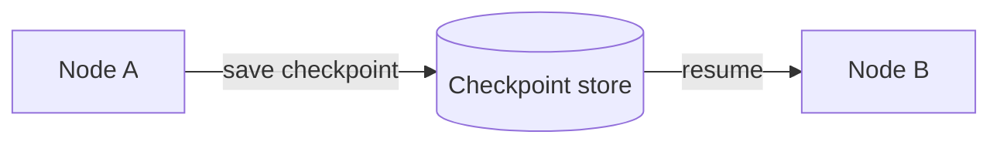
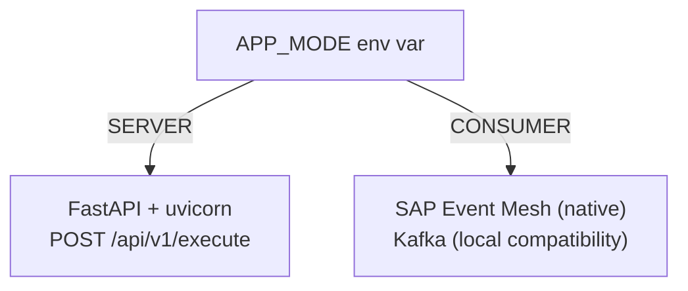
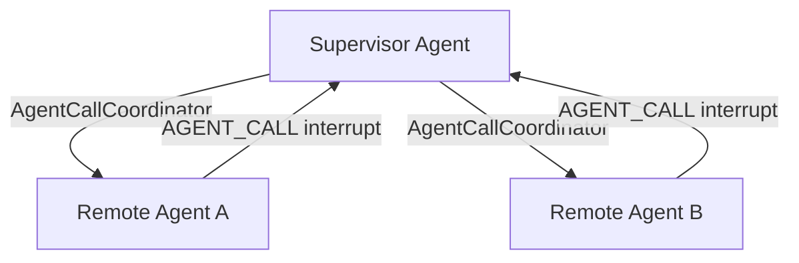
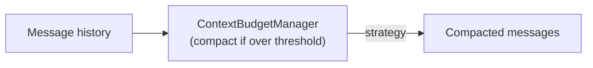
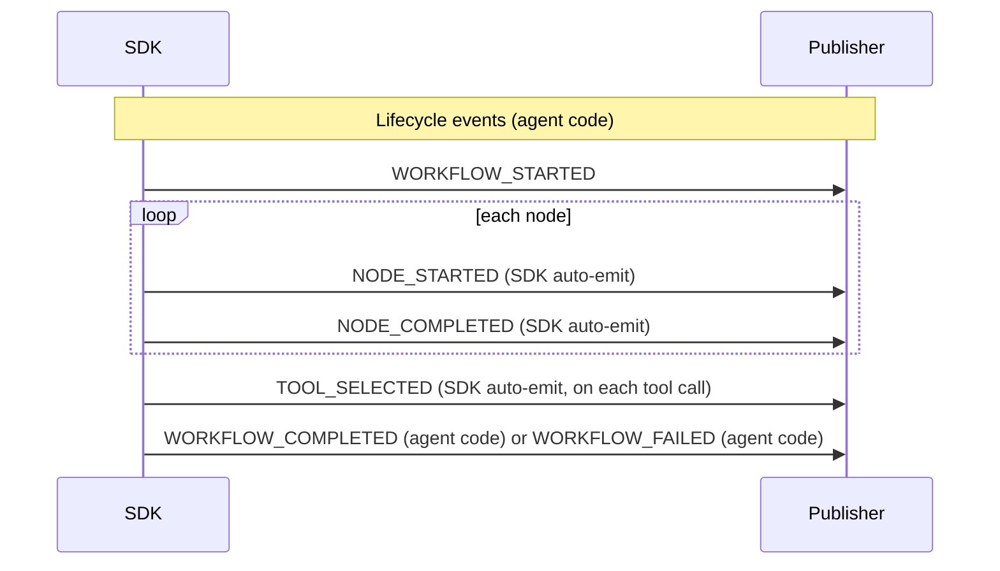

# 04 — Features

[← Docs home](../README.md) | [SDK root](../../README.md)

---

## Contents

- [Checkpointing](#checkpointing)
- [Transports](#transports)
- [Remote Agents and Multi-Agent Orchestration](#remote-agents-and-multi-agent-orchestration)
- [Context Budget Management](#context-budget-management)
- [Workflow Events](#workflow-events)
- [Dependency Injection Cookbook](#dependency-injection-cookbook)

---

## Checkpointing

Checkpointing persists graph state between nodes so that execution can resume after a HITL interrupt or a process restart.



| Saver | When to use |
|---|---|
| `MemorySaver` | Local development and testing — state is in-process memory, lost on restart |
| `HanaCheckpointSaver` | Production — state persisted in SAP HANA |

```python
from langgraph.checkpoint.memory import MemorySaver
from agent_sdk import create_checkpointer

# Development
checkpointer = MemorySaver()

# Production (reads from VCAP_SERVICES or env vars)
checkpointer = create_checkpointer()
```

Full guide: [checkpointing.md](checkpointing.md)

---

## Transports

The SDK supports two run modes, controlled by `APP_MODE`.



| Mode | `APP_MODE` | Description |
|---|---|---|
| SERVER | `SERVER` | FastAPI on `SERVER_HOST:SERVER_PORT` (default 36000). Standard HTTP request/response. |
| CONSUMER | `CONSUMER` | SAP Event Mesh is the native CONSUMER path. Kafka remains the local compatibility backend. The consumer routes `agent.request.agent` / `agent.response` through `MessageReactionRouter`, delegates `AGENT_CALL` interrupts via `AsyncAgentDelegator`, and publishes final responses to `reply_to`. |

SAP Event Mesh uses `EVENT_MESH_REQUEST_TOPIC` in sap mode, while local Kafka compatibility uses `KAFKA_REQUEST_TOPIC`.

### Messaging backend (`MESSAGING_MODE`)

| Value | Backend |
|---|---|
| `mock` | Console/no-op publisher and mock consumer (default for development) |
| `local` | Kafka (aiokafka) |
| `sap` | SAP Event Mesh |

Full guide: [transports.md](transports.md)

---

## Remote Agents and Multi-Agent Orchestration

Call another registered agent as a tool from within your agent graph.

Queue-first systems should prefer registry discovery + queue metadata + `AsyncAgentDelegator`; `AgentCallCoordinator` remains the HTTP compatibility path.



### RemoteAgentTool (manual)

```python
from agent_sdk import RemoteAgentTool

remote_tool = RemoteAgentTool(
    agent_id="task-executor",
    registry=my_registry,
    capability=AgentCapability(agent_type="executor", name="execute_task", ...),
)
```

### AgentDiscoveryService (dynamic)

Discovers all active agents at runtime and creates tools from them:

```python
from agent_sdk import AgentDiscoveryService, default_tool_factory

discovery = AgentDiscoveryService(
    registry=my_registry,
    exclude_agent_types=["supervisor"],
    tool_factory=default_tool_factory,
)
tools = await discovery.discover()
```

### AgentCallCoordinator

Auto-handles the `AGENT_CALL` interrupt loop. When a sub-agent call raises an interrupt, the coordinator resumes it automatically — with per-agent timeouts, parameter validation, and exponential backoff retry for transient failures:

```python
from agent_sdk import AgentCallCoordinator

coordinator = AgentCallCoordinator(
    endpoint_resolver=my_resolver,
    resume_use_case=resume_use_case,
    http_client=my_http_client,
    capabilities=tools,
    max_retries=3,
    retry_backoff_seconds=2.0,
)
```

Full guide: [remote-agents.md](remote-agents.md)

---

## Context Budget Management

Prevents context window overflow when accumulated tool results and message history grow too large.



| Strategy | Behaviour |
|---|---|
| `TOOL_RESULT_CLEAR` | Clear all tool result messages |
| `SELECTIVE` | Remove least-important tool results first |
| `HEAD_TAIL` | Keep first N and last N messages, discard middle |
| `TIERED` | Apply increasingly aggressive strategies until under budget |
| `NONE` | Disabled — never compacts |

```python
from agent_sdk import ContextBudgetConfig, ContextBudgetManager, CompactionStrategy

config = ContextBudgetConfig(
    max_total_tokens=8000,
    max_tool_result_tokens=2000,
    compaction_strategy=CompactionStrategy.TIERED,
    preserve_business_payloads=True,
)
budget_manager = ContextBudgetManager(config=config, llm_service=llm_service)
```

Use `system_reminder` to inject a summary of compacted context back to the LLM via the system prompt.

Full reference: [Reference → API Reference](../05-reference/api-reference.md#context-budget-management)  
Example: `examples/context_budget_example.py`

---

## Workflow Events

The SDK publishes structured events throughout graph execution via two parallel, best-effort delivery paths: the broker backend and an optional push-gateway fan-out selected by `PUSH_GATEWAY_TRANSPORT`.

gRPC is the default transport. If you set `PUSH_GATEWAY_TRANSPORT=http`, the SDK switches that fan-out path to the HTTP notifier; broker publishing stays unchanged.

`NODE_STARTED`, `NODE_COMPLETED`, and `TOOL_SELECTED` are emitted automatically by the SDK. **Lifecycle events (`WORKFLOW_STARTED`, `WORKFLOW_COMPLETED`, `WORKFLOW_FAILED`) are agent-controlled** — emit them from your node code at the appropriate points.



Additional events emittable from node code via `emit_workflow_event`:

```python
from agent_sdk import emit_workflow_event, workflow_event_scope

async def my_node(state, deps):
    with workflow_event_scope(deps["workflow_event_emitter"], request=state, mode="server"):
        await emit_workflow_event(
            my_custom_event,
            state=state,
            node_id="my_node",
            topic="my.topic",
        )
    return {}
```

Full reference: [workflow-events.md](workflow-events.md)

---

## Dependency Injection Cookbook

The DI container (`build_app_container`) assembles all dependencies. Override any default by passing `extra_dependencies`.

| Key | Interface | Default |
|---|---|---|
| `logger` | `ILogger` | `StandardLogger` |
| `monitor` | `IMonitor` | `PrometheusMonitor` |
| `llm` | `BaseChatModel` | `ChatOpenAI` (if `OPENAI_API_KEY` set) |
| `openai_service` | `ILLMService` | `OpenAIService` (if `OPENAI_API_KEY` set) |
| `publisher` | `IMessagePublisher` | Selected by `MESSAGING_MODE` |
| `consumer` | `IMessageConsumer` | Selected by `MESSAGING_MODE` |
| `workflow_event_emitter` | `IWorkflowEventEmitter` | `WorkflowEventEmitter` |

### Custom LLM (Azure OpenAI)

```python
from agent_sdk import build_app_container

container = build_app_container(
    agent_graph=graph,
    extra_dependencies={
        "openai_service": azure_service,
        "llm": azure_service.get_chat_client(),
    },
)
```

### Custom logger

```python
container = build_app_container(
    agent_graph=graph,
    extra_dependencies={"logger": JsonLogger(service_name="my-agent")},
)
```

Full cookbook with all recipes: [dependency-injection-cookbook.md](../03-building-agents/dependency-injection-cookbook.md)

---

## Next Steps

- [Reference](../05-reference/README.md) — full API surface and configuration variables
- [Building Agents](../03-building-agents/README.md) — builder paths and graph patterns

---

[← Docs home](../README.md) | [SDK root](../../README.md)
