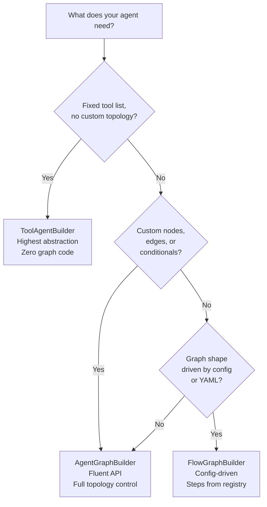
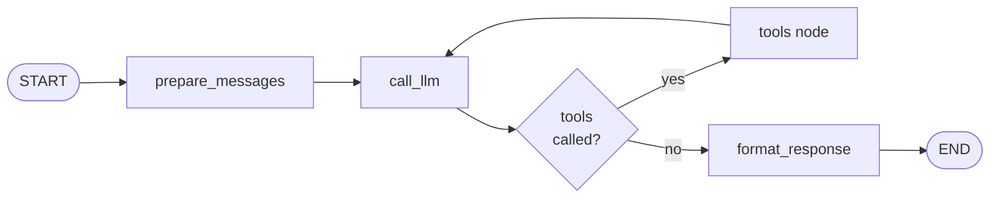
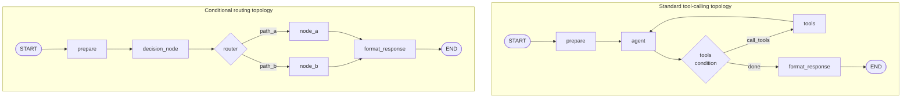
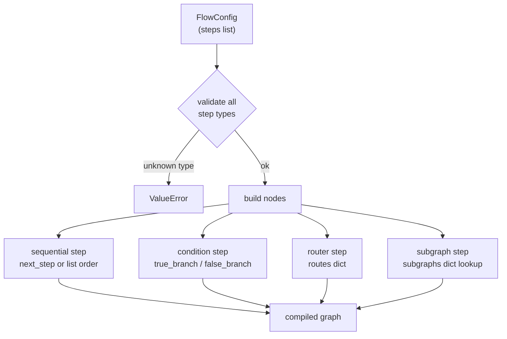

# Builders

[← Features](README.md) | [Docs home](../README.md)

## When to use this page

Read this when you need to choose or configure a builder. It covers all three builder classes with full API references, Mermaid diagrams, and guidance on when to choose each.

---

## Builder Decision Flow



---

## ToolAgentBuilder

`ToolAgentBuilder` is the highest-level builder. Give it an LLM and a list of tools; it wires the complete tool-calling loop automatically.

### Internal topology



`prepare_messages` formats the incoming message into a LangChain `HumanMessage` and optionally injects a `system_reminder`. `call_llm` invokes the LLM (with optional `ContextBudgetManager.compact()` before every call). `format_response` writes `formatted_response` and sets `transport_state = "COMPLETED"`.

### Constructor

```python
ToolAgentBuilder(
    tools: list[BaseTool],
    llm: Any | None = None,
    llm_service: ILLMService | None = None,
    system_prompt: str = "",
    pre_nodes: list[tuple[str, Callable]] | None = None,
    post_nodes: list[tuple[str, Callable]] | None = None,
    context_budget: ContextBudgetManager | None = None,
    system_reminder: str | None = None,
    system_reminder_threshold: int = 6,
)
```

`llm` and `llm_service` are mutually exclusive; at least one must be provided.

`context_budget` enables automatic context window management. `compact()` is called before each LLM invocation to keep the message history within the token budget.

`system_reminder` mitigates the "lost-in-the-middle" effect. When the conversation exceeds `system_reminder_threshold` messages, the reminder is appended as a `SystemMessage` at the end of the message list.

### `compile()` options

```python
graph = builder.compile(
    checkpointer=None,
    interrupt_before=None,   # list[str] or str — pause before these nodes
    interrupt_after=None,    # list[str] or str — pause after these nodes
)
```

`interrupt_before` and `interrupt_after` suspend execution at the named node so the user can inspect or modify state before continuing. See [hitl.md](hitl.md).

### `ToolAgentState`

```python
class ToolAgentState(AgentBaseState, total=False):
    messages: Annotated[list, add_messages]  # append-only message list
    tool_results: list[dict]                 # populated by format_response
```

After a successful run, `state["formatted_response"]` contains:

```python
{
    "content": "<final LLM text>",
    "tool_results": [
        {"tool": "lookup_price", "result": "9.99"}
    ]
}
```

### `pre_nodes` and `post_nodes`

Advanced extension points. `pre_nodes` inserts `(name, fn)` tuples before `prepare_messages`. `post_nodes` inserts them after `format_response`:

```python
def audit_input(state: ToolAgentState) -> dict:
    return {"parameters": {**state.get("parameters", {}), "audited": True}}

builder = ToolAgentBuilder(
    llm_service=make_openai_service(),
    tools=[lookup_price],
    pre_nodes=[("audit", audit_input)],
)
```

Each function receives the full `ToolAgentState` and returns a partial update dict.

### Full example with context budget

```python
from agent_sdk import (
    ToolAgentBuilder, ContextBudgetManager, ContextBudgetConfig,
    CompactionStrategy, make_openai_service, tool,
)

@tool
def lookup_price(sku: str) -> float:
    """Return the current price for a product SKU."""
    return 9.99

config = ContextBudgetConfig(
    max_total_tokens=16_000,
    max_message_history=10,
    compaction_strategy=CompactionStrategy.TIERED,
    compaction_threshold=0.8,
    aggressive_threshold=0.85,
    danger_threshold=0.95,
    preserve_business_payloads=True,
)

builder = ToolAgentBuilder(
    llm_service=make_openai_service(),
    tools=[lookup_price],
    system_prompt="You are a pricing assistant.",
    context_budget=ContextBudgetManager(config),
    system_reminder="Always include the SKU in your final response.",
    system_reminder_threshold=6,
)
graph = builder.compile()
```

---

## AgentGraphBuilder

`AgentGraphBuilder` provides a fluent API for assembling arbitrary node/edge graphs. It handles dependency injection, `ToolNode` creation, and `tools_condition` conditional routing.

### Graph topology examples



### Constructor

```python
AgentGraphBuilder(
    deps: dict[str, Any] | None = None,
    state_schema: type | None = None,  # any TypedDict subclass; defaults to dict
)
```

### Fluent API

```python
builder = (
    AgentGraphBuilder(deps={"db": my_db}, state_schema=MyState)
    .add_tools([my_tool])
    .add_node("prepare", prepare_fn)
    .add_node("agent", agent_fn)
    .add_tool_node("tools")
    .add_node("format_response", fmt_fn)
    .set_entry_point("prepare")
    .add_edge("prepare", "agent")
    .add_tools_condition("agent", tools_node="tools", next_node="format_response")
    .add_edge("tools", "agent")
    .add_edge("format_response", END)
)
graph = builder.compile()
```

### `add_node_if`

Conditionally include a node at construction time (not a runtime conditional):

```python
enable_guard = settings.ENABLE_INPUT_GUARD

builder.add_node_if(enable_guard, "input_guard", input_guard_fn)
if enable_guard:
    builder.add_edge("input_guard", "agent")
```

Useful for feature flags set at import time.

### `add_conditional_edges`

For multi-branch routing (not just tool vs. continue):

```python
def router_fn(state: MyState) -> str:
    if state.get("error"):
        return "error_handler"
    return "next_step"

builder.add_conditional_edges(
    "decision_node",
    router_fn,
    {"error_handler": "error_handler", "next_step": "next_step"},
)
```

### Dependency injection in node signatures

```python
def fetch_data(state: MyState, deps: dict) -> dict:
    client = deps["api_client"]
    data = client.get(state["user_id"])
    return {"intermediate_result": data}
```

The builder detects the two-parameter signature and injects `deps` automatically.

### Choosing a subgraph integration pattern

| Situation | Method to use |
|-----------|--------------|
| Parent and subgraph share the same state keys | `add_subgraph()` |
| Parent and subgraph have different state schemas | `add_mapped_subgraph()` |
| Schema mapping inside `FlowGraphBuilder` | Use `AgentGraphBuilder` or a custom node |

Both `add_subgraph()` and `FlowGraphBuilder.build(subgraphs=...)` require a **compiled** subgraph. Passing an uncompiled `StateGraph` raises `TypeError`.

### `add_subgraph`

Attaches a compiled `StateGraph` as a single node in the parent graph. Use when parent and subgraph share the same state keys:

```python
from agent_sdk import AgentGraphBuilder, StateGraph, END

sub = StateGraph(dict)
sub.add_node("step_a", lambda state: {"intermediate": state.get("input", "")})
sub.add_node("step_b", lambda state: {"result": state.get("intermediate", "").upper()})
sub.set_entry_point("step_a")
sub.add_edge("step_a", "step_b")
sub.add_edge("step_b", END)
compiled_sub = sub.compile()

builder = (
    AgentGraphBuilder(state_schema=dict)
    .add_node("prepare", lambda state: {"input": state.get("message", "")})
    .add_subgraph("process", compiled_sub)
    .add_node("finish", lambda state: {"output": state.get("result", "")})
    .set_entry_point("prepare")
    .add_edge("prepare", "process")
    .add_edge("process", "finish")
    .add_edge("finish", END)
)
```

### `add_mapped_subgraph`

Wraps a compiled subgraph in a node that explicitly translates state between parent and subgraph schemas:

```python
def map_input(parent_state: dict) -> dict:
    return {"payload": parent_state.get("raw_input", "")}

def map_output(subgraph_out: dict, parent_state: dict) -> dict:
    return {"result": subgraph_out.get("mapped_result", "")}

builder.add_mapped_subgraph("process", compiled_sub, map_input, map_output)
```

### `format_response_node`

A pre-built middleware node that populates `formatted_response` and sets `transport_state = "COMPLETED"`:

```python
from agent_sdk import format_response_node

builder.add_node("format_response", format_response_node)
builder.add_edge("my_last_node", "format_response")
builder.add_edge("format_response", END)
```

---

## FlowGraphBuilder

`FlowGraphBuilder` builds a graph from a `FlowConfig` dataclass. It is the right choice when the graph shape is data-driven and may change without code changes.

### Routing flow



### What is implemented

| Step type | Behaviour |
|-----------|-----------|
| Any registered type | Sequential: proceeds to `next_step`, or next in list, or `END` |
| `condition` | Reads `state[step_id]["result"]`; routes to `true_branch` or `false_branch` |
| `router` | Reads `state[step_id]["branch"]`; dispatches to matching key in `routes` |
| `subgraph` | Embeds a compiled `StateGraph` passed via `build(subgraphs={...})` |

There is no richer DSL beyond these four. For parallel branches or dynamic step injection, use `AgentGraphBuilder`.

### Constructor

```python
FlowGraphBuilder(
    registry: NodeTypeRegistry,
    deps: dict[str, Any] | None = None,
    checkpointer: Any = None,
    log: logging.Logger | None = None,
)
```

### Registering step implementations

```python
from agent_sdk import FlowGraphBuilder, NodeTypeRegistry

registry = NodeTypeRegistry()

def validate_step(state: dict, step_config: StepConfig, deps: dict) -> dict:
    return {"validate": {"ok": True}}

def enrich_step(state: dict, step_config: StepConfig, deps: dict) -> dict:
    db = deps["db"]
    return {"enrich": {"data": db.fetch(state["user_id"])}}

registry.register("validate", validate_step)
registry.register("enrich", enrich_step)
```

### `FlowConfig` and `StepConfig`

```python
from agent_sdk import FlowConfig, StepConfig

flow_config = FlowConfig(
    agent_type="order_agent",
    flow_type="process_order",
    steps=[
        StepConfig(id="validate", type="validate"),
        StepConfig(id="enrich",   type="enrich"),
    ],
)
```

`FlowConfig` fields:

| Field | Type | Default | Purpose |
|-------|------|---------|---------|
| `agent_type` | `str` | `""` | Identifies the owning agent |
| `flow_type` | `str` | `""` | Identifies the flow variant |
| `version` | `int` | `1` | Schema version |
| `description` | `str` | `""` | Human-readable summary |
| `steps` | `list[StepConfig]` | `[]` | Ordered list of steps |

`StepConfig` fields:

| Field | Type | Purpose |
|-------|------|---------|
| `id` | `str` | Node name in the graph |
| `type` | `str` | Registry key → node function |
| `next_step` | `str` | Explicit next step (overrides list order) |
| `true_branch` | `str` | Used when `type == "condition"` |
| `false_branch` | `str` | Used when `type == "condition"` |
| `routes` | `dict` | Used when `type == "router"` |
| `params` | `dict` | Passed to the node via `step_config.params` |
| `subflow_ref` | `str` | Key into `subgraphs` dict for `type == "subgraph"` |

### Node function signature

Every step function receives three arguments:

```python
def my_step(state: dict, step_config: StepConfig, deps: dict) -> dict:
    return {"my_step": {"result": "ok"}}
```

### Condition and router examples

**Condition** — branches on a boolean `result`:

```python
def check_eligibility(state: dict, step_config: StepConfig, deps: dict) -> dict:
    eligible = state.get("age", 0) >= 18
    return {step_config.id: {"result": eligible}}

flow_config = FlowConfig(
    agent_type="eligibility",
    flow_type="check",
    steps=[
        StepConfig(id="check", type="eligible_check", true_branch="approve", false_branch="reject"),
        StepConfig(id="approve", type="approve_action"),
        StepConfig(id="reject",  type="reject_action"),
    ],
)
```

**Router** — dispatches on a string `branch`:

```python
def classify(state: dict, step_config: StepConfig, deps: dict) -> dict:
    category = "urgent" if "urgent" in state.get("message", "") else "normal"
    return {step_config.id: {"branch": category}}
```

### `interrupt_before` and `interrupt_after`

```python
graph = FlowGraphBuilder(
    registry=registry,
    deps={},
    checkpointer=MemorySaver(),
).build(flow_config, interrupt_before=["approve"])
```

### Subgraphs in FlowGraphBuilder

```python
flow_config = FlowConfig(
    agent_type="order_agent",
    flow_type="process_order",
    steps=[
        StepConfig(id="validate", type="validate"),
        StepConfig(id="enrich_data", type="subgraph", subflow_ref="enrichment"),
    ],
)

graph = FlowGraphBuilder(registry=registry).build(
    flow_config,
    subgraphs={"enrichment": compiled_sub},
)
```

---

## Feature comparison

| Feature | `ToolAgentBuilder` | `AgentGraphBuilder` | `FlowGraphBuilder` |
|---------|-------------------|--------------------|--------------------|
| Tool-calling loop | Auto-wired | Manual | N/A |
| Custom nodes | `pre_nodes` / `post_nodes` | Full control | Via registry |
| Custom edges | No | Full control | Sequential + condition + router |
| Subgraph embedding | No | `add_subgraph()` | `type="subgraph"` |
| State schema | `ToolAgentState` (fixed) | Any `TypedDict` | `dict` |
| Config-driven shape | No | No | Yes |
| HITL / checkpointing | `compile()` args | `compile()` args | `build()` args |
| DI (`deps`) | No | Yes | Yes |

---

## Read next

- [HITL](hitl.md) — `interrupt()`, `interrupt_before`, and the resume endpoint
- [Checkpointing](checkpointing.md) — `MemorySaver` vs `HanaCheckpointSaver`
- [Core Concepts](../01-overview/core-concepts.md) — state, nodes, and transport state

---

[← Features](README.md) | [Docs home](../README.md)
