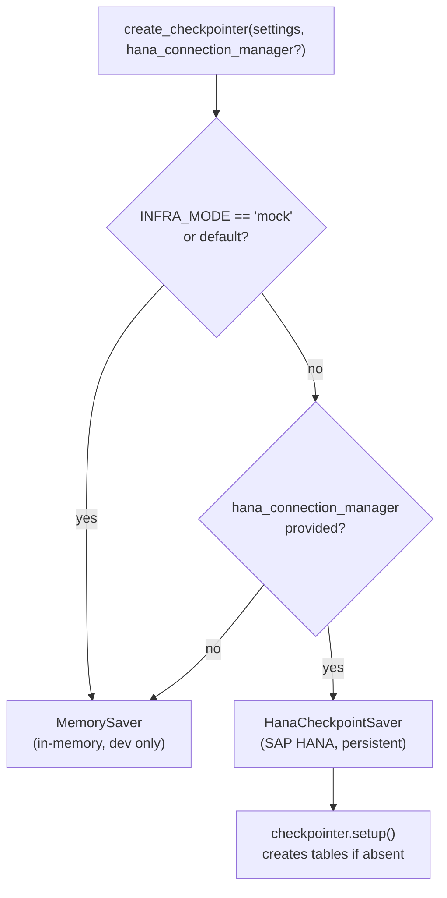

# Checkpointing

[← Features](README.md) | [Docs home](../README.md)

## When to use this page

Read this when you need durable graph state — either for HITL resume across HTTP requests, or to survive process restarts in production.

---

## Checkpointer Selection Flow



> **Warning:** If `INFRA_MODE != "mock"` but no `hana_connection_manager` is supplied, `create_checkpointer` silently falls back to `MemorySaver`. No error is raised. Double-check your production wiring.

---

## `create_checkpointer(settings, hana_connection_manager=None)`

```python
from agent_sdk import create_checkpointer, settings

checkpointer = create_checkpointer(settings)
```

| `INFRA_MODE` | `hana_connection_manager` provided? | Returns |
|---|---|---|
| `"mock"` (default) | any | `MemorySaver` (in-memory, lost on restart) |
| any other value | No | `MemorySaver` |
| any other value | Yes | `HanaCheckpointSaver` (SAP HANA, persistent) |

`INFRA_MODE` is read via `getattr(settings, "INFRA_MODE", "mock")` for compatibility with custom `Settings` subclasses. `CHECKPOINT_TTL_HOURS` is read the same way with a default of `24`.

---

## Development (mock mode)

By default `INFRA_MODE` is `"mock"`, so `create_checkpointer` returns a `MemorySaver`. No external infrastructure is required. State is local to the running process and lost on restart.

```python
# Development — no extra config needed
checkpointer = create_checkpointer(settings)
agent_graph = builder.compile(checkpointer=checkpointer)
run_agent(agent_graph=agent_graph)
```

---

## Production (HANA-backed)

`HanaCheckpointSaver` persists checkpoints to two SAP HANA column-store tables:

| Table | Contents |
|---|---|
| `AIW_FLOW_CHECKPOINTS` | Serialized graph state snapshots per `thread_id` |
| `AIW_FLOW_CHECKPOINT_WRITES` | Pending channel writes not yet folded into a snapshot |

To enable HANA-backed checkpointing:

1. Set `INFRA_MODE` to any value other than `"mock"` (e.g. `INFRA_MODE=production`).
2. Construct a `HanaConnectionManager` and pass it as `hana_connection_manager`.
3. Call `create_checkpointer(settings, hana_connection_manager=db)`.

```python
from agent_sdk import create_checkpointer, settings, HanaConnectionManager

db = HanaConnectionManager(settings)
checkpointer = create_checkpointer(settings, hana_connection_manager=db)
agent_graph = builder.compile(checkpointer=checkpointer)
run_agent(agent_graph=agent_graph)
```

**`create_checkpointer` calls `checkpointer.setup()` automatically** when returning a `HanaCheckpointSaver`. `setup()` creates the two tables if they do not already exist (HANA error code 288 is silently ignored).

---

## SAP BTP / Cloud Foundry

On Cloud Foundry, bind a SAP HANA Cloud service instance to your application. Set `GET_FROM_VCAP=true` so `app_config.py` reads HANA credentials from `VCAP_SERVICES` at startup. Then set `INFRA_MODE=production` and wire the checkpointer as above.

---

## TTL and cleanup

`HanaCheckpointSaver` accepts a `ttl_hours` parameter (default: 24, configurable via `CHECKPOINT_TTL_HOURS`). The SDK does **not** launch a background cleanup loop — the application is responsible for scheduling calls:

```python
deleted = checkpointer.cleanup_expired()
```

Returns the total number of rows deleted from both tables.

---

## Async interface

`HanaCheckpointSaver` implements both the synchronous and asynchronous LangGraph `BaseCheckpointSaver` interfaces. The async methods delegate to the sync methods via `asyncio.get_running_loop().run_in_executor`, ensuring compatibility with LangGraph's async graph execution without blocking the event loop.

---

## `HanaConnectionManager` API

`HanaConnectionManager` is a thread-safe SAP HANA connection pool that satisfies the `IDatabaseConnection` protocol.

```python
from agent_sdk import HanaConnectionManager, settings

db = HanaConnectionManager(settings)
db.initialize()   # pre-populate the pool
```

### Constructor attributes read from `settings`

| Attribute | Settings variable | Description |
|---|---|---|
| `HANA_HOST` | `HANA_HOST` | HANA endpoint hostname |
| `HANA_PORT` | `HANA_PORT` | HANA endpoint port (default `443`) |
| `HANA_USERNAME` | `HANA_USERNAME` | HANA user |
| `HANA_PASSWORD` | `HANA_PASSWORD` | HANA password |
| `HANA_SCHEMA` | `HANA_SCHEMA` | Default schema |
| `HANA_ENCRYPT` | `HANA_ENCRYPT` | Enable TLS |
| `HANA_SSL_CERT` | `HANA_SSL_CERT` | Optional SSL trust store certificate |
| `HANA_POOL_SIZE` | `HANA_POOL_SIZE` | Base pool size (default `5`) |
| `HANA_MAX_OVERFLOW` | `HANA_MAX_OVERFLOW` | Maximum extra connections (default `10`) |
| `HANA_POOL_RECYCLE` | `HANA_POOL_RECYCLE` | Seconds before recycling (default `3600`) |

### Public methods

**`execute_query(sql, params=()) -> list[dict]`** — Execute a read-only SQL statement and return all rows as a list of lowercase-keyed dicts.

**`execute_write(sql, params=()) -> int`** — Execute DML (INSERT / UPDATE / DELETE). Returns affected rows, or `0` on failure (after automatic `ROLLBACK`).

**`initialize() -> None`** — Pre-populate the pool by creating `HANA_POOL_SIZE` connections up front.

**`close() -> None`** — Drain the pool and close all open connections.

### Connection pool behaviour

| Scenario | Behaviour |
|---|---|
| Pool has idle connections | Returns immediately |
| Pool empty, under max overflow | Creates a new connection |
| Pool exhausted | Blocks for up to 30 seconds |
| Connection older than `pool_recycle` seconds | Discarded and replaced |

---

## Read next

- [HITL](hitl.md) — why a checkpointer is required for HITL resume
- [Configuration](../05-reference/configuration.md) — full settings reference, `INFRA_MODE`, `CHECKPOINT_TTL_HOURS`

---

[← Features](README.md) | [Docs home](../README.md)
