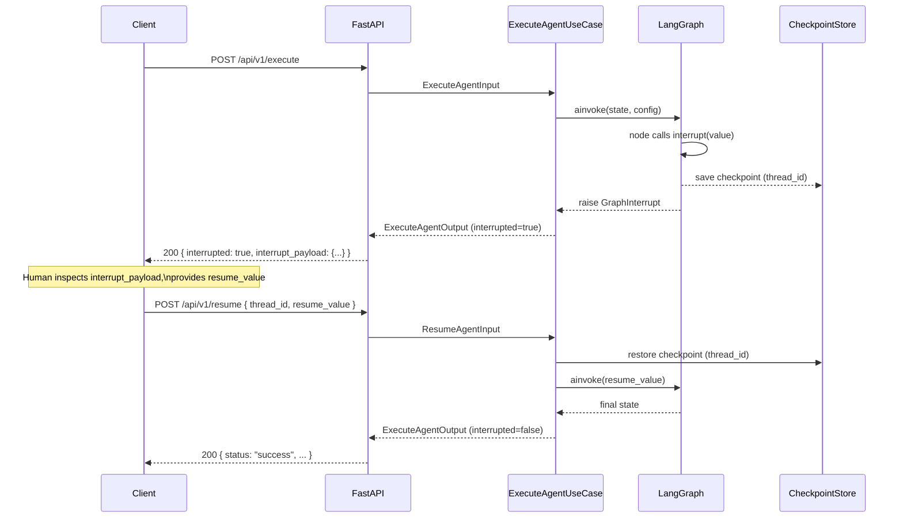

# Human-in-the-Loop (HITL)

[← Features](README.md) | [Docs home](../README.md)

## When to use this page

Read this when your agent needs to pause mid-execution and wait for a human decision before continuing. It covers the interrupt/resume sequence, both interrupt patterns, the payload shape, and production wiring.

---

## Interrupt / Resume Sequence



---

## How it works

When a graph node calls `interrupt()` or the graph is compiled with `interrupt_before`, LangGraph raises a `GraphInterrupt` internally. `ExecuteAgentUseCase` catches this exception and returns an `ExecuteAgentOutput` with `interrupted=True` and a populated `interrupt_payload`. Execution state is persisted via the checkpointer so it can be restored when the caller resumes.

**A checkpointer is required.** Without a checkpointer the graph cannot save state before pausing, so resume will fail.

---

## Pattern 1: Runtime `interrupt()`

Call `interrupt(value)` inside any node to pause the graph at that point. The `value` argument is surfaced verbatim as `interrupt_payload.value` in the response. `interrupt()` is re-exported from `langgraph.types`; no direct langgraph import is needed.

```python
from agent_sdk import AgentGraphBuilder, interrupt

def request_approval(state: dict, deps: dict) -> dict:
    action = state.get("action", "unknown action")
    human_decision = interrupt(
        {
            "question": "Do you approve this action?",
            "action": action,
            "options": ["approved", "rejected"],
        }
    )
    return {"human_decision": human_decision}
```

When the graph is resumed, the return value of `interrupt()` carries the human's answer (the `resume_value` from the `/resume` request).

```python
from agent_sdk import create_checkpointer, settings

checkpointer = create_checkpointer(settings)
graph = builder.compile(checkpointer=checkpointer)
```

---

## Pattern 2: Compile-time `interrupt_before`

Pass `interrupt_before=["<node_name>"]` to `compile()`. LangGraph pauses automatically before the named node without any node-level code changes. Useful for guarding existing sensitive nodes.

```python
graph = builder.compile(
    checkpointer=checkpointer,
    interrupt_before=["execute_sensitive_action"],
)
```

The same checkpointer requirement applies.

---

## `interrupt_payload` shape

The HTTP response body when interrupted:

```json
{
  "interrupted": true,
  "status": "interrupted",
  "session_id": "9f1a2b3c-...",
  "interrupt_payload": {
    "thread_id": "conv-1",
    "interrupt_id": "int-abc",
    "value": { "question": "Do you approve?", "action": "...", "options": ["approved", "rejected"] },
    "type": "CONFIRMATION",
    "message": "",
    "tenant_id": "default",
    "user_id": "anonymous",
    "conv_id": "conv-1",
    "metadata": {}
  }
}
```

| Field | Source | Purpose |
|---|---|---|
| `thread_id` | `conv_id` from the execute request | Key for resume lookup |
| `interrupt_id` | LangGraph `Interrupt.id` | Identifies which interrupt point fired |
| `value` | The argument passed to `interrupt()` | Human-readable prompt / decision data |
| `type` | Derived from `value.type` when `value` is a dict; defaults to `"GENERIC"` | Interrupt category string |
| `message` | `value.get("message", "")` | Optional human-readable summary |
| `tenant_id`, `user_id`, `conv_id` | Copied from execute request | Correlation and multi-tenant tracking |
| `metadata` | `value.get("metadata", {})` | Additional context |

> **Discriminator note:** Use `interrupt_payload.value.type` as the reliable discriminator for interrupt kind. The top-level `interrupt_payload.type` may be `"GENERIC"` for state-level `__interrupt__` hooks where `value` is not a dict.

---

## Execute / Resume API flow

### Execute

```bash
curl -X POST http://localhost:36000/api/v1/execute \
     -H 'Content-Type: application/json' \
     -d '{"message": "transfer $100 to account #42", "conv_id": "conv-1"}'
```

| Field | Type | Default | Description |
|---|---|---|---|
| `message` | string | required | User instruction |
| `conv_id` | string | `""` | Thread ID — required for HITL |
| `user_id` | string | `"anonymous"` | For correlation |
| `tenant_id` | string | `"default"` | Tenant identifier |

### Resume

```bash
curl -X POST http://localhost:36000/api/v1/resume \
     -H 'Content-Type: application/json' \
     -d '{"thread_id": "conv-1", "resume_value": "approved"}'
```

| Field | Type | Description |
|---|---|---|
| `thread_id` | string | Must match the `thread_id` returned in `interrupt_payload` |
| `resume_value` | any | Passed back to the graph as the return value of `interrupt()` |
| `interrupt_id` | string (optional) | Reserved for future multi-interrupt routing |

**Resume prerequisites:**
- Graph must have been compiled with a checkpointer.
- The `thread_id` must exist in the checkpoint store.
- `run_agent(agent_graph=graph)` must have been called so `/resume` is registered (otherwise returns 404).

---

## `InterruptType` enum

```python
from agent_sdk import InterruptType

InterruptType.CONFIRMATION        # "CONFIRMATION"
InterruptType.DATA_REQUEST        # "DATA_REQUEST"
InterruptType.VALIDATION_ERROR    # "VALIDATION_ERROR"
InterruptType.PERMISSION_REQUEST  # "PERMISSION_REQUEST"
InterruptType.AGENT_CALL          # "AGENT_CALL"  ← set by RemoteAgentTool
InterruptType.GENERIC             # "GENERIC"     ← default when type is absent
```

### `AGENT_CALL` interrupt

`InterruptType.AGENT_CALL` is produced exclusively by `RemoteAgentTool`. It signals that the graph has paused to delegate execution to another registered agent. The interrupt `value` carries the resolved `agent_id` and the forwarded `input`:

```json
{
  "type": "AGENT_CALL",
  "agent_id": "3a7f-...",
  "input": "approve the transfer of $100",
  "message": "Calling agent approval-agent (3a7f-...)"
}
```

An orchestrator that calls `/execute` must detect `AGENT_CALL` and handle it before resuming:

1. Detect `interrupt_payload.value.type == "AGENT_CALL"`.
2. Forward `interrupt_payload.value.input` to the agent identified by `interrupt_payload.value.agent_id`.
3. Collect the remote agent's response.
4. POST to `/api/v1/resume` with `{"thread_id": "<thread_id>", "resume_value": <remote response>}`.

---

## Chained interrupts

If a resumed graph reaches another `interrupt()`, the resume response will itself have `interrupted=True` with a new `interrupt_payload`. The caller must POST to `/resume` again with the new `thread_id` and a new `resume_value`.

---

## Wiring HITL in production

```python
from agent_sdk import run_agent, create_checkpointer, settings

checkpointer = create_checkpointer(settings)
agent_graph = build_hitl_graph(checkpointer=checkpointer)
run_agent(agent_graph=agent_graph)
```

In `mock` mode (`INFRA_MODE=mock`, the default), `create_checkpointer` returns a `MemorySaver` which holds state in process memory. For production deploy, see [checkpointing.md](checkpointing.md).

---

## Read next

- [Checkpointing](checkpointing.md) — required for HITL resume; `MemorySaver` vs `HanaCheckpointSaver`
- [Transports](transports.md) — endpoint reference; HITL is only supported in SERVER mode
- [Remote Agents](remote-agents.md) — `AGENT_CALL` interrupt for multi-agent orchestration

---

[← Features](README.md) | [Docs home](../README.md)
