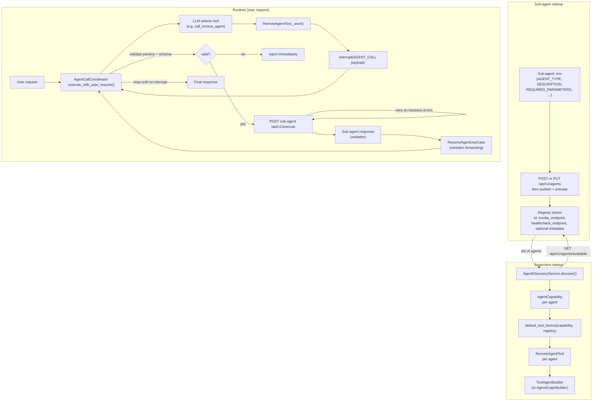

# Multi-Agent Orchestration

[← Features](README.md) | [Docs home](../README.md)

## When to use this page

Read this when your agent needs to delegate work to other agents. It covers the full lifecycle: sub-agent registration, dynamic discovery, the `RemoteAgentTool` interrupt mechanism, and `AgentCallCoordinator`'s automated interrupt-resume loop.

---

## Discovery and Coordination Flow



---

## Three approaches

| Approach | When to use | Key symbols |
|---|---|---|
| **Manual** | You know exactly which sub-agents exist | `RemoteAgentTool`, `ToolAgentBuilder`, `AgentCallCoordinator` |
| **Dynamic discovery** | Sub-agents are added/removed without redeploying the supervisor | `AgentDiscoveryService`, `default_tool_factory`, `ToolAgentBuilder` |
| **Custom topology** | You need guardrails, intent-based routing, or branching before the LLM | `AgentDiscoveryService`, `default_tool_factory`, `AgentGraphBuilder` |

---

## `RemoteAgentTool` — the building block

`RemoteAgentTool` is a LangChain `BaseTool` subclass. When invoked by a LangGraph tool node, it:

1. Resolves the target `agent_id` from the agent registry using the `remote_agent_type` label.
2. Calls `interrupt()` with a structured `AGENT_CALL` payload.
3. Returns control to `AgentCallCoordinator` or an external orchestrator.

**`RemoteAgentTool` does not perform the remote HTTP call itself.** It interrupts the graph.

### Construction

```python
from agent_sdk import RemoteAgentTool

tool = RemoteAgentTool(
    remote_agent_type="approval-agent",
    registry=registry,
    name="call_approval_agent",
    description="Call the approval agent to get a decision.",
    resolve_ttl_seconds=300,   # re-resolve agent_id every 5 minutes
)
```

| Parameter | Type | Default | Description |
|---|---|---|---|
| `remote_agent_type` | `str` | — | Logical agent type label for registry lookup |
| `registry` | `IAgentRegistry` | — | Registry that resolves `remote_agent_type` to `agent_id` |
| `name` | `str` | — | Tool name seen by the LLM |
| `description` | `str` | — | Tool description for LLM tool selection |
| `resolve_ttl_seconds` | `float` | `0.0` | Cache TTL. `0.0` = cache forever. Positive value = re-resolve after that duration. |

### Async-only

`RemoteAgentTool` only supports async invocation. Calling `_run()` raises `NotImplementedError`. All nodes that use `RemoteAgentTool` must be `async def`, and the graph must be invoked with `ainvoke`.

---

## `AGENT_CALL` interrupt payload

When `_arun` succeeds, it calls `interrupt()` with:

```json
{
  "type": "AGENT_CALL",
  "agent_id": "<resolved UUID>",
  "agent_type": "approval-agent",
  "input": "<the string input passed to the tool>",
  "message": "Calling agent approval-agent (<resolved UUID>)"
}
```

The `agent_type` field is used by `AgentCallCoordinator` to look up the matching `AgentCapability` for per-agent timeout and parameter validation.

---

## `AgentCallCoordinator` — automated interrupt-resume loop

`AgentCallCoordinator.execute_with_auto_resume()` encapsulates the detect-call-resume loop transparently.

```python
from agent_sdk import AgentCallCoordinator, AgentCapability

coordinator = AgentCallCoordinator(
    endpoint_resolver=resolver,
    resume_use_case=resume_uc,
    http_client=httpx.AsyncClient(),
    timeout=300.0,
    max_chain_depth=5,
    capabilities=caps_dict,
    max_retries=3,
    retry_backoff_seconds=1.0,
)

result = await coordinator.execute_with_auto_resume(execute_uc, request)
```

### What it does

1. Calls `ExecuteAgentUseCase.execute(request)`.
2. If the result contains an `AGENT_CALL` interrupt:
   a. Extracts `agent_id`, `agent_type`, and `input` from the interrupt payload.
   b. Validates `required_parameters` if `capabilities` is set.
   c. Validates `input_schema` via JSON Schema if set.
   d. Resolves the sub-agent's HTTP base URL via `IAgentEndpointResolver.resolve_endpoint(agent_id)`.
   e. POSTs to `{base_url}/api/v1/execute` with the input.
   f. Retries on transient errors up to `max_retries` times.
   g. Resumes the parent graph with the verbatim sub-agent response.
3. Loops until no interrupt remains or `max_chain_depth` is exceeded.

**Critical design rule:** Sub-agent responses are forwarded **verbatim** as `resume_value`. Never summarise or transform structured business payloads.

This coordinator is still important for compatibility, but it is no longer the primary orchestration design. Queue-first systems should treat downstream work as publish + correlated resume.

### Coordinator-owned transport errors

`AgentCallCoordinator` now distinguishes between:

- **Accepted sub-agent business payloads** — forwarded to `ResumeAgentUseCase` unchanged, even if the payload itself uses `status: "error"` or `success: false`
- **Coordinator-owned transport / validation failures** — returned immediately as top-level `ExecuteAgentOutput(status="error", error_code="SUB_AGENT_TRANSPORT_ERROR")`

Coordinator-owned failures include:

- missing required parameters
- input-schema validation failures
- invalid endpoint / connection / timeout / remote protocol errors
- retry exhaustion for transient HTTP failures
- non-retryable `httpx.HTTPStatusError`
- malformed sub-agent response bodies that fail SDK response validation

This keeps genuine business payloads visible to the parent graph while stopping infrastructure failures from being mistaken for successful resume data.

### Resume targeting note

`ResumeAgentInput.interrupt_id` is optional. When it is omitted (or empty), the runtime uses scalar LangGraph resume semantics: `Command(resume=value)`. Only a real interrupt ID produces targeted map resume semantics: `Command(resume={interrupt_id: value})`.

### Parameter reference

| Parameter | Type | Default | Description |
|---|---|---|---|
| `endpoint_resolver` | `IAgentEndpointResolver` | — | Maps `agent_id` → HTTP base URL |
| `resume_use_case` | `ResumeAgentUseCase` | — | Use case for the resume path |
| `http_client` | `httpx.AsyncClient` | — | Shared HTTP client |
| `timeout` | `float` | `300.0` | Global per-sub-agent call timeout (seconds) |
| `max_chain_depth` | `int` | `5` | Max nested `AGENT_CALL` loops before error |
| `capabilities` | `dict[str, AgentCapability] \| None` | `None` | Per-agent routing metadata; enables per-agent timeout and validation |
| `max_retries` | `int` | `3` | Retry attempts for transient failures |
| `retry_backoff_seconds` | `float` | `1.0` | Base delay for exponential backoff |

### Retry behaviour

| Error type | Retried? |
|---|---|
| HTTP 502 / 503 / 504 | ✅ Yes |
| `httpx.TimeoutException` | ✅ Yes |
| `httpx.ConnectError` | ✅ Yes |
| `httpx.RemoteProtocolError` | ✅ Yes |
| HTTP 4xx (client errors) | ❌ No |
| Other `Exception` | ❌ No |

Delay formula: `retry_backoff_seconds * 2^attempt`. With defaults: 1s → 2s → 4s.

### `IAgentEndpointResolver`

```python
from agent_sdk import IAgentEndpointResolver

class MyResolver(IAgentEndpointResolver):
    async def resolve_endpoint(self, agent_id: str) -> str:
        return f"http://{agent_id}.svc.cluster.local:36000"
```

---

## Dynamic agent discovery

`AgentDiscoveryService` queries the registry at startup and builds tools automatically.

```python
from agent_sdk import AgentDiscoveryService, default_tool_factory

discovery = AgentDiscoveryService(
    registry=registry,
    exclude_agent_types=["supervisor"],
    tool_factory=default_tool_factory,
)

capabilities, tools = await discovery.discover(domain="finance")
```

### `default_tool_factory`

- **Tool name:** Prepends `call_` and replaces hyphens with underscores (e.g., `"invoice-agent"` → `"call_invoice_agent"`).
- **Tool description:** Built from `capability.description`. Appends `"Do NOT call this agent when: ..."` if `negative_examples` are set.
- **Automatic `BUSINESS_DATA` protection:** Because every tool name produced by `default_tool_factory` starts with `call_`, `ToolAgentBuilder` automatically classifies every tool-result message as `PayloadType.BUSINESS_DATA` during context compaction. Sub-agent responses are never dropped or summarised.

Discovery payloads may now include semantic intents, `AGENT_KIND`, `IS_PUBLISHED`, execution policy data, and queue metadata. Supervisors can use that richer contract to choose queue-native destinations without reading service-specific registry payloads.

### Full supervisor setup

```python
async def build_supervisor(registry, resolver, resume_uc, http_client):
    discovery = AgentDiscoveryService(
        registry=registry,
        exclude_agent_types=["supervisor"],
        tool_factory=default_tool_factory,
    )
    capabilities, tools = await discovery.discover()
    caps_dict = {cap.agent_type: cap for cap in capabilities}

    builder = ToolAgentBuilder(
        llm_service=make_openai_service(),
        tools=tools,
        system_prompt="You are a supervisor. Use available tools to delegate tasks.",
    )
    graph = builder.compile(checkpointer=create_checkpointer(settings))

    coordinator = AgentCallCoordinator(
        endpoint_resolver=resolver,
        resume_use_case=resume_uc,
        http_client=http_client,
        capabilities=caps_dict,
    )

    return graph, coordinator
```

### Production server wiring for supervisors

For a real supervisor **server**, building the graph is only half of the setup.
You must also replace the SDK container's default `execute_agent` use case with
a wrapper that calls `AgentCallCoordinator.execute_with_auto_resume()`.

If you only do this:

```python
run_agent(agent_graph=compiled_graph)
```

then `RemoteAgentTool` still emits an `AGENT_CALL` interrupt, but the server
returns that interrupt instead of auto-calling the sub-agent and resuming.

Recommended production pattern:

```python
registry = HttpAgentRegistry()
graph = build_supervisor_graph(registry=registry)

container = build_app_container(
    agent_graph=graph,
    extra_dependencies={"agent_registry": registry, "settings": settings},
)

execute_agent = container["execute_agent"]
resume_agent = container["resume_agent"]
deps = container["_dependencies"]

coordinator = AgentCallCoordinator(
    endpoint_resolver=RegistryBackedEndpointResolver(registry),
    resume_use_case=resume_agent,
    http_client=httpx.AsyncClient(),
    logger=deps["logger"],
    capabilities={},
)

container["execute_agent"] = CoordinatorExecuteAgentUseCase(
    coordinator=coordinator,
    execute_agent=execute_agent,
)

app = create_agent_app(container)
```

### Two supervisor gotchas

1. **Endpoint resolution must handle real registry payloads**
    - match either `id` or the legacy `agent_id`
    - prefer `invoke_endpoint`
    - fall back to metadata or configuration `endpoint_url`
    - finally strip `/health` from `healthcheck_endpoint` or legacy `health_endpoint`

2. **Do not cache remote `agent_id` forever in long-lived supervisors**
   - `RemoteAgentTool(resolve_ttl_seconds=0.0)` caches forever
   - if downstream agents restart, the old `agent_id` may become invalid
   - use a finite TTL or explicit invalidation for production supervisors

---

## Custom topology with `AgentGraphBuilder`

For guardrails, intent-based routing, or complex branching, use `AgentGraphBuilder`:

```python
builder = (
    AgentGraphBuilder(state_schema=ToolAgentState)
    .add_tools(tools)
    .add_node("prepare", prepare)
    .add_node("classify_intent", classify_intent)
    .add_node("call_llm", call_llm)
    .add_tool_node("tools")
    .add_node("reject_response", reject_response)
    .add_node("format_response", format_response)
    .set_entry_point("prepare")
    .add_edge("prepare", "classify_intent")
    .add_conditional_edges(
        "classify_intent", intent_router,
        {"delegate": "call_llm", "reject": "reject_response"},
    )
    .add_tools_condition("call_llm", tools_node="tools", next_node="format_response")
    .add_edge("tools", "call_llm")
    .add_edge("reject_response", END)
    .add_edge("format_response", END)
)
```

---

## Sub-agent `.env` example

```bash
AGENT_TYPE=invoice-processor
AGENT_DOMAIN=finance
DESCRIPTION=Processes invoice documents.

REQUIRED_PARAMETERS=["file_id", "action"]
NEGATIVE_EXAMPLES=["user is asking a general question"]
INPUT_SCHEMA={"type": "object", "properties": {"file_id": {"type": "string"}, "action": {"type": "string"}}, "required": ["file_id", "action"]}
ROUTING_TIMEOUT_SECONDS=120.0

OPENAI_API_KEY=sk-...
SERVER_PORT=36001
REGISTRY_URL=http://localhost:8003
```

---

## Summary of surprising behaviors

| Behavior | Detail |
|---|---|
| Async-only | `_run` raises `NotImplementedError`; always use async graph execution |
| Does not call the remote agent | Issues an `interrupt`; `AgentCallCoordinator` performs the actual HTTP call |
| Memoizes `agent_id` | Registry queried once per instance (or per TTL period) |
| `run_agent(agent_graph=...)` is not enough for supervisors | Real supervisor servers must override `container["execute_agent"]` with a coordinator-backed wrapper |
| Resume is required | Without checkpointer and `agent_graph`, the interrupted execution cannot continue |
| Verbatim responses | `AgentCallCoordinator` forwards sub-agent responses unchanged |
| Retry on transient failures | Retries timeouts, connection errors, HTTP 502/503/504 up to `max_retries` times |

---

## Read next

- [HITL](hitl.md) — interrupt mechanics and resume endpoint
- [Checkpointing](checkpointing.md) — required for resume after `AGENT_CALL`
- [Configuration — Routing metadata](../05-reference/configuration.md#routing-metadata) — `.env` fields for sub-agent discovery

---

[← Features](README.md) | [Docs home](../README.md)
