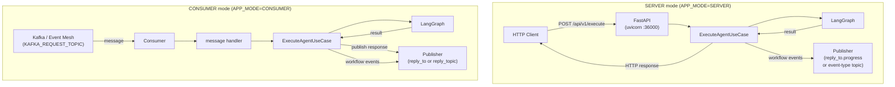

# Transports: SERVER mode and CONSUMER mode

[← Features](README.md) | [Docs home](../README.md)

## When to use this page

Read this to understand the two ways your agent can receive requests: HTTP (SERVER mode) and SAP Event Mesh / Kafka (CONSUMER mode). SAP Event Mesh is the native CONSUMER path; Kafka is the local compatibility backend. It covers endpoint shapes, message envelopes, and event publishing routing.

---

## Transport Request Flow



---

## Overview

| | SERVER mode | CONSUMER mode |
|---|---|---|
| `APP_MODE` | `SERVER` (default) | `CONSUMER` |
| Transport | HTTP (FastAPI + uvicorn) | SAP Event Mesh (`sap`) or Kafka (`local`) compatibility |
| Entry point | `run_agent()` | `run_agent()` |
| How requests arrive | `POST /api/v1/execute` | SAP Event Mesh topic `EVENT_MESH_REQUEST_TOPIC` in sap mode, or `KAFKA_REQUEST_TOPIC` in local compatibility mode |
| How responses leave | HTTP response body | Published to `reply_to` (or `reply_topic`) |
| HITL resume | `POST /api/v1/resume` | Queue-native via broker resume envelopes handled by `MessageReactionRouter` |
| Ops endpoints | `/health`, `/ready`, `/api/v1/info` on the main server | `/health`, `/ready`, `/api/v1/info` on the lightweight consumer ops app when `CONSUMER_OPS_ENABLED=true` |

The SDK now treats **CONSUMER mode as the native orchestration path**. HTTP remains first-party for direct client calls and compatibility, but Event Mesh is the native consumer backend and Kafka is the local compatibility path.

Queue-native CONSUMER flows support two queue contracts:

- The legacy SDK-native contract uses `MessageReactionRouter` and `AsyncAgentDelegator` together: the router handles `agent.request.agent` and `agent.response` envelopes, while delegated `AGENT_CALL` interrupts are published back to the broker using registry `QueueMetadata`.
- The business-context delegated-step contract lets technical agents built with the SDK consume `executor.request.agent` and reply with `agent.step.status`. In that business flow, business agents publish `executor.request.step_batch` and handle `executor.step.status` as an application event through custom handlers or their own queue adapter.

---

## SERVER mode

`APP_MODE=SERVER` starts a FastAPI application served by uvicorn on `SERVER_HOST:SERVER_PORT` (default `0.0.0.0:36000`).

### Endpoints

| Method | Path | Description |
|---|---|---|
| `GET` | `/health` | Liveness check — returns `{"status": "ok"}` |
| `GET` | `/ready` | Readiness check — returns `{"status": "ready"}` |
| `GET` | `/api/v1/info` | Agent metadata (`agent_type`, `version`, `capabilities`) |
| `POST` | `/api/v1/execute` | Run the agent; returns result or interrupt payload |
| `POST` | `/api/v1/resume` | Resume a paused (HITL) execution |

> **Note:** `/api/v1/resume` is only registered when `agent_graph` is provided to `run_agent`. If the agent does not use HITL, the endpoint is absent and returns 404.

### Request / response for `/api/v1/execute`

Request body:

```json
{
  "message": "do something",
  "conv_id": "conv-1",
  "user_id": "user-42",
  "tenant_id": "acme",
  "source": "api",
  "correlation_id": null,
  "parameters": {}
}
```

Normal response:

```json
{
  "status": "success",
  "message": "...",
  "interrupted": false,
  "interrupt_payload": null
}
```

HITL-interrupted response:

```json
{
  "status": "interrupted",
  "session_id": "9f1a2b3c-...",
  "interrupted": true,
  "interrupt_payload": {
    "thread_id": "conv-1",
    "interrupt_id": "int-abc",
    "value": { "question": "Approve?" },
    "type": "GENERIC",
    "message": "",
    "tenant_id": "acme",
    "user_id": "user-42",
    "conv_id": "conv-1",
    "metadata": {}
  }
}
```

Use `interrupt_payload.value.type` as the reliable discriminator (e.g. `"AGENT_CALL"`, `"CONFIRMATION"`).

### `GET /api/v1/info` — AgentInfo schema

```json
{
  "agent_type": "order-agent",
  "version": "1.2.0",
  "sdk_version": "1.0.0",
  "domain": "commerce",
  "capabilities": [
    { "name": "order.create", "description": "Create a new order" }
  ],
  "metadata": {
    "tenant_aware": true,
    "default_tenant_id": "default"
  }
}
```

### Workflow-event publishing in SERVER mode

The SDK wires a `publisher` in SERVER mode exactly as it does in CONSUMER mode. The publisher backend is selected by `MESSAGING_MODE` (or `INFRA_MODE`), so workflow events can be emitted to Kafka, SAP Event Mesh, or mock console output.

If push-gateway fan-out is enabled, the notifier now runs behind a bounded in-process buffer by default. That keeps normal workflow execution off the push-gateway latency path while preserving the existing HTTP and unary gRPC payload contracts underneath.

**Topic routing** is determined by the presence of `reply_to` in the request body, not by `APP_MODE`:

- When `/api/v1/execute` includes a `reply_to` field, lifecycle events are published to `reply_to.progress`.
- When `reply_to` is absent, each event is published to a topic named after the event type (e.g., `WORKFLOW_STARTED`).

### Starting in SERVER mode

```bash
APP_MODE=SERVER OPENAI_API_KEY=sk-... python main.py
```

---

## CONSUMER mode

`APP_MODE=CONSUMER` starts a consumer loop. The backend is controlled by `MESSAGING_MODE`:

| `MESSAGING_MODE` | Backend | Required credentials |
|---|---|---|
| `mock` | Console publisher + no-op consumer | None |
| `local` (default) | Kafka (`aiokafka` / `confluent-kafka`) | `KAFKA_BOOTSTRAP_SERVERS`, `KAFKA_REQUEST_TOPIC`, `KAFKA_GROUP_ID` |
| `sap` | SAP Event Mesh REST API | `EVENT_MESH_*` variables |

### Orchestrator request envelope

**Inbound message** (from Kafka or Event Mesh topic):

```json
{
  "message": "do something",
  "conv_id": "conv-42",
  "user_id": "user-7",
  "tenant_id": "acme",
  "correlation_id": "corr-001",
  "reply_to": "reply/conv-42",
  "reply_topic": "agent.responses",
  "action": "execute",
  "agent_type": "my-agent",
  "intent": { "text": "do something" },
  "execution_context": { "conversation_id": "conv-42" },
  "context_snapshot": {},
  "parameters": {}
}
```

Field resolution rules:
- `reply_to` takes precedence over `reply_topic` for routing the final response.
- `message` falls back to `intent.text` when absent.
- `conv_id` falls back to `conversation_id` (legacy) and then `execution_context.conversation_id`.

Queue-first requests may also include FE metadata, shared-state snapshots, and queue-native delegation fields:

```json
{
  "metadata": {
    "main_conv_id": "main_123",
    "sub_conv_ids": ["sub_abc"],
    "uploaded_file_ids": ["file_1"]
  },
  "shared_state": {"approval_status": "pending"},
  "shared_state_key": "main_123:approval",
  "reply_queue": "agent.responses.finance"
}
```

### Queue-native delegation inside CONSUMER mode

`run_consumer_agent` first routes broker payloads through `MessageReactionRouter`. If `ExecuteAgentUseCase` returns an `AGENT_CALL` interrupt and the container provides `agent_delegator`, the consumer delegates the call, acknowledges the original delivery, and waits for the correlated `agent.response` to arrive back through the router.

`AsyncAgentDelegator` uses registry `QueueMetadata` to resolve the downstream request topic or queue. In CONSUMER mode, the active consumer subscription becomes the default downstream reply path for nested sub-agent calls unless registry metadata overrides it.

Broker-backed consumers keep the process alive after subscription, install shutdown signal handlers, and drain a bounded number of in-flight deliveries on exit. `CONSUMER_MAX_IN_FLIGHT_MESSAGES` controls broker-side dispatch concurrency and `CONSUMER_SHUTDOWN_GRACE_SECONDS` controls how long shutdown waits for those deliveries before cancelling remaining work.

Workflow-event push fan-out remains additive in CONSUMER mode as well. When `PUSH_GATEWAY_BUFFER_ENABLED=true`, the SDK wraps the selected HTTP or gRPC notifier in a bounded async buffer. If the queue stays full longer than `PUSH_GATEWAY_BUFFER_ENQUEUE_TIMEOUT_MS`, the SDK logs a warning and falls back to inline delivery instead of silently dropping the event. On shutdown, the notifier drains queued push events for up to `PUSH_GATEWAY_BUFFER_DRAIN_TIMEOUT_SECONDS` before it cancels the worker and closes the underlying transport client.

Consumer mode can also expose a lightweight ops surface on `SERVER_HOST:SERVER_PORT`. When `CONSUMER_OPS_ENABLED=true`, the SDK starts an ops-only FastAPI app that reuses the same registry registration / heartbeat lifecycle as server mode and exposes `/health`, `/ready`, and `/api/v1/info` without enabling `/api/v1/execute` or `/api/v1/resume`.

### Business-context delegated-step contract

Alongside the legacy SDK-native envelopes, the SDK supports the agent-side portion of the executor/business-agent flow:

- business agents can publish `executor.request.step_batch` with the public executor-step event helpers
- delegated technical agents in CONSUMER mode can receive `executor.request.agent` and automatically reply with `agent.step.status`
- business agents can process `executor.step.status` via `MessageReactionRouter` custom handlers or a dedicated queue adapter

Minimal example for a business agent that hands work to an executor:

```python
from agent_sdk import (
  ExecutorStep,
  ExecutorStepEventPayload,
  create_executor_request_step_batch_event,
)

step = ExecutorStep(
  id="step-1",
  execute_by="agent.file",
  goal="Normalize uploaded files",
  message="Normalize the uploaded files for downstream use",
  uploaded_file_ids=["file-1"],
  input_schema=[],
  output_schema=["step-1.file_id"],
)

event = create_executor_request_step_batch_event(
  "conv-42",
  ExecutorStepEventPayload(
    from_agent="agent.business",
    to_agent="executor.runtime",
    payload_type="step_batch",
    batch_id="batch-1",
    steps=[step],
  ),
  message_id="msg-batch-1",
  correlation_id="corr-batch-1",
)
```

When an inbound `executor.request.agent` delivery does not include `reply_to` or `reply_topic`, CONSUMER mode can fall back to `EXECUTOR_STATUS_TOPIC` for outbound `agent.step.status` publishes.

### Shared-state scope

The SDK exposes generic `SharedStateRecord` storage plus compare-and-set and lock primitives. The richer `AgentSharedState` from the business docs remains a caller-owned schema layered on top of `SharedStateRecord.state`.

The SDK does not implement executor-runtime persistence and does not implement dependency sequencing.

### Event Mesh consumer flow

SAP Event Mesh is the native CONSUMER path. In sap mode, `EventMeshMessageConsumer` subscribes to `EVENT_MESH_REQUEST_TOPIC`, `EventMeshMessagePublisher` publishes to the Event Mesh messaging REST endpoint, and `EventMeshBrokerClient` auto-provisions namespace-prefixed topic and queue names.

The Event Mesh delivery contract differs from Kafka:

- `ack()` acks the broker message
- `nack(requeue=True)` skips ack so the broker can redeliver
- `reject()` settles the broker message without requeue

That settle behavior is intentionally simpler than Kafka offset management. It still works with queue-native delegation and resume because the router only advances the parent thread once the downstream response has been handled.

Two concrete demos now cover both queue reply-path variants:

- [`examples/kafka_consumer_example.py`](../../examples/kafka_consumer_example.py) shows the default fallback where the parent consumer topic / queue becomes the delegated reply path.
- [`examples/queue_native_supervisor_example.py`](../../examples/queue_native_supervisor_example.py) shows the queue-first supervisor path where registry `QueueMetadata` overrides the downstream request topic and reply topic.

### Ack / retry / dead-letter semantics

The consumer-facing contract is `IMessageDelivery`:

- `ack()` — message processed successfully; safe to release broker delivery
- `nack(requeue=True)` — transient failure; preserve retry eligibility for the same record
- `reject()` — poison-pill / unparseable / non-retryable message; route to dead-letter behavior when supported

Kafka-specific mapping in this SDK:

- `ack()` commits the consumer offset immediately after downstream work succeeds
- `nack(requeue=True)` seeks the consumer back to the current record without committing, so the same consumer group retries that record before moving past it
- `reject()` commits the offset and, when `KAFKA_REJECT_TOPIC` is configured, republishes the original record to that topic with `x-original-topic` and `x-reject-reason` headers before committing
- decode / JSON parse failures take the same `reject()` path instead of being silently dropped

The SDK's `MessageReactionRouter` decides which use case or custom handler should process each delivery, and only acknowledges after publish / checkpoint / resume work completes.

| Outcome | Typical causes | Broker intent |
|---|---|---|
| `ack` | Valid execute/resume request, successful publish, handled known business error envelope | Commit / settle delivery |
| `nack(requeue=True)` | Broker outage, database outage, transient dependency failure | Retry later |
| `reject` | Invalid envelope, unsupported action, poisoned payload that cannot ever succeed | Dead-letter / drop according to broker policy |

**Legacy SDK-native outbound response envelope**:

```json
{
  "correlation_id": "corr-001",
  "success": true,
  "message": "[processed] do something",
  "status": "success",
  "error": null,
  "agent_data": {},
  "result": {
    "message": "[processed] do something",
    "status": "success",
    "session_id": "",
    "interrupted": false,
    "interrupt_payload": null,
    "agent_data": {},
    "error": null,
    "error_code": null
  }
}
```

**Business-context delegated-agent status envelope**:

```json
{
  "type": "agent.step.status",
  "message_id": "msg-agent-status-1",
  "correlation_id": "corr-001",
  "conversation_id": "conv-42",
  "payload": {
    "from": "agent.file",
    "to": "executor.runtime",
    "type": "step",
    "step": {
      "id": "step-1",
      "execute_by": "agent.file",
      "goal": "Normalize uploaded files",
      "message": "Normalize the uploaded files for downstream use",
      "uploaded_file_ids": ["file-1"],
      "input_schema": ["step-0.file_id"],
      "output_schema": ["step-1.file_id"],
      "status": "success"
    }
  }
}
```

### Kafka configuration

| Variable | Default | Description |
|---|---|---|
| `KAFKA_BOOTSTRAP_SERVERS` | `localhost:9092` | Broker address(es), comma-separated |
| `KAFKA_REQUEST_TOPIC` | `agent.request` | Topic to ensure and consume from during startup |
| `KAFKA_RESPONSE_TOPIC` | `agent.responses` | Fallback response topic when `reply_to` is absent |
| `KAFKA_GROUP_ID` | `agent-sdk-consumer` | Consumer group ID |
| `KAFKA_REJECT_TOPIC` | empty | Optional dead-letter topic used by `reject()` and decode failures before the consumer commits the source record |

Kafka is no longer documented as implicit auto-commit infrastructure. The SDK consumer owns commit timing through `ack()` / `nack()` / `reject()` semantics so a message is not marked complete before downstream publish/checkpoint work finishes. On Kafka, retry preservation is implemented by rewinding the current partition offset on `nack(requeue=True)`; there is no separate SDK retry queue. If `KAFKA_REJECT_TOPIC` is unset, `reject()` still commits the record to stop replay, but dead-letter retention must be provided by broker policy outside the SDK.
During Kafka consumer startup, the SDK now ensures `KAFKA_REQUEST_TOPIC` exists before it subscribes. Repeated startup checks are idempotent, so existing topics are reused without additional broker changes.

### Starting in CONSUMER mode

```bash
APP_MODE=CONSUMER \
MESSAGING_MODE=local \
KAFKA_BOOTSTRAP_SERVERS=kafka:9092 \
KAFKA_REQUEST_TOPIC=agent.request \
KAFKA_GROUP_ID=my-agent-group \
OPENAI_API_KEY=sk-... \
python main.py
```

For SAP Event Mesh:

```bash
APP_MODE=CONSUMER \
MESSAGING_MODE=sap \
EVENT_MESH_TOKEN_URL=https://... \
EVENT_MESH_CLIENT_ID=... \
EVENT_MESH_CLIENT_SECRET=... \
EVENT_MESH_MESSAGING_URL=https://... \
EVENT_MESH_BROKER_URL=https://... \
EVENT_MESH_MANAGEMENT_URL=https://... \
OPENAI_API_KEY=sk-... \
python main.py
```

> **Compatibility note:** direct client-driven HITL resume is still simplest in SERVER mode via `POST /api/v1/resume`. In queue-first systems, resume is typically performed by publishing a correlated resume envelope that `MessageReactionRouter` maps into `ResumeAgentUseCase`.

Event Mesh follows the same Layer 2 delivery contract even though its broker settlement mechanics differ from Kafka. Queue-native resume and delegated-response matching are handled by the SDK reaction router, not by ad-hoc broker callbacks in agent code.

---

## Queue-native delegation and resume flow

Queue-first orchestration in this SDK follows a fixed six-step lifecycle:

1. The parent consumer receives a broker delivery and converts it into `ExecuteAgentInput`.
2. Graph execution returns an `AGENT_CALL` interrupt instead of a final user response.
3. `AsyncAgentDelegator` resolves downstream routing from registry `QueueMetadata` and publishes an `agent.request.agent` envelope.
4. The delegator stores the paused parent mapping in `correlation_threads`, keyed by the delegated correlation ID.
5. A downstream `agent.response` delivery arrives and `MessageReactionRouter` converts it into `ResumeAgentInput`.
6. The parent thread resumes successfully, the router acknowledges the reply delivery, and the temporary `correlation_threads` entry is removed.

That six-step flow describes the legacy SDK-native supervisor contract. In the executor/business-agent contract, business agents publish `executor.request.step_batch`, technical agents consume `executor.request.agent`, and the business agent handles `executor.step.status` separately from the router's built-in resume path.

The delivery acknowledgements happen at different points on purpose:

- the original request delivery is acknowledged only after the delegated request has been published successfully
- the correlated reply delivery is acknowledged only after `ResumeAgentUseCase` finishes successfully

That separation is what lets the SDK preserve broker retry behavior while still supporting queue-first multi-agent orchestration.

Use these examples as the canonical walkthroughs:

- [`examples/kafka_consumer_example.py`](../../examples/kafka_consumer_example.py) for the parent-topic fallback path
- [`examples/queue_native_supervisor_example.py`](../../examples/queue_native_supervisor_example.py) for registry-driven request/reply routing

## Reply field reference

The queue-first path uses similarly named fields for different stages of the flow:

| Field | Where it appears | Purpose |
|---|---|---|
| `reply_to` | Top-level inbound execute request | Preferred destination for the final top-level agent response |
| `reply_topic` | Top-level inbound execute request | Legacy alias for `reply_to` when routing the final top-level response |
| `reply_topic` | Delegated `agent.request.agent` envelope | Topic the downstream sub-agent should publish its `agent.response` to |
| `reply_queue` | Delegated `agent.request.agent` envelope | Queue / subscription identity for the downstream response path; usually the parent consumer's current queue when no registry override is needed |

The most common confusion is that delegated envelopes reuse `reply_topic`, but in that context it no longer means the final caller response topic. It means the broker destination that will carry the downstream `agent.response` back to the paused parent execution.

## Custom reaction handlers

`MessageReactionRouter` handles `agent.request.agent` and `agent.response` directly, but you can register additional typed envelope handlers through the `message_reaction_handlers` key in `extra_dependencies`.

```python
container = build_app_container(
  extra_dependencies={
    "message_reaction_handlers": {
      "workflow.queue": workflow_queue_handler,
    },
  },
)
```

Use this when your consumer must react to broker messages that are not standard execute or resume envelopes. Custom handlers share the same acknowledgment contract as the built-in queue flow: the router only acknowledges after the handler completes successfully.

---

## Choosing a mode

Use **SERVER mode** when:
- You need synchronous request/response semantics
- Your agent uses HITL (`interrupt()`)
- You need `/info`, `/health`, `/ready` for service discovery or load balancers
- You are intentionally using the HTTP compatibility path shown in `supervisor_agent_example.py`

Use **CONSUMER mode** when:
- Your orchestrator dispatches work via SAP Event Mesh or Kafka compatibility mode
- You need asynchronous, decoupled processing
- You want queue-first remote-agent delegation via `AsyncAgentDelegator` + `MessageReactionRouter`
- You want the patterns shown in `kafka_consumer_example.py` or `queue_native_supervisor_example.py`

---

## Read next

- [HITL](hitl.md) — HITL patterns and resume endpoint details
- [Checkpointing](checkpointing.md) — required for HITL in SERVER mode
- [Workflow Events](workflow-events.md) — event emission and `reply_to.progress` routing

---

[← Features](README.md) | [Docs home](../README.md)
