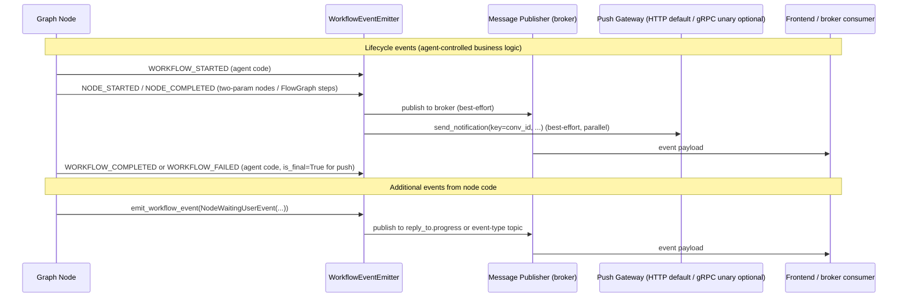

# Workflow Events

[← Features](README.md) | [Docs home](../README.md)

## When to use this page

Read this when you need to understand or emit workflow events from your agent's nodes. It covers the event emission lifecycle, all 15 event types, the two emission categories, and topic routing rules.

---

## Event Emission Lifecycle



---

## Overview

The Agent SDK provides infrastructure to emit structured **workflow events** throughout graph execution. `WorkflowEventEmitter` publishes each event via two parallel, best-effort delivery paths: the broker backend (Kafka, SAP Event Mesh, or mock console) and an optional push-gateway fan-out selected by `PUSH_GATEWAY_TRANSPORT`.

The queue-first SDK surface now has **three event families**:

1. Legacy `WorkflowEvent` lifecycle / HITL events for existing agents.
2. FE/UI chat events (`chat:thinking`, `chat:response`, `chat:disabled`, `chat:enabled`) for frontend-facing chat timelines.
3. Queue orchestration events (`conversation.plan.created`, `agent.plan.created`, `agent.plan.executing`, `agent.plan.executed`, `agent.request.agent`, `agent.plan.success`, `agent.plan.error`) for orchestrators and queue-native delegation.

**Lifecycle events (`WORKFLOW_STARTED`, `WORKFLOW_COMPLETED`, `WORKFLOW_FAILED`) are agent-controlled business logic.** The `ExecuteAgentUseCase` does not auto-emit them. Your node code (or a thin wrapper around the graph invocation) is responsible for emitting these events at the appropriate points.

`NODE_STARTED` and `NODE_COMPLETED` are emitted automatically by `AgentGraphBuilder` for two-parameter nodes and by `FlowGraphBuilder` for all steps. `TOOL_SELECTED` is emitted by `ToolAgentBuilder` when the LLM selects a tool call.

Consumers (e.g. the frontend chat UI, broker response topics) receive these events as serialised `WorkflowEventPydantic` payloads and use them to drive real-time UI updates, progress indicators, and HITL prompts.

### Topic routing

Events are published to the first matching rule:

1. The explicit `topic` argument passed to `emit_workflow_event` (if provided).
2. `reply_to.progress` when the active request scope contains a `request` with a `reply_to` field.
3. The event type name (e.g., `WORKFLOW_STARTED`) when neither of the above applies.

Both SERVER mode and CONSUMER mode follow this same routing rule. The publisher backend (Kafka, SAP Event Mesh, or mock console) is controlled by `MESSAGING_MODE`.

**Push-gateway fan-out** is additive and runs in parallel with broker publishing. `PUSH_GATEWAY_TRANSPORT=grpc` uses `PUSH_GATEWAY_GRPC_TARGET`; `PUSH_GATEWAY_TRANSPORT=http` uses `PUSH_GATEWAY_URL`. gRPC is now the default when you do not set a transport. The current gRPC notifier scope is unary only. When `conv_id` is present in the event payload and `push_gateway_notifier` is configured, the event is also sent to the push gateway keyed by `conv_id`. Broker and push-gateway failures are logged but do not affect each other.

---

## Base event shape

```python
from agent_sdk import WorkflowEvent
```

| Field | Type | Default | Description |
|---|---|---|---|
| `event_id` | `str` | — | Matches `event_type`; stable identifier |
| `event_type` | `str` | — | One of the 15 `EVENT_*` constants |
| `message` | `str` | `""` | Human-readable status message |
| `conv_id` | `str` | `""` | Conversation / thread ID |
| `correlation_id` | `str` | `"auto-generated"` | Trace correlation ID |
| `timestamp` | `str` | `"1970-01-01T00:00:00Z"` | ISO-8601 timestamp |
| `workflow_id` | `str` | `""` | Identifies the workflow definition |
| `node_id` | `str` | `""` | The graph node that emitted the event |
| `data` | `dict` | `{}` | Event-specific payload |

### FE metadata contract

Queue-first execution and frontend timelines both use `ConversationMetadata`.

| Field | Type | Purpose |
|---|---|---|
| `main_conv_id` | `str` | Main conversation identifier for top-level chat |
| `sub_conv_ids` | `list[str]` | Known sub-conversation identifiers used by delegated/child flows |
| `uploaded_file_ids` | `list[str]` | Uploaded file identifiers that must survive execute/resume boundaries |

The SDK carries this contract in request parsing, runtime scope, and event serialization so agents can emit UI/orchestration events without rebuilding metadata by hand.

---

## Event constants

```python
from agent_sdk import (
    EVENT_WORKFLOW_STARTED,
    EVENT_UI_RENDER_REQUEST,
    EVENT_WORKFLOW_GUIDELINE_RENDER_REQUEST,
    EVENT_NODE_STARTED,
    EVENT_INPUT_VALIDATING,
    EVENT_NODE_WAITING_USER,
    EVENT_INPUT_UPDATED,
    EVENT_NODE_COMPLETED,
    EVENT_WORKFLOW_COMPLETED,
    EVENT_WORKFLOW_FAILED,
    EVENT_UNSUPPORTED_FEATURE,
    EVENT_NODE_UPDATED,
    EVENT_NODE_DATA_INITIALIZED,
    EVENT_AGENT_SELECTED,
    EVENT_TOOL_SELECTED,
)
```

---

## SDK-emitted events

These events are emitted **automatically** by the SDK pipeline. No agent code is required.

| Event | Emitted by | When |
|---|---|---|
| `NODE_STARTED` | `AgentGraphBuilder` (two-param nodes only) / `FlowGraphBuilder` (all steps) | Before a wrapped node executes |
| `NODE_COMPLETED` | `AgentGraphBuilder` (two-param nodes only) / `FlowGraphBuilder` (all steps) | After a wrapped node completes |
| `TOOL_SELECTED` | `ToolAgentBuilder.call_llm` | When the LLM selects a tool call |

> **Coverage note:** `AgentGraphBuilder` only auto-wraps nodes that accept two parameters `(state, deps)`. Single-parameter nodes, compiled subgraphs, and `ToolAgentBuilder`'s internal nodes do not automatically emit `NODE_STARTED` / `NODE_COMPLETED`.

---

## Lifecycle events (agent-controlled)

`WORKFLOW_STARTED`, `WORKFLOW_COMPLETED`, and `WORKFLOW_FAILED` are **not** auto-emitted by the SDK. They are agent-controlled business logic that your code emits at the appropriate points using `emit_workflow_event`. This gives agents full control over what constitutes a workflow boundary.

```python
from agent_sdk import emit_workflow_event, WorkflowStartedEvent, WorkflowCompletedEvent

async def run_my_workflow(state: dict, deps: dict) -> dict:
    await emit_workflow_event(WorkflowStartedEvent(conv_id=state.get("conv_id", "")))
    # ... do work ...
    await emit_workflow_event(WorkflowCompletedEvent(conv_id=state.get("conv_id", "")))
    return state
```

**Push-gateway terminal events:** only `WORKFLOW_COMPLETED` and `WORKFLOW_FAILED` are sent to the push gateway with `is_final=True`. All other events are sent with `is_final=False`, regardless of whether the notifier is HTTP or unary gRPC.

---

## Helper-emitted events

These events are emitted by agent node code using `emit_workflow_event`. Use them to communicate UI state, HITL prompts, and business milestones.

| Event | Usage |
|---|---|
| `UI_RENDER_REQUEST` | Request the frontend to render a workflow form |
| `WORKFLOW_GUIDELINE_RENDER_REQUEST` | Request guideline/instruction panel rendering |
| `NODE_WAITING_USER` | Node needs user input before proceeding |
| `INPUT_UPDATED` | User has submitted updated input values |
| `INPUT_VALIDATING` | Node is validating user-supplied inputs |
| `NODE_UPDATED` | Node data payload changed (file upload, form write-back) |
| `NODE_DATA_INITIALIZED` | Seed initial node data before execution |
| `AGENT_SELECTED` | Orchestrator selected a specific agent for this step |
| `UNSUPPORTED_FEATURE` | Capability not available in current SDK/deployment |

### Emitting a helper event

```python
from agent_sdk import (
    emit_workflow_event,
    EVENT_NODE_WAITING_USER,
    NodeWaitingUserEvent,
)

async def my_node(state: dict, deps: dict) -> dict:
    await emit_workflow_event(
        NodeWaitingUserEvent(
            conv_id=state.get("conv_id", ""),
            node_id="my_node",
            data={"missing_required_keys": ["amount"], "filled_required_key": []},
        ),
        state=state,
        node_id="my_node",
    )
    return {}
```

`emit_workflow_event` silently no-ops if no active scope is found (e.g., during unit tests without the scope).

> **Deprecated:** The old pattern of manually calling `publisher.publish(topic="agent.events", message=asdict(event))` from nodes is deprecated. Use `emit_workflow_event` instead.

---

## FE / UI event contract

Import from the top-level SDK:

```python
from agent_sdk import (
    ConversationMetadata,
    ChatThinkingEvent,
    ChatResponseEvent,
    ChatDisabledEvent,
    ChatEnabledEvent,
    SummaryPayload,
    TextPayload,
    WfInfo,
)
```

| Event | When to emit | Typical payload |
|---|---|---|
| `chat:thinking` | Agent is still working and the UI should show progress | `progressing_collapse`, `text` |
| `chat:response` | Agent wants to append a visible chat response | `text`, `button_group`, `open_workspace`, `tool_form`, `summary` |
| `chat:disabled` | UI must pause new user input during a critical step | optional metadata only |
| `chat:enabled` | UI may accept input again | optional recovery or completion metadata |

UI events are serialized with a frontend-facing root contract that is separate from the legacy workflow event envelope:

| Root key | Type | Notes |
|---|---|---|
| `event_id` | `str` | Stable event identifier. Generated if omitted. |
| `event_type` | `str` | One of `chat:thinking`, `chat:response`, `chat:disabled`, `chat:enabled`. |
| `correlation_id` | `str` | Inherited from workflow scope when available. |
| `timestamp` | `str` | ISO-8601 timestamp added by the emitter. |
| `conv_id` | `str` | Conversation/thread identifier. |
| `metadata` | `dict[str, Any]` | Carries `ConversationMetadata` plus optional `uploaded_file_ids`. |
| `payload` | `dict[str, Any]` | Present for renderable UI content. Toggle events may omit it. |

Payload objects share a small canonical shape:

| Payload key | Type | Notes |
|---|---|---|
| `id` | `str` | Optional payload identifier. |
| `parent_id` | `str \| null` | Optional parent payload identifier. |
| `type` | `str` | Payload discriminator. |
| `content` | `str` | Main human-readable content for the UI. |
| `status` | `str` | Defaults to `processing`. |
| `wf_info` | `dict[str, str]` | Optional workflow execution context for UI actions. |

Supported payload types:

| Payload type | Extra fields |
|---|---|
| `text` | none |
| `progressing_collapse` | `title`, `message` |
| `button_group` | `text: list[str]` |
| `open_workspace` | none |
| `tool_form` | `wf_info` |
| `summary` | none |

Example:

```python
await emitter.emit_ui_event(
    ChatResponseEvent(
        conv_id=state.get("conv_id", ""),
        payload=SummaryPayload(content="Workflow completed successfully.", status="success"),
    ),
    state=state,
)
```

`ToolFormPayload` may include `wf_info=WfInfo(node_id="...", task_id="...", run_id="...")` when the frontend needs to submit an action back into the current workflow run. Low-cost constructor compatibility is preserved in Python (`conversation_id=...`, `TextPayload(text=...)`, `ButtonGroupPayload(buttons=[...])`), but the emitted wire format stays on the canonical keys above.

---

## Queue orchestration event contract

Import from the top-level SDK:

```python
from agent_sdk import (
    AGENT_PLAN_ERROR,
    AGENT_REQUEST_AGENT,
    ConversationMetadata,
    OrchestrationEventType,
)
```

| Event | Purpose |
|---|---|
| `conversation.plan.created` | Parent workflow announced a conversation-level plan |
| `agent.plan.created` | Agent-specific plan was created |
| `agent.plan.executing` | Agent has started a step or delegated stage |
| `agent.plan.executed` | Step execution finished and produced output |
| `agent.request.agent` | Queue-native delegation request to a downstream agent |
| `agent.plan.success` | Step/plan completed successfully |
| `agent.plan.error` | Structured business/workflow/transport failure payload |

`agent.request.agent` is the queue-native counterpart to the legacy HTTP sub-agent call. The payload should preserve correlation data, session/thread identifiers, queue metadata, and shared-state context snapshots so the resume path can match the downstream reply correctly.

`agent.plan.error` should carry semantic error data when available (`error_code`, `related_step_id`, `is_critical`, `exception_type`, serialized metadata) so orchestrators can decide whether to retry, skip, or stop.

---

## Event reference

### `WORKFLOW_STARTED` / `WORKFLOW_COMPLETED` / `WORKFLOW_FAILED`

Emitted by agent code once per workflow run at the start, on success, and on error respectively. `data: {}`. These are **not** auto-emitted by the framework — see [Lifecycle events (agent-controlled)](#lifecycle-events-agent-controlled). `WORKFLOW_COMPLETED` and `WORKFLOW_FAILED` are the only terminal push events (`is_final=True` in push-gateway delivery, keyed by `conv_id`).

### `NODE_STARTED` / `NODE_COMPLETED`

`NODE_STARTED`: emitted before a wrapped node executes. `NODE_COMPLETED`: emitted after it completes. The `message` for `NODE_COMPLETED` contains `{label}` substituted with the node's display label. `data: {}`.

### `UI_RENDER_REQUEST`

Requests the frontend to render the workflow form UI in the side panel.

| Field | Value |
|---|---|
| `message` | `"The Workflow interface will be rendered in right side of chat."` |
| `data.ui_yaml_blocks` | YAML block string describing the UI layout |

### `NODE_WAITING_USER`

Emitted when the node cannot proceed because one or more required input fields are missing.

| Field | Value |
|---|---|
| `data.missing_required_keys` | `list[str]` — keys the user must supply |
| `data.filled_required_key` | `list[str]` — keys already filled |

### `INPUT_UPDATED`

Emitted after the user has submitted updated input values. If further required keys remain, `data.missing_required_keys` is non-empty.

### `NODE_UPDATED`

Emitted when a node's data payload changes (file upload, form write-back).

| Field | Value |
|---|---|
| `data.json_data` | JSON string of the updated node data |
| `data.file_id` | ID of an associated uploaded file, if any |

### `TOOL_SELECTED` / `AGENT_SELECTED`

Emitted when the LLM selects a tool or when the orchestrator selects an agent. The `message` contains `{name}` substituted with the tool/agent name.

---

## Typical event order

```
WORKFLOW_STARTED
  └─ UI_RENDER_REQUEST              (if a form UI is needed)
  └─ WORKFLOW_GUIDELINE_RENDER_REQUEST
  └─ NODE_DATA_INITIALIZED
  └─ [per node]
       NODE_STARTED
       INPUT_VALIDATING
       NODE_WAITING_USER             (if required inputs missing)
         └─ INPUT_UPDATED            (after user submits; repeats until filled)
       AGENT_SELECTED / TOOL_SELECTED
       NODE_UPDATED
       NODE_COMPLETED
WORKFLOW_COMPLETED  (or WORKFLOW_FAILED / UNSUPPORTED_FEATURE)
```

---

## Read next

- [Transports](transports.md) — `reply_to.progress` routing and publisher backend selection
- [Core Concepts](../01-overview/core-concepts.md) — transport state and the SDK execution model

---

[← Features](README.md) | [Docs home](../README.md)
