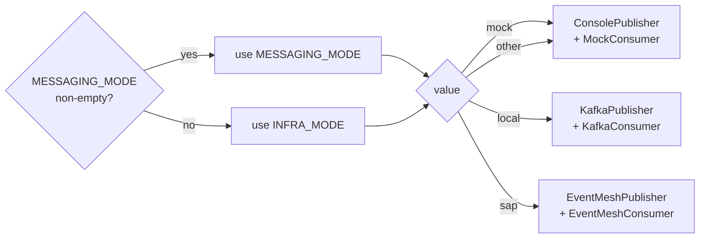

# Configuration Reference

[← Reference index](README.md) | [Docs home](../README.md)

The SDK is configured entirely through environment variables (or a `.env` file read by `pydantic-settings`). All settings are declared in the `Settings` class, exposed at the top-level import as `agent_sdk.Settings` and `agent_sdk.settings`.

```python
from agent_sdk import Settings, settings

# Read a single value
print(settings.APP_MODE)

# Subclass for agent-specific settings
class MySettings(Settings):
    MY_CUSTOM_SETTING: str = "default"
```

`Settings` uses `extra="allow"`, so any environment variable not declared as a typed field is accepted and accessible as a dynamic attribute (e.g. `settings.CHECKPOINT_TTL_HOURS`).

---

## Contents

- [Settings lookup](#settings-lookup)
- [Identity settings](#identity-settings)
- [Routing metadata](#routing-metadata)
- [Runtime settings](#runtime-settings)
- [Push-gateway delivery](#push-gateway-delivery)
- [Registry settings](#registry-settings)
- [Messaging mode resolution](#messaging-mode-resolution)
- [Kafka settings](#kafka-settings)
- [SAP Event Mesh settings](#sap-event-mesh-settings)
- [LLM settings](#llm-settings)
- [Model Context Protocol (MCP) settings](#model-context-protocol-mcp-settings)
- [Tenancy settings](#tenancy-settings)
- [SAP HANA settings](#sap-hana-settings)
- [Cloud Foundry / BTP settings](#cloud-foundry--btp-settings)
- [Cloud Foundry credential extraction](#cloud-foundry-credential-extraction)
- [Extended settings](#extended-settings)

---

## Settings lookup

Access any setting at runtime through the `settings` singleton:

```python
from agent_sdk import settings

mode = settings.APP_MODE              # "SERVER" or "CONSUMER"
port = settings.SERVER_PORT           # 36000 (default)
key  = settings.OPENAI_API_KEY        # "" if not set
ttl  = settings.CHECKPOINT_TTL_HOURS  # dynamic attribute via extra="allow"
```

Override at startup by setting environment variables or writing a `.env` file in the agent root.

---

## Identity settings

Control how the agent presents itself to the service registry.

| Variable | Type | Default | Required |
|---|---|---|---|
| `APP_NAME` | `str` | `"Agent SDK"` | No |
| `AGENT_TYPE` | `str` | `"generic"` | Recommended |
| `AGENT_VERSION` | `str` | `"0.1.0"` | No |
| `AGENT_DOMAIN` | `str` | `"general"` | No |
| `DESCRIPTION` | `str` | `"Generic agent powered by Agent SDK"` | No |
| `CAPABILITIES` | `list` | `[]` | No |
| `SDK_VERSION` | `str` | `"1.0.0"` | No |

`AGENT_TYPE` must not contain dots (`.`). The registry uses `AGENT_TYPE` as a capability key, and dots are reserved separators in capability matching queries.

---

## Routing metadata

These fields declare how the agent should be discovered and called by supervisor agents. They are sent to the service registry at startup as part of `AgentRegistration.metadata.routing` and read back by `AgentDiscoveryService` on the supervisor side.

| Variable | Type | Default | Notes |
|---|---|---|---|
| `INPUT_SCHEMA` | `dict` | `{}` | JSON Schema describing the agent's expected input |
| `OUTPUT_SCHEMA` | `dict` | `{}` | JSON Schema describing the agent's response shape |
| `REQUIRED_PARAMETERS` | `list` | `[]` | Parameters validated by `AgentCallCoordinator` before the HTTP call |
| `NEGATIVE_EXAMPLES` | `list` | `[]` | "Do NOT call when…" phrases appended to the tool description |
| `ROUTING_TIMEOUT_SECONDS` | `float` | `300.0` | Per-agent HTTP timeout when `capabilities` is set |
| `REQUIRED_CONFIRMATION` | `bool` | `true` | Whether this agent's actions require human-in-the-loop confirmation |

### Registry/runtime contract additions

The queue-first registration contract also exposes first-class runtime and publication fields.

| Variable | Type | Default | Notes |
|---|---|---|---|
| `AGENT_KIND` | `str` | `"SERVICE"` | Registration kind exposed in the registry contract |
| `IS_PUBLISHED` | `bool` | `true` | Whether discovery should treat the agent as published |
| `ATTACHED_AGENT_IDS` | `list[str]` | `[]` | Downstream agents attached to this runtime |
| `SYSTEM_PROMPT` | `str` | `""` | Runtime metadata for registry / diagnostics; not rendered in docs as prompt content |
| `MAX_CONCURRENCY` | `int` | `1` | Runtime execution-policy hint |
| `AGENT_CALL_CORRELATION_TTL_SECONDS` | `int` | `3600` | TTL for persisted or fallback parent-thread resume mappings used by async queue delegation |
| `AGENT_CALL_CORRELATION_MAX_ENTRIES` | `int` | `10000` | Upper bound for in-memory fallback correlation mappings when shared-state persistence is unavailable |
| `SUPPORTS_STREAMING` | `bool` | `false` | Runtime capability metadata |
| `SUPPORTS_HUMAN_IN_THE_LOOP` | `bool` | `false` | Runtime capability metadata |

Execution policy and runtime config are published as typed SDK models (`ExecutionPolicy`, `AgentRuntimeConfig`) instead of a single unstructured metadata blob.

### Queue metadata

| Variable | Type | Default | Notes |
|---|---|---|---|
| `QUEUE_NAME` | `str` | `""` | Logical queue name for registration/discovery |
| `QUEUE_REQUEST_TOPIC` | `str` | `""` | Preferred inbound queue/topic for `agent.request.agent` |
| `QUEUE_CONSUME_TOPICS` | `list[str]` | `[]` | List of topics the agent will subscribe to natively |
| `QUEUE_REPLY_TOPIC` | `str` | `""` | Preferred reply topic/queue for downstream responses |
| `QUEUE_REQUEST_MESSAGE_TYPE` | `str` | `""` | Message type override for inbound requests |
| `QUEUE_RESPONSE_MESSAGE_TYPE` | `str` | `""` | Message type override for outbound responses |
| `QUEUE_DELIVERY_HINTS` | `dict[str, Any]` | `{}` | Broker-specific delivery hints, still wrapped in typed `QueueMetadata` |

These fields let queue-native delegation discover where to publish without depending on legacy `KAFKA_REQUEST_TOPIC` alone.

`QUEUE_REQUEST_TOPIC` and `QUEUE_REPLY_TOPIC` are the registry contract consumed by `AsyncAgentDelegator`. `QUEUE_REPLY_TOPIC` is the downstream agent response path; in CONSUMER mode the parent agent's own subscribed topic/queue is used as the default reply path for delegated calls unless registry metadata provides a more specific value.

**Example `.env` for a sub-agent:**

```bash
AGENT_TYPE=invoice-processor
AGENT_DOMAIN=finance
DESCRIPTION=Processes invoice documents. Call when the user needs to extract, validate, or transform invoice data.
REQUIRED_PARAMETERS=["file_id", "action"]
NEGATIVE_EXAMPLES=["user is asking a general question", "user wants to chat"]
INPUT_SCHEMA={"type": "object", "properties": {"file_id": {"type": "string"}, "action": {"type": "string"}}, "required": ["file_id", "action"]}
ROUTING_TIMEOUT_SECONDS=120.0
```

---

## Runtime settings

| Variable | Type | Default | Notes |
|---|---|---|---|
| `APP_MODE` | `str` | `"SERVER"` | `"SERVER"` starts a FastAPI/uvicorn HTTP server. `"CONSUMER"` starts a SAP Event Mesh / Kafka consumer loop. `"HYBRID"` runs both simultaneously. |
| `SERVER_HOST` | `str` | `"0.0.0.0"` | Bind address for the HTTP server |
| `SERVER_PORT` | `int` | `36000` | Bind port for the HTTP server |
| `ALLOW_ORIGINS` | `list[str]` | `["*"]` | List of allowed origins for CORS. When `"*"` is present, `allow_credentials` is automatically `False`. |
| `AGENT_ADVERTISED_URL` | `str` | `""` | Explicit URL registered in the registry (e.g., `https://abc.ngrok-free.app`). Bypasses host/scheme/port assembly if provided. |
| `AGENT_ADVERTISED_HOST` | `str` | `"localhost"` | Host registered in the registry. Auto-detected from `VCAP_APPLICATION` when running on Cloud Foundry. |
| `AGENT_ADVERTISED_SCHEME` | `str` | `""` | Protocol scheme for the registry (`http` or `https`). Overrides default CF logic if provided. |
| `AGENT_ADVERTISED_PORT` | `str` | `""` | Port number. Falls back to `SERVER_PORT` if omitted. |
| `INFRA_MODE` | `str` | `"mock"` | Controls checkpointer selection and the fallback messaging backend. `"mock"` → `MemorySaver`; any other value + HANA → `HanaCheckpointSaver`. |
| `MESSAGING_MODE` | `str` | `""` | Overrides `INFRA_MODE` for the messaging backend when non-empty. Values: `mock`, `sap` (SAP Event Mesh native), `local` (Kafka compatibility). |
| `CONSUMER_MAX_IN_FLIGHT_MESSAGES` | `int` | `4` | Max broker deliveries the consumer transport dispatches concurrently before back-pressuring the poll loop. |
| `CONSUMER_SHUTDOWN_GRACE_SECONDS` | `int` | `30` | How long broker-backed consumer shutdown waits for in-flight deliveries to drain before cancelling remaining work. |
| `CONSUMER_OPS_ENABLED` | `bool` | `true` | Enables the lightweight consumer-mode ops app on `SERVER_HOST:SERVER_PORT` with `/health`, `/ready`, and `/api/v1/info`. |
| `OUTBOX_FLUSH_INTERVAL_SECONDS` | `int` | `30` | Interval in seconds for the background task that flushes pending/failed outbox records to the message broker. |
| `DELEGATION_REQUEST_MESSAGE_TYPE` | `str` | `"agent.request.agent"` | Defines the default payload `type` wrapper for an agent-to-agent delegation via message broker. |
| `DELEGATION_RESPONSE_MESSAGE_TYPE`| `str` | `"agent.response"` | Defines the default payload `type` wrapper for returning the result of a delegation. |
| `DELEGATION_REQUEST_TOPIC` | `str` | `""` | Fallback request topic used by `AsyncAgentDelegator` if none is derived from queue metadata. |

`SERVER_PORT` controls the port that uvicorn binds at runtime. Docker port mappings (`-p HOST:36000`) are independent — the container-internal port must match `SERVER_PORT`.

---

## Push-gateway delivery

Push-gateway delivery is **additive**: broker publishing remains unchanged, and an optional push-gateway notifier runs in parallel on a best-effort basis. A failure in one path does not fail the other.

| Variable | Type | Default | Notes |
|---|---|---|---|
| `PUSH_GATEWAY_URL` | `str` | `""` | Base URL for HTTP push-gateway fan-out. Used only when `PUSH_GATEWAY_TRANSPORT=http`. |
| `PUSH_GATEWAY_TRANSPORT` | `str` | `"grpc"` | Push-gateway delivery transport. Supported values: `grpc`, `http`. Defaults to gRPC. |
| `PUSH_GATEWAY_GRPC_TARGET` | `str` | `""` | gRPC target used when `PUSH_GATEWAY_TRANSPORT=grpc` (for example `push-gateway:50051`). |
| `PUSH_GATEWAY_BUFFER_ENABLED` | `bool` | `true` | Wraps non-mock push-gateway delivery in a bounded async buffer so normal workflow execution is not coupled to notifier latency. |
| `PUSH_GATEWAY_BUFFER_MAX_SIZE` | `int` | `256` | Max queued push-gateway notifications before the SDK back-pressures and eventually falls back to inline delivery. |
| `PUSH_GATEWAY_BUFFER_ENQUEUE_TIMEOUT_MS` | `int` | `50` | How long `send_notification()` waits to enqueue before logging a warning and sending inline through the underlying notifier. |
| `PUSH_GATEWAY_BUFFER_DRAIN_TIMEOUT_SECONDS` | `int` | `5` | How long notifier shutdown waits for queued push events to drain before cancelling the worker and closing the inner notifier. |

**Notifier selection rules** (`build_push_gateway_notifier(settings)`):

| Resolved mode | Transport/config | Notifier selected |
|---|---|---|
| `mock` | any | `ConsolePushGatewayNotifier` (logs to stdout) |
| `local` or `sap` | `PUSH_GATEWAY_TRANSPORT=http` + non-empty `PUSH_GATEWAY_URL` | `BufferedPushGatewayNotifier(HttpPushGatewayNotifier(...))` when buffering is enabled, otherwise `HttpPushGatewayNotifier(PUSH_GATEWAY_URL)` |
| `local` or `sap` | `PUSH_GATEWAY_TRANSPORT=grpc` + non-empty `PUSH_GATEWAY_GRPC_TARGET` | `BufferedPushGatewayNotifier(GrpcPushGatewayNotifier(...))` when buffering is enabled, otherwise `GrpcPushGatewayNotifier(PUSH_GATEWAY_GRPC_TARGET)` |
| `local` or `sap` | transport selected but matching endpoint/target blank | `_NoOpPushGatewayNotifier` (silent) |

- **Default transport:** if you do not set `PUSH_GATEWAY_TRANSPORT`, the SDK uses `grpc`.
- **Default buffering:** if you do not set `PUSH_GATEWAY_BUFFER_ENABLED`, the SDK buffers non-mock push notifications in-process with a lazily started worker.
- **Overflow behavior:** if the buffer stays full for longer than `PUSH_GATEWAY_BUFFER_ENQUEUE_TIMEOUT_MS`, the SDK logs a warning and falls back to inline delivery through the underlying notifier instead of dropping the event.
- **Shutdown behavior:** `close()` waits up to `PUSH_GATEWAY_BUFFER_DRAIN_TIMEOUT_SECONDS` for queued push notifications to drain before cancelling the worker. Normal shutdown keeps queued notifications best-effort instead of discarding them immediately.
- **Current gRPC scope:** the SDK notifier supports the push gateway's unary gRPC `SendData` RPC only. Do not expect client-streaming support from the SDK yet.
- **Invalid values:** values other than `http` or `grpc` raise `ValueError` during notifier selection.
- **Push key:** `conv_id` from the event payload. Events without a `conv_id` are not forwarded to the push gateway.
- **Terminal events:** only `WORKFLOW_COMPLETED` and `WORKFLOW_FAILED` are marked `is_final=True` in the push notification.
- **`MESSAGING_MODE` / `INFRA_MODE` relationship:** `MESSAGING_MODE` takes precedence over `INFRA_MODE` when non-empty. The same resolved mode controls both the broker backend and the push-gateway notifier selection.

### Example `.env`: gRPC fan-out (default transport)

```bash
MESSAGING_MODE=local
PUSH_GATEWAY_TRANSPORT=grpc
PUSH_GATEWAY_GRPC_TARGET=localhost:50051
```

---

## Registry settings

The agent auto-registers on startup and sends heartbeats when `APP_MODE=SERVER` or `HYBRID`.

| Variable | Type | Default | Notes |
|---|---|---|---|
| `REGISTRY_URL` | `str` | `"http://localhost:8003"` | Base URL of the agent registry service |
| `HEARTBEAT_INTERVAL_SECONDS` | `int` | `30` | Seconds between heartbeat pings |

### Current `/api/v1` interop behavior

- `REGISTRY_URL` must point at the registry service root. The SDK calls `/api/v1/agents`, `/api/v1/agents/all`, `/api/v1/agents/available`, and `/api/v1/tools` relative to that base URL.
- In `SERVER` mode, startup registration reconciles by `name = AGENT_TYPE`, writes `version = AGENT_VERSION`, advertises `invoke_endpoint = {agent_base}/api/v1/execute` and `healthcheck_endpoint = {agent_base}/health`, then publishes and activates the agent.
- `HEARTBEAT_INTERVAL_SECONDS` controls a lightweight `GET /api/v1/agents/{id}` existence check. If the registry no longer has the agent, the SDK clears the cached registration and re-registers on the next cycle.
- Local LangChain tools passed directly into the SDK are synced as inline tools under deterministic names: `{AGENT_TYPE}__{TOOL_NAME}__{AGENT_VERSION}`. The SDK lists existing tools first and reuses the matching tool ID on repeat startups. MCP-discovered tools and remote-agent tools are not auto-registered.
- Supervisor discovery accepts registry responses shaped like `id`, `name`, `invoke_endpoint`, `healthcheck_endpoint`, and optional `metadata`. When response metadata is absent, discovery falls back to safe defaults instead of failing.

---

## Messaging mode resolution

`MESSAGING_MODE` and `INFRA_MODE` together control which broker backend is used when `build_app_container` auto-wires publisher and consumer.



| Value | Backend | When to use |
|---|---|---|
| `mock` | `ConsoleMessagePublisher` + `MockMessageConsumer` | Local development; no broker required |
| `local` | Kafka via `confluent-kafka` | Use with a local or remote Kafka cluster |
| `sap` | SAP Event Mesh REST/AMQP/MQTT API | Use on SAP BTP when `EVENT_MESH_*` credentials are set |

---

## Kafka settings

Used only when the resolved messaging mode is `local` (Kafka compatibility).

| Variable | Type | Default | Notes |
|---|---|---|---|
| `KAFKA_BOOTSTRAP_SERVERS` | `str` | `"localhost:9092"` | Comma-separated Kafka broker addresses |
| `KAFKA_REQUEST_TOPIC` | `str` | `"agent.request"` | Default topic the agent reads requests from |
| `KAFKA_CONSUME_TOPICS` | `list[str]` | `[]` | Explicit list of topics the agent will subscribe to. Overrides `KAFKA_REQUEST_TOPIC` for consuming. |
| `KAFKA_RESPONSE_TOPIC` | `str` | `"agent.responses"` | Fallback response topic when no `reply_to` is present |
| `EXECUTOR_STATUS_TOPIC` | `str` | `""` | Where executor responses are routed natively by the coordinator |
| `KAFKA_GROUP_ID` | `str` | `"agent-sdk-consumer"` | Consumer group ID |
| `KAFKA_REJECT_TOPIC` | `str` | `""` | Dead-letter topic where malformed or unprocessable messages are rejected |

---

## SAP Event Mesh settings

Required only when `MESSAGING_MODE=sap`. Uses SAP BTP's Event Mesh service for message brokering and queueing.

| Variable | Type | Default | Notes |
|---|---|---|---|
| `EVENT_MESH_PROTOCOL` | `str` | `"httprest"` | Default messaging/management protocol (e.g., `amqp10ws`, `mqtt311ws`, `httprest`). |
| `EVENT_MESH_MESSAGING_PROTOCOL` | `str` | `""` | Overrides the protocol exclusively for messaging (consuming/publishing). |
| `EVENT_MESH_MANAGEMENT_PROTOCOL`| `str` | `"httprest"` | Overrides the protocol exclusively for management APIs (e.g. provisioning). |
| `EVENT_MESH_NAMESPACE` | `str` | `"default"` | Event Mesh namespace prefix for topic names |
| `EVENT_MESH_TOKEN_URL` | `str` | `""` | OAuth 2.0 token endpoint URL |
| `EVENT_MESH_CLIENT_ID` | `str` | `""` | OAuth 2.0 client ID |
| `EVENT_MESH_CLIENT_SECRET` | `str` | `""` | OAuth 2.0 client secret |
| `EVENT_MESH_MESSAGING_URL` | `str` | `"http://localhost:18080"` | Messaging REST base URL used for publish/consume; falls back to `EVENT_MESH_BROKER_URL` when blank |
| `EVENT_MESH_BROKER_URL` | `str` | `""` | General SAP Event Mesh REST API base URL |
| `EVENT_MESH_MANAGEMENT_URL` | `str` | `"http://localhost:18080"` | Management API base URL used for queue/topic provisioning; falls back to `EVENT_MESH_BROKER_URL` when blank. |
| `EVENT_MESH_REQUEST_TOPIC` | `str` | `"agent.request"` | Default request topic for this agent |
| `EVENT_MESH_CONSUME_TOPICS` | `list[str]` | `[]` | Explicit list of topics to subscribe to. Overrides `EVENT_MESH_REQUEST_TOPIC` for consuming. |
| `EVENT_MESH_REPLY_TOPIC` | `str` | `""` | Fallback response topic when a request has no `reply_to`. |

### Advanced AMQP / MQTT connectivity options

If `EVENT_MESH_PROTOCOL` (or messaging/management specifically) is set to AMQP or MQTT formats, the SDK has robust retry parameters to ensure continuous connectivity.

| Variable | Type | Default | Notes |
|---|---|---|---|
| `EVENT_MESH_MESSAGING_AMQP10WS_URL` | `str` | `""` | Directly specify the AMQP WebSockets endpoint, overriding general URLs. |
| `EVENT_MESH_AMQP_TOKEN_RETRY_ATTEMPTS` | `int` | `3` | Attempts to fetch an OAuth token via AMQP. Must be `>= 0`. |
| `EVENT_MESH_AMQP_PUBLISH_RETRY_ATTEMPTS` | `int` | `2` | Retries when an AMQP message publish fails. Must be `>= 0`. |
| `EVENT_MESH_AMQP_SEND_CLIENT_CACHE_MAX_SIZE` | `int` | `128` | Maximum number of cached AMQP send clients (per address) reused across publishes. |
| `EVENT_MESH_AMQP_SEND_CLIENT_IDLE_TTL_SECONDS` | `float` | `900.0` | Idle time before a cached AMQP send client is evicted and closed. |
| `EVENT_MESH_MQTT_KEEPALIVE_SECONDS` | `int` | `60` | Ping intervals to prevent dropping idle MQTT sessions. |
| `EVENT_MESH_MQTT_QOS` | `int` | `1` | MQTT quality-of-service level for publish/subscribe. Must be `0`, `1`, or `2`. |
| `EVENT_MESH_MQTT_LAST_WILL_TOPIC` | `str` | `""` | Standard MQTT LWT topic sent upon unexpected disconnects. |
| `EVENT_MESH_MQTT_LAST_WILL_QOS` | `int` | `1` | Quality-of-service level for the MQTT last-will message. Must be `0`, `1`, or `2`. |
| `EVENT_MESH_MQTT_CONNECT_RETRY_ATTEMPTS`| `int` | `3` | Maximum connection/authentication attempt limits before faulting. Must be `>= 0`. |

There are equivalent `_URL` environment overrides for all permutations (e.g. `_HTTPREST_URL`, `_MQTT311_URL`). The SDK correctly reads and prefers them matching the active protocol.

---

## LLM settings

`build_app_container` auto-wires `llm_service` when `LLM_MODEL` is non-empty and `extra_dependencies` does not already provide `llm_service`. The SDK forwards the typed `LLM_*` settings plus any extra keys from `LLM_MODEL_KWARGS` to LangChain (`init_chat_model`).

| Variable | Type | Default | Notes |
|---|---|---|---|
| `OPENAI_API_KEY` | `str` | `""` | Provider-specific API key |
| `LLM_API_KEY` | `str` | `""` | Generic provider-agnostic override. Replaces OpenAI/Anthropic/Google keys if used. |
| `LLM_MODEL` | `str` | `"gpt-4o-mini"` | Target foundation model name |
| `LLM_PROVIDER` | `str` | `""` | e.g. `"openai"`, `"anthropic"`, `"azure_openai"` |
| `LLM_TEMPERATURE` | `float` | `0.01` | Creativity/variance |
| `LLM_TIMEOUT` | `float \| None` | `None` | Network timeout |
| `LLM_MAX_TOKENS` | `int \| None` | `None` | Restrict maximum output length |
| `LLM_MAX_RETRIES` | `int` | `6` | Retry limits via the LangChain wrapper |
| `LLM_MODEL_KWARGS` | `dict[str, Any]` | `{}` | Additional raw parameters passed via `model_kwargs` |
| `LLM_USE_LITELLM_PROXY` | `bool` | `False` | Route LLM calls through a LiteLLM proxy instead of talking to the provider directly. |
| `LITELLM_PROXY_URL` | `str` | `""` | Base URL of the LiteLLM proxy (used when `LLM_USE_LITELLM_PROXY=True`). |
| `LITELLM_PROXY_API_KEY` | `str` | `""` | API key presented to the LiteLLM proxy. |
| `LITELLM_PROXY_MODEL` | `str` | `"default"` | Model name/alias to request from the LiteLLM proxy. |
| `LLM_REASONING_EFFORT` | `str \| None` | `None` | Pass `"low"`, `"medium"`, or `"high"` to control reasoning capability for models like OpenAI `o1`/`o3`. (The SDK safely ignores this if the model does not support reasoning). |
| `LLM_USAGE_LOG_ENABLED` | `bool` | `False` | When `True`, the standard logger tracks token usage across operations. |
| `LLM_USAGE_COST_ENABLED`| `bool` | `True` | Calculates estimated costs in metadata responses. |
| `LLM_USAGE_CURRENCY` | `str` | `"USD"` | Metric for cost estimation displays. |
| `LLM_USAGE_PRICE_TABLE_JSON` | `str` | `"{}"` | Custom pricing lookup in JSON (e.g. `{"gpt-4o": {"input_per_1m": 5.0, "output_per_1m": 15.0}}`) |

If a `LLM_MODEL_KWARGS` key duplicates a first-class SDK option (`model_provider`, `temperature`, `timeout`, `max_tokens`, or `max_retries`), the typed SDK setting wins.

---

## Model Context Protocol (MCP) settings

The SDK allows you to natively configure remote tool servers implementing the Model Context Protocol. MCP tools will be injected seamlessly alongside the agent's regular local tools.

| Variable | Type | Default | Notes |
|---|---|---|---|
| `MCP_SERVERS` | `list[dict]` | `[]` | Array of connection configs. For example: `[{"name": "remote-tools", "server_url": "http://localhost:8080/mcp"}]`. |
| `MCP_TOOL_FILTER` | `list[str]` | `[]` | If set, the SDK will only import specific tools from the remote server by their name. |

Example `.env` snippet for an MCP configuration:
```json
MCP_SERVERS=[{"name": "math-tools", "server_url": "http://math-agent:8080", "transport": "streamable-http"}]
MCP_TOOL_FILTER=["calculate_sum", "calculate_derivative"]
```

---

## Tenancy settings

| Variable | Type | Default | Notes |
|---|---|---|---|
| `DEFAULT_TENANT_ID` | `str` | `"default"` | Fallback tenant ID for agents that do not resolve tenant context themselves |

---

## SAP HANA settings

Used for production checkpointing and data access. Credentials are resolved lazily at `Settings` init time via `_resolve_hana_from_vcap`. When `VCAP_SERVICES` is present, values from it fill only HANA fields still at their defaults — explicit env-var or `.env` values are never overwritten.

| Variable | Type | Default | Notes |
|---|---|---|---|
| `HANA_HOST` | `str` | `""` | HANA endpoint hostname |
| `HANA_PORT` | `int` | `443` | HANA endpoint port |
| `HANA_USERNAME` | `str` | `""` | HANA user |
| `HANA_PASSWORD` | `str` | `""` | HANA password |
| `HANA_SCHEMA` | `str` | `""` | HANA schema for checkpoint tables |
| `HANA_ENCRYPT` | `bool` | `true` | Enable TLS on the HANA connection |
| `HANA_SSL_CERT` | `str` | `""` | Optional SSL certificate |
| `HANA_POOL_SIZE` | `int` | `5` | Connection pool base size |
| `HANA_MAX_OVERFLOW` | `int` | `10` | Maximum overflow connections |
| `HANA_POOL_RECYCLE` | `int` | `3600` | Connection recycle interval (seconds) |
| `GET_FROM_VCAP` | `bool` | `false` | When `true`, HANA credentials are read from `VCAP_SERVICES` and applied only to fields still at their defaults |

HANA is also the default backing store for `HanaSharedStateRepository` when shared-state persistence is auto-wired by `build_app_container`.

---

## Cloud Foundry / BTP settings

| Variable | Type | Source | Notes |
|---|---|---|---|
| `VCAP_APPLICATION` | `str` | CF runtime | Automatically parsed to extract the application URI for `AGENT_ADVERTISED_HOST` |
| `VCAP_SERVICES` | `str` | CF runtime | Automatically parsed when `GET_FROM_VCAP=true` to extract HANA credentials |

`AGENT_ADVERTISED_HOST` auto-detection runs as a `model_validator` on every `Settings` instance. If `AGENT_ADVERTISED_HOST` is still `"localhost"` and `VCAP_APPLICATION` contains a URI, the URI is used automatically.

---

## Cloud Foundry credential extraction

### `get_hana_credentials() -> HanaCredentials | None`

Parse `VCAP_SERVICES` and return a `HanaCredentials` dataclass, or `None` if the variable is absent, malformed, or contains no HANA binding.

```python
from agent_sdk import get_hana_credentials

creds = get_hana_credentials()
if creds:
    print(creds.host, creds.port, creds.schema)
```

The function looks for HANA service bindings under these service names **in order** and stops at the first match: `"hana"`, `"hana-cloud"`, `"hanatrial"`. A binding is considered incomplete if `host`, `user`, or `password` is empty — in that case it logs a warning and returns `None`.

### `HanaCredentials` dataclass

| Field | Type | Default | Description |
|---|---|---|---|
| `host` | `str` | required | HANA endpoint hostname |
| `port` | `int` | required | HANA endpoint port |
| `user` | `str` | required | HANA user |
| `password` | `str` | required | HANA password |
| `schema` | `str` | required | Default schema |
| `encrypt` | `bool` | `True` | Enable TLS |
| `certificate` | `str` | `""` | SSL trust store certificate |
| `hdi_user` | `str` | `""` | HDI user (schema migrations) |
| `hdi_password` | `str` | `""` | HDI user password |

### Integration with `Settings`

When `GET_FROM_VCAP=true`, HANA credentials are resolved automatically by the `_resolve_hana_from_vcap` model validator during every `Settings` instantiation. No manual call to `get_hana_credentials()` is needed in normal usage.

---

## Extended settings

Because `Settings` is declared with `extra="allow"`, any environment variable is accepted. Common extended settings used by the SDK internally or by agents:

| Variable | Used by | Notes |
|---|---|---|
| `CHECKPOINT_TTL_HOURS` | `HanaCheckpointSaver` | How long to retain checkpoint rows. Defaults to `24`. |

Both `INFRA_MODE`, `MESSAGING_MODE`, and `PUSH_GATEWAY_URL` are **typed fields** on `Settings`. The effective messaging backend is always resolved via `_resolve_infra_mode`, which prefers `MESSAGING_MODE` over `INFRA_MODE` when `MESSAGING_MODE` is non-empty. `PUSH_GATEWAY_URL` enables additive push-gateway fan-out on top of the broker delivery path.

---

[← Reference index](README.md) | [Runtime and container reference](runtime-and-container-reference.md) | [Full API reference](api-reference.md)
