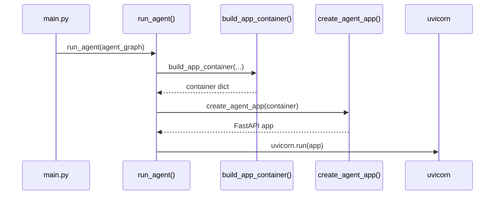
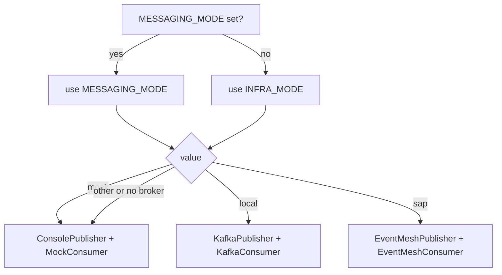
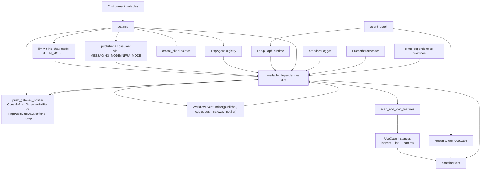

# Runtime and Container Reference

[← Reference index](README.md) | [Full API reference](api-reference.md)

This page covers the four SDK entry points and the dependency injection (DI) container they assemble.

---

## Contents

- [Entry points](#entry-points)
  - [run_agent](#run_agent)
  - [build_app_container](#build_app_container)
  - [create_agent_app](#create_agent_app)
  - [run_consumer_agent](#run_consumer_agent)
  - [scan_and_load_features](#scan_and_load_features)
- [DI container keys and defaults](#di-container-keys-and-defaults)
- [Transport assembly](#transport-assembly)
- [Container wiring diagram](#container-wiring-diagram)

---

## Entry points

### `run_agent`

```python
from agent_sdk import run_agent

run_agent(agent_graph=my_compiled_graph)
```

The top-level entry point for most agents. Calls `build_app_container` internally, then either starts a FastAPI/uvicorn server (`APP_MODE=SERVER`) or runs the consumer loop (`APP_MODE=CONSUMER`).

| Parameter | Type | Description |
|---|---|---|
| `agent_graph` | `Any` | Optional compiled LangGraph graph. Required for HITL resume to be wired automatically. |
| `features_path` | `str \| None` | Custom features directory. Defaults to the SDK built-in features. |
| `base_module` | `str \| None` | Python module prefix matching `features_path`. |
| `extra_dependencies` | `dict \| None` | Key/value pairs merged into the DI container before conditional OpenAI/messaging auto-wiring. Values provided here suppress auto-wiring for those keys. |

> **Note:** `local_tools` is a parameter of `build_app_container`, not `run_agent`. Pass tools via `build_app_container` directly if you need worker-agent tool wiring.

> **Standalone registration:** For non-agent services such as an executor runtime, register the same `@tool` callables directly with `ToolRegistrar` instead of routing them through `worker_tools`.

**Startup sequence:**



### `build_app_container`

```python
from agent_sdk import build_app_container

container = build_app_container(
    features_path=None,         # defaults to SDK built-in features
    base_module=None,           # module path matching features_path
    extra_dependencies=None,    # dict injected after SDK defaults
    agent_graph=None,           # compiled graph; wires ResumeAgentUseCase
    local_tools=None,           # list of @tool-decorated callables
)
```

Assembles the DI container. The returned dict has one key per discovered use-case feature plus `_dependencies` for the raw dependency map.

**Auto-wired dependencies:**

| Dependency | Condition | Value |
|---|---|---|
| `logger` | Always | `StandardLogger()` |
| `monitor` | Always | `PrometheusMonitor()` |
| `agent_registry` | Always | `HttpAgentRegistry()` |
| `settings` | Always | Global `settings` singleton |
| `default_tenant_id` | Always | `settings.DEFAULT_TENANT_ID` |
| `correlation_threads` | Always | `{}` | Shared correlation map used by queue resume and delegation routing |
| `agent_graph` | When `agent_graph` provided | The compiled graph |
| `agent_runtime` | When `agent_graph` provided | `LangGraphRuntime(agent_graph)` |
| `llm` | When `LLM_MODEL` is non-empty and `llm` is not already in `extra_dependencies` | `init_chat_model(LLM_MODEL, model_provider=LLM_PROVIDER, ..., **LLM_MODEL_KWARGS)` |
| `worker_tools` | Always | `list(local_tools)` or `[]` |
| `registered_tool_ids` | When `local_tools` and `tool_registry` are both available | Result of `ToolRegistrar(tool_registry).register_tools(local_tools, owner_kind="agent", owner_name=AGENT_TYPE, owner_version=AGENT_VERSION)` |
| `publisher` | When not already in `extra_dependencies` | Resolved from `MESSAGING_MODE` / `INFRA_MODE` |
| `consumer` | When not in `extra_dependencies` and `APP_MODE != SERVER` | Resolved from messaging mode |
| `agent_delegator` | When `publisher` and `agent_registry` are available and the key is not already provided | `AsyncAgentDelegator(publisher, registry, correlation_threads, compatibility_request_topic=...)` |
| `message_reaction_router` | When not already in `extra_dependencies` | `MessageReactionRouter(execute_use_case, resume_use_case, custom_handlers=extra_dependencies.get("message_reaction_handlers", {}), correlation_threads, logger)` |
| `push_gateway_notifier` | When not already in `extra_dependencies` and `workflow_event_emitter` not overridden | `build_push_gateway_notifier(settings)` — console, HTTP, or no-op based on mode/URL |
| `workflow_event_emitter` | When not already in `extra_dependencies` | `WorkflowEventEmitter(publisher, logger, push_gateway_notifier)` |
| `resume_agent` | When `agent_graph` provided | `ResumeAgentUseCase(...)` |

**Override any default** by passing the key in `extra_dependencies`. `extra_dependencies` values are merged first; then LLM and messaging auto-wiring check whether the key is already present before injecting.

**Queue wiring notes:**

- `correlation_threads` is the shared queue resume map. `AsyncAgentDelegator` records delegated correlation IDs in it, and `message_reaction_router` removes them after a successful correlated resume.
- `message_reaction_handlers` is the extension point for additional broker envelope types. When provided in `extra_dependencies`, it is passed into `message_reaction_router` as `custom_handlers`.
- Override `agent_delegator`, `message_reaction_router`, or `correlation_threads` directly in `extra_dependencies` only when you need custom queue routing behavior. The built-in defaults match the flows shown in `examples/kafka_consumer_example.py` and `examples/queue_native_supervisor_example.py`.

```python
container = build_app_container(
    agent_graph=graph,
    extra_dependencies={
        "input_guard": MyInputGuard(),
        "output_guard": MyOutputGuard(),
        "openai_service": MyLLMService(),
    },
)
```

**Feature use-case injection:** `build_app_container` calls `scan_and_load_features` to discover use-case classes, then inspects each class's `__init__` signature. Any parameter whose name matches a key in the dependency dict is injected. Extra parameters are silently ignored.

### `create_agent_app`

```python
from agent_sdk import create_agent_app

app = create_agent_app(container)
```

Builds the FastAPI application from a pre-built container dict. Use this when you need to control the app instance directly (e.g. to attach additional routes before starting uvicorn).

**What it does:**

1. Creates a `FastAPI` instance with a `lifespan` context that handles agent registration and heartbeat.
2. Reads `ALLOW_ORIGINS` from `container["_dependencies"]["settings"]` and configures `CORSMiddleware`. When `"*"` is present, `allow_credentials` is automatically set to `False`.
3. Attaches `container["_dependencies"]` to `app.state.dependencies` for downstream use by route handlers.
4. Registers the `/health` and `/ready` ops endpoints.
5. Mounts the `POST /api/v1/execute` and `POST /api/v1/resume` routes via `create_router(container)`.

```python
# Example: attach additional routes
app = create_agent_app(container)

@app.get("/custom")
def custom():
    return {"ok": True}

import uvicorn
uvicorn.run(app, host="0.0.0.0", port=36000)
```

### `run_consumer_agent`

```python
from agent_sdk import run_consumer_agent

await run_consumer_agent(container)
```

Entry point for CONSUMER mode. Called automatically by `run_agent` when `APP_MODE=CONSUMER`. Resolves `execute_agent`, `consumer`, and `publisher` from the container and starts the consumer loop.

The current consumer loop is queue-native: it also uses `MessageReactionRouter` for `agent.request.agent` / `agent.response` envelopes and `AsyncAgentDelegator` for `AGENT_CALL` interrupts when those dependencies are wired into the container. The active consumer topic/queue becomes the default downstream reply path for delegated sub-agent calls unless registry metadata overrides it.

Direct use is rare — set `APP_MODE=CONSUMER` in the environment and let `run_agent` call it automatically.

### `scan_and_load_features`

```python
from agent_sdk import scan_and_load_features

registry = scan_and_load_features(
    features_path="/my/features",   # directory to scan
    base_module="myapp.features",   # Python module prefix
)
```

Scans a features directory for sub-packages and loads each one as a use-case class. The class name must follow the convention `{SnakeToPascal(module_name)}UseCase`. Used internally by `build_app_container`.

---

## DI container keys and defaults

The table below lists every key that `build_app_container` auto-wires and what it defaults to. Pass the same key in `extra_dependencies` to override.

| Key | Default value | Override when you want to… |
|---|---|---|
| `logger` | `StandardLogger` | Use a structured logger (Datadog, Cloud Logging, etc.) |
| `monitor` | `PrometheusMonitor` | Emit real Prometheus metrics |
| `agent_registry` | `HttpAgentRegistry` | Use a custom discovery backend |
| `openai_service` | Not auto-wired by default | Inject your own `OpenAIService` instance when a use case depends on it directly |
| `llm` | LangChain chat model from `LLM_*` settings (if `LLM_MODEL` set) | Inject a pre-configured LangChain model |
| `publisher` | `ConsoleMessagePublisher` / Kafka / Event Mesh | Use a custom broker adapter |
| `consumer` | `MockMessageConsumer` / Kafka / Event Mesh | Use a custom consumer adapter |
| `push_gateway_notifier` | `ConsolePushGatewayNotifier` (mock) / `HttpPushGatewayNotifier` (if `PUSH_GATEWAY_URL` set) / no-op | Use a custom push gateway adapter |
| `workflow_event_emitter` | `WorkflowEventEmitter(publisher, logger, push_gateway_notifier)` | Use a custom event emitter |
| `execute_agent` | `ExecuteAgentUseCase` | — (not typically overridden) |
| `resume_agent` | `ResumeAgentUseCase` (if `agent_graph` provided) | — (not typically overridden) |
| `input_guard` | Not injected by default | Add input validation / sanitization |
| `output_guard` | Not injected by default | Add output validation / sanitization |

---

## Transport assembly

`build_app_container` selects the messaging backend using `_resolve_infra_mode(settings)`:

```
effective_mode = MESSAGING_MODE (if non-empty) else INFRA_MODE
```



| Mode | Publisher | Consumer | When to use |
|---|---|---|---|
| `mock` | `ConsoleMessagePublisher` | `MockMessageConsumer` | Local development; no broker required |
| `local` | `KafkaMessagePublisher` | `KafkaMessageConsumer` | Local or remote Kafka cluster |
| `sap` | `EventMeshMessagePublisher` | `EventMeshMessageConsumer` | SAP BTP with Event Mesh credentials |

---

## Container wiring diagram

The diagram below shows how `build_app_container` assembles dependencies and injects them into feature use cases.



---

[← Reference index](README.md) | [Full API reference](api-reference.md) | [Configuration](configuration.md)
