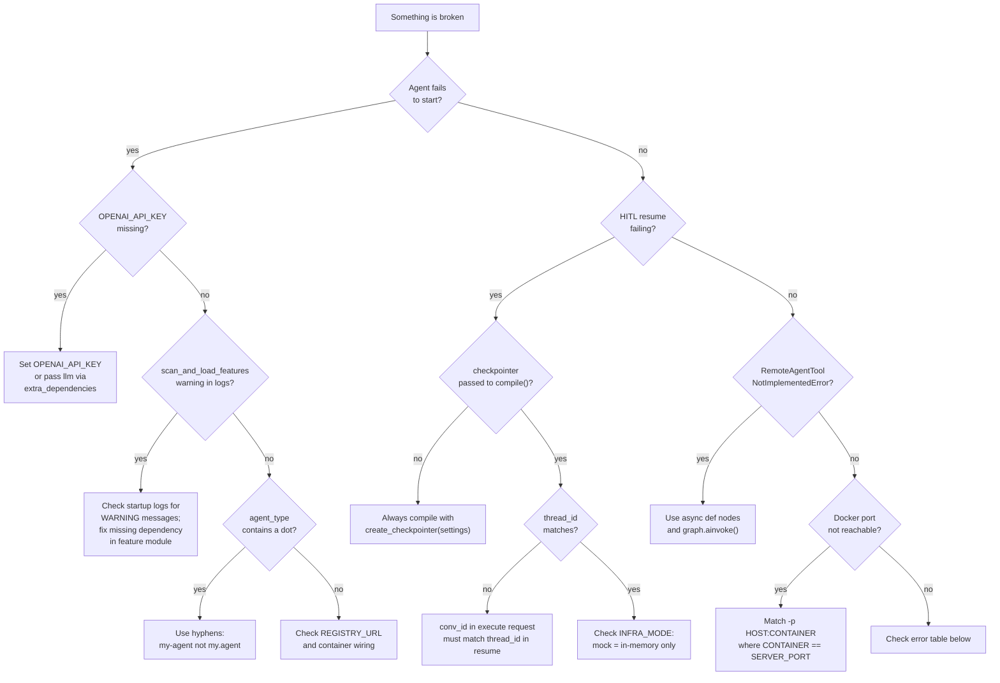

# Testing and Troubleshooting

[← Reference](README.md) | [Docs home](../README.md)

## When to use this page

Read this when you need to run the SDK test suite, debug a failing test, or diagnose a production issue. It covers test commands, common errors with resolutions, and a decision-tree for the most frequent failure modes.

---

## Troubleshooting Decision Flow



---

## Running tests

```bash
# Install dev dependencies
pip install -e ".[dev]"

# Run all tests
pytest

# Run unit tests only
pytest tests/unit

# Run with coverage
pytest --cov=agent_sdk --cov-report=term-missing

# Run a specific test file
pytest tests/unit/test_bootstrap_llm.py -v

# Stop on first failure and show locals
pytest -x -l
```

Test configuration is in `pyproject.toml`. Async tests use `pytest-asyncio` with `asyncio_mode = "auto"`.

---

## Known issues and operational caveats

### 1. Absent `OPENAI_API_KEY` silently disables LLM injection

When `OPENAI_API_KEY` is empty (or not set), `build_app_container` does **not** create `openai_service` or `llm`. Use cases that declare either of these in their `__init__` will receive `None`.

This is intended behavior — the SDK supports LLM-free agents (e.g. pure routing agents). However, if your graph nodes expect `llm` to be present, you will get a runtime error when the node executes, not at startup.

**Resolution:** Set `OPENAI_API_KEY` in your environment or `.env` file. Alternatively, pass a custom LLM client via `extra_dependencies={"llm": my_llm}`.

---

### 2. Resume requires a checkpointer — no error at compile time

HITL resume requires a checkpoint store. If the graph is compiled without a checkpointer (`builder.compile()` with no `checkpointer` argument), LangGraph uses an in-memory fallback that does not persist across requests.

**Known behavior:** If `checkpointer=None`, a resumed thread will not be found and `POST /resume` will return an error. This fails at runtime, not at graph compile time.

**Resolution:**

```python
from agent_sdk import create_checkpointer, settings

checkpointer = create_checkpointer(settings)
graph = builder.compile(checkpointer=checkpointer)
```

For development, `INFRA_MODE` is `"mock"` by default (returns `MemorySaver`). For production, set `INFRA_MODE` to any non-`"mock"` value and provide a `hana_connection_manager` to get `HanaCheckpointSaver`.

---

### 3. `RemoteAgentTool` is async-only

`RemoteAgentTool` overrides both `_run` and `_arun`. The synchronous `_run` raises `NotImplementedError`.

**Resolution:** Use `RemoteAgentTool` only inside `async def` graph nodes and invoke the graph with `.ainvoke()`.

---

### 4. `agent_type` must not contain dots

The `HttpAgentRegistry.register()` method validates `agent_type` and raises `ValueError` if it contains a dot (`.`). The registry uses `agent_type` to construct capability strings in the format `{agent_type}.agent`.

**Resolution:** Use hyphens instead of dots in `AGENT_TYPE`, e.g. `"my-agent"` or `"data-processor"`.

---

### 5. Docker port confusion vs runtime port

`SERVER_PORT` (default `36000`) is the port that uvicorn binds **inside** the container. The Docker `-p` flag maps a host port to this container port:

```bash
# Container binds on 36000 (SERVER_PORT default)
docker run -p 8080:36000 -e OPENAI_API_KEY=sk-... agent-sdk
#          ^^^^ host port         ^^^^^ container port (must match SERVER_PORT)
```

**Resolution:** Either keep `SERVER_PORT=36000` and use `-p <host>:36000`, or explicitly pass `-e SERVER_PORT=<port>` and use `-p <host>:<port>`.

---

### 6. `PrometheusMonitor` is a stub

The `PrometheusMonitor` class implements `IMonitor` but only prints metric values to stdout. There is no Prometheus exporter, no `/metrics` endpoint, and no `prometheus_client` dependency.

**Resolution:** Inject a custom `IMonitor` implementation via `build_app_container(extra_dependencies={"monitor": my_monitor})` if real metrics collection is required.

---

### 7. `scan_and_load_features` silently skips failed feature modules

When a feature sub-package raises an exception during import, `scan_and_load_features` logs a warning and continues. The feature will be absent from the container.

**Resolution:** Check startup logs for `WARNING` messages from `agent_sdk.bootstrap`. Treat any warning about feature loading as a configuration error.

---

### 8. Queue message keeps replaying unexpectedly

If a Kafka or Event Mesh message reappears after processing, the usual cause is that the handler never reached `ack()` or raised a transient error that triggered `nack(requeue=True)`.

**Resolution:**

- confirm the message reached the intended `MessageReactionRouter` branch
- verify publish/checkpoint/shared-state work completed before acknowledgement
- for Kafka transient failures, confirm logs show the SDK rewound the current topic/partition/offset after `nack(requeue=True)`
- use `reject()` for poison-pill envelopes that should go to a dead-letter path instead of looping forever; for Kafka, configure `KAFKA_REJECT_TOPIC` if you want the SDK to republish the rejected record before committing it

### 9. Queue-native delegation pauses but never resumes

Typical causes:

- downstream response did not echo the original correlation key
- registry queue metadata points to the wrong `reply_topic` / `reply_queue`
- shared-state or checkpoint persistence failed before `ack()`

**Resolution:** inspect the `agent.request.agent` envelope, downstream response envelope, and broker topic/queue bindings together. Treat correlation mismatches as contract bugs, not as frontend issues.

### 10. Event Mesh / Kafka delivery semantics differ from local expectations

The SDK exposes a single Layer 2 contract (`ack`, `nack`, `reject`), but broker behavior still differs underneath:

- Kafka maps `ack()` to commit timing owned by the SDK consumer
- Kafka maps `nack(requeue=True)` to "seek back to the current record and do not commit" so the same consumer group retries that record instead of advancing past it
- Kafka maps `reject()` to commit-and-stop-retry, with optional republish to `KAFKA_REJECT_TOPIC` before commit
- Kafka decode failures use the same reject path instead of being silently ignored
- Event Mesh maps `ack()` / `reject()` to broker settlement operations
- dead-letter handling ultimately still depends on broker/topic configuration, not on ad-hoc SDK retry loops

**Resolution:** debug at the contract level first (`ack` vs `nack` vs `reject`), then inspect broker-specific bindings only if the Layer 2 outcome was correct.

---

## Common error types

| Error | Typical cause | Resolution |
|---|---|---|
| `ValueError: agent_type must not contain dots` | `AGENT_TYPE` contains `.` | Use hyphens instead |
| `ValueError: OPENAI_API_KEY` | `OpenAIService(api_key="")` with no env fallback | Set `OPENAI_API_KEY` or pass a non-empty key |
| `NotImplementedError: RemoteAgentTool requires async` | `RemoteAgentTool._run` called synchronously | Use only inside async graph nodes |
| `GraphCompilationError` | Invalid graph topology (e.g. unreachable node, missing entry point) | Check `add_node`, `set_entry_point`, `add_edge` calls |
| `RegistrationError` | Registry HTTP call failed or returned non-200 | Check `REGISTRY_URL` and registry service availability |
| `DependencyError` | Use-case constructor declares a dependency not in the container | Add it via `extra_dependencies` or set the required env var |

---

## Useful pytest flags

```bash
pytest -x              # stop after first failure
pytest -v              # verbose output
pytest -l              # show local variables on failure
pytest -k "test_boot"  # run tests matching substring
pytest --tb=short      # shorter tracebacks
pytest -s              # do not capture stdout
```

---

## Read next

- [DI Cookbook](../03-building-agents/dependency-injection-cookbook.md) — replacing dependencies in tests using stub implementations
- [Configuration](configuration.md) — environment variable reference for all settings
- [Core Concepts](../01-overview/core-concepts.md) — transport state and the execution model

---

[← Reference](README.md) | [Docs home](../README.md)
