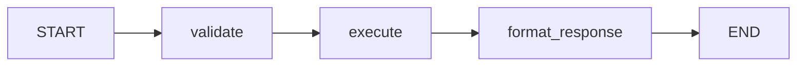

# 06 — Onboarding

[← Docs home](../README.md) | [SDK root](../../README.md)

Welcome to the Agent SDK. This page is written for developers who are new to the codebase, new to agent development, or new to Clean Architecture. Read it end-to-end before writing your first agent.

> **New to the SDK?** Start with the presentation overview first:
> **[Agent SDK for New Developers →](agent-sdk-for-new-developers.md)**
> It covers what the SDK solves, all builder paths, clean-architecture expectations, and how teams use it — with diagrams and links into the deeper guides.

---

## Pages in this section

| Page | What you get |
|---|---|
| [Agent SDK for New Developers](agent-sdk-for-new-developers.md) | Presentation overview: problem, builders, architecture, features, team patterns |
| [Onboarding Checklist](#) *(this page)* | Repo layout, mental models, first 30 minutes, glossary, pitfalls, first PR checklist |

---

## Contents

- [What You Are Looking At](#what-you-are-looking-at)
- [Core Mental Models](#core-mental-models)
- [Repository Layout](#repository-layout)
- [Your First 30 Minutes](#your-first-30-minutes)
- [Key Concepts Glossary](#key-concepts-glossary)
- [Common Pitfalls](#common-pitfalls)
- [First PR Checklist](#first-pr-checklist)

---

## What You Are Looking At

The Agent SDK is a framework for building AI workflow agents — software agents that receive a natural-language request, use an LLM to decide what to do, call tools or sub-agents to do it, and return a structured response.

It sits on top of [LangGraph](https://langchain-ai.github.io/langgraph/) (a graph execution engine for LLM applications) and [FastAPI](https://fastapi.tiangolo.com/), but hides most of that complexity behind three simple builder classes.

**You do not need to know LangGraph deeply to use this SDK.** You write Python functions and declare tools.

---

## Core Mental Models

### 1 — The Agent as a Graph

Every agent is a directed graph. Nodes are Python functions. Edges connect them.



Each node receives the current **state** (a typed dict) and returns a partial update. The SDK merges updates into the state between nodes.

### 2 — The Four Layers

The SDK and your agent code both follow Clean Architecture:

```
Layer 1 (Domain)       → State definitions. No external deps.
Layer 2 (Application)  → Your node functions and business logic.
Layer 3 (Adapters)     → HTTP/Kafka translation. Usually empty for simple agents.
Layer 4 (Frameworks)   → Graph wiring, LLM, database. Imports LangGraph/FastAPI.
```

**The most important rule**: Layer 2 (your nodes) must never import LangGraph, LangChain, FastAPI, or any HTTP client directly. Dependencies are injected via `deps`.

### 3 — Dependency Injection via `deps`

Your nodes receive a `deps` dict that contains everything they need:

```python
async def my_node(state: MyState, deps: dict) -> dict:
    logger = deps["logger"]
    db = deps["db"]
    llm = deps["llm"]
    ...
```

The SDK assembles this dict automatically from `build_app_container`. You override defaults by passing `extra_dependencies`.

### 4 — Run Lifecycle

```
POST /api/v1/execute
  → ExecuteAgentUseCase
    → emit WORKFLOW_STARTED
    → run graph nodes (emit NODE_STARTED, NODE_COMPLETED per node)
    → emit WORKFLOW_COMPLETED
  → return ExecuteAgentOutput
```

If any node calls `interrupt()`, the graph pauses and returns `interrupted=true`. The caller resumes via `POST /api/v1/resume`.

---

## Repository Layout

```
apps/backend/ai-workflow-management/agent/
├── agent-sdk/                    ← You are here
│   ├── agent_sdk/                ← SDK source code
│   │   ├── layer1_domain/        ← State, exceptions, value objects
│   │   ├── layer2_application/   ← Use cases, nodes, services
│   │   ├── layer3_adapters/      ← HTTP routes, Kafka adapters
│   │   └── layer4_frameworks/    ← Builders, OpenAI, HANA, Kafka
│   ├── docs/                     ← Documentation (you are here)
│   │   ├── 01-overview/          ← What the SDK is
│   │   ├── 02-quickstart/        ← Run an agent in 5 minutes
│   │   ├── 03-building-agents/   ← Builder paths and patterns
│   │   ├── 04-features/          ← Platform features
│   │   ├── 05-reference/         ← API, config, architecture
│   │   └── 06-onboarding/        ← This file
│   ├── examples/                 ← Runnable example agents
│   │   ├── echo_agent/           ← Layered example: full bootstrap + graph wiring
│   │   ├── convenient_tool_agent.py  ← AgentGraphBuilder with tool nodes
│   │   ├── minimal_tool_agent.py     ← Simplest ToolAgentBuilder example
│   │   └── ...
│   ├── tests/                    ← Unit and integration tests
│   ├── main.py                   ← SDK's own entry point
│   └── README.md                 ← Landing page
```

The public examples under `examples/` demonstrate the clean architecture pattern. When in doubt, read `examples/echo_agent/` for a complete layered project structure.

---

## Your First 30 Minutes

### Step 1 — Get it running (5 min)

Follow [02 — Quick Start](../02-quickstart/README.md).

```bash
pip install -e ".[dev]"
OPENAI_API_KEY=sk-... python3 examples/minimal_tool_agent.py
curl -X POST http://localhost:36000/api/v1/execute \
     -H 'Content-Type: application/json' \
     -d '{"message": "wait for 5 seconds", "conv_id": "test-1"}'
```

### Step 2 — Read the overview (5 min)

Read [01 — Overview](../01-overview/README.md). Understand the four layers and the capability matrix.

### Step 3 — Read an example (10 min)

Open `examples/convenient_tool_agent.py`. It is the simplest example of `AgentGraphBuilder`. Notice:
- Nodes are plain functions `(state, deps) -> dict`.
- No direct LangGraph imports.
- `build_app_container` wires everything.

### Step 4 — Read the example agent layout (10 min)

Look at `examples/echo_agent/`:
- `main.py` — 5 lines, just calls `run_agent`.
- `bootstrap.py` — all dependencies are wired here.
- `app/layer4_frameworks/graph/` — graph wiring using `AgentGraphBuilder`.

---

## Key Concepts Glossary

| Term | Meaning |
|---|---|
| **Agent** | A software service that receives a request, uses an LLM + tools to process it, and returns a response |
| **Graph** | The directed acyclic (or cyclic) execution graph that defines the agent's control flow |
| **Node** | A Python function `(state, deps) -> partial_update` that represents one step in the graph |
| **State** | A typed dict that flows through the graph; each node can read from and update it |
| **Tool** | A Python function decorated with `@tool`; the LLM can choose to call it |
| **Builder** | A fluent API class (`ToolAgentBuilder`, `AgentGraphBuilder`, `FlowGraphBuilder`) that helps you construct graphs |
| **DI container** | A dict assembled by `build_app_container` that holds all runtime dependencies (logger, LLM, DB, etc.) |
| **HITL** | Human-in-the-Loop — a pattern where the agent pauses and waits for human input before continuing |
| **Checkpoint** | A persisted snapshot of the graph state; required for HITL and multi-turn conversations |
| **Interrupt** | A signal raised by a node to pause graph execution; the caller must resume with a `HitlResumeCommand` |
| **Transport** | How the agent receives requests: `SERVER` (HTTP) or `CONSUMER` (Kafka/Event Mesh) |
| **Workflow event** | An event automatically published by the SDK at key lifecycle points (node start/end, workflow start/end) |

---

## Common Pitfalls

### "My node does nothing"

Check that your node returns a dict. Returning `None` silently skips the state update.

### "HITL does not work"

The graph must be compiled with a checkpointer:
```python
graph = builder.compile(checkpointer=MemorySaver())  # not builder.compile()
```
And `build_app_container` must receive `agent_graph=graph`.

### "I get an import error for LangGraph in my node"

You are importing LangGraph directly in Layer 2. Move that import to Layer 4 and inject the dependency via `deps`.

### "The LLM is not called"

Check `OPENAI_API_KEY` is set. The SDK will not create an `OpenAIService` if the key is absent.

### "My tool is not called"

The `@tool` decorator requires a docstring with an `Args:` section. LangChain uses this to generate the tool schema. Without a docstring, the LLM cannot understand when to call the tool.

### "State updates are not visible in the next node"

Nodes must return a partial update dict with the keys they want to update. Do not mutate `state` in-place.

---

## First PR Checklist

Before opening a pull request:

- [ ] New code in nodes stays in Layer 2 (no LangGraph/FastAPI/httpx imports).
- [ ] Graph wiring stays in Layer 4.
- [ ] `bootstrap.py` is the only place dependencies are wired.
- [ ] Tests cover your node functions (they are plain Python — easy to unit test).
- [ ] `python3 -m pytest tests/ -q` passes.
- [ ] New documentation goes into the appropriate numbered section folder under `docs/`.

---

[← Docs home](../README.md) | [SDK root](../../README.md)
