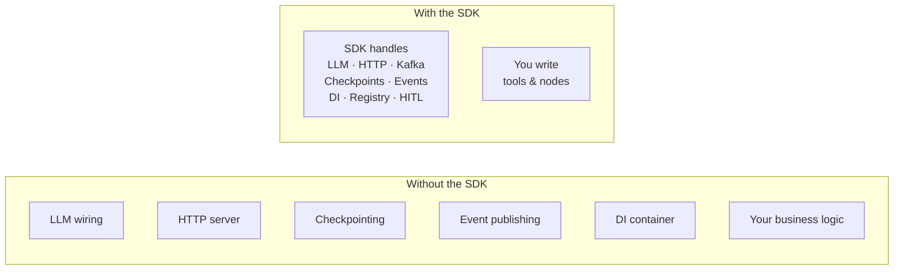
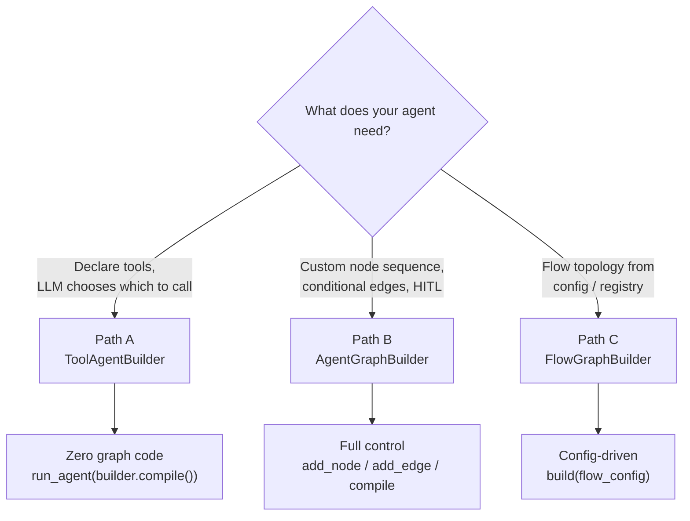
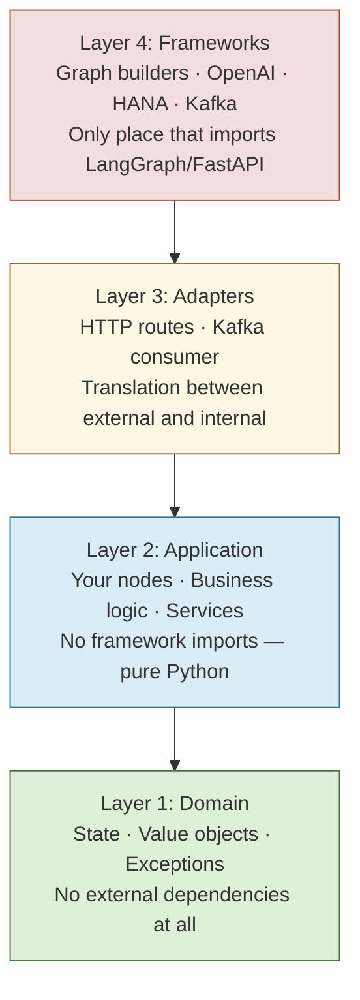
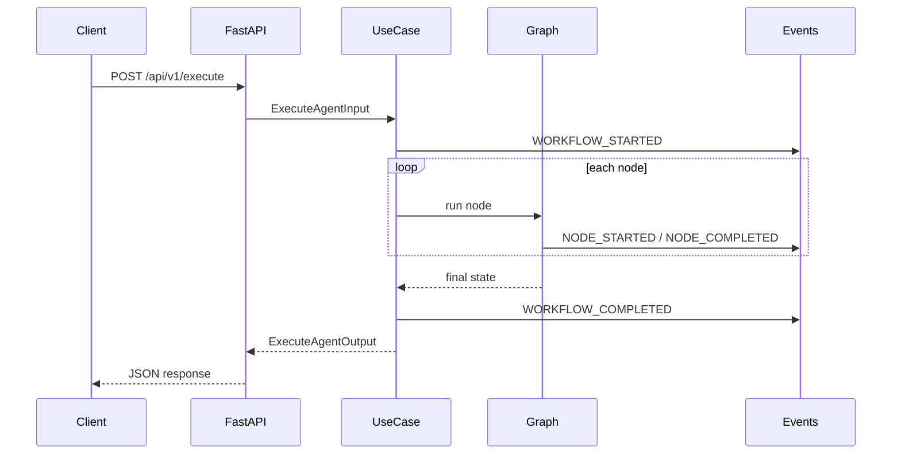
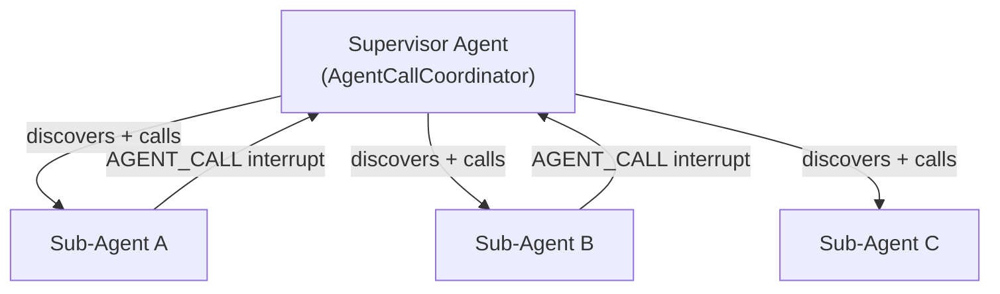

# Agent SDK for New Developers

[← Onboarding](README.md) | [← Docs home](../README.md) | [SDK root](../../README.md)

> **Start here if you are new to this codebase, new to agent development, or new to Clean Architecture.**
> This page gives you a complete picture of what the SDK solves, what it includes, and which path to take next.
> Each section links into the deeper guides so you can dive straight to what you need.

---

## What Problem Does the SDK Solve?

Building an AI agent from scratch means wiring together an LLM provider, a graph execution engine, an HTTP server or Kafka consumer, a checkpoint store, a service registry, event publishing, multi-tenancy, and dependency injection — before you write a single line of business logic.

The Agent SDK takes care of all of that.



**You declare your tools or graph nodes. The SDK handles everything else.**

---

## The Three Builder Paths

Every agent you build starts with one of three builders. Choosing the right one takes 30 seconds.



| Builder | Use when | Example file |
|---|---|---|
| `ToolAgentBuilder` | You have a list of tools and want the LLM to call them | `examples/minimal_tool_agent.py` |
| `AgentGraphBuilder` | You need custom nodes, edges, subgraphs, or HITL | `examples/convenient_tool_agent.py` |
| `FlowGraphBuilder` | Your flow is defined in configuration at runtime | `examples/flow_graph_example.py` |

→ Full guide: [Choose Your Builder](../02-quickstart/choose-your-builder.md)

---

## Clean Architecture in 90 Seconds

Every agent built with this SDK — and the SDK itself — follows a four-layer Clean Architecture. The layers define **what code is allowed to live where** and **what can import what**.



**The golden rule**: your node functions live in Layer 2 and must never import LangGraph, LangChain, FastAPI, or any HTTP client. Dependencies are injected via `deps`.

**Why it matters for you**: you can unit test your business logic without spinning up the framework stack.

→ Full tutorial: [Clean Architecture Tutorial](../03-building-agents/clean-architecture-tutorial.md)  
→ Layer rules and anti-patterns: [Architecture Rules and Anti-Patterns](../03-building-agents/architecture-rules-and-anti-patterns.md)

---

## How an Agent Run Works



If a node calls `interrupt()`, the graph pauses and the response contains `interrupted=true`. The client resumes via `POST /api/v1/resume`. This is the Human-in-the-Loop (HITL) pattern.

→ [Building Agents → HITL](../03-building-agents/README.md#hitl)

---

## Feature Overview

| Feature | What it gives you | Where to learn more |
|---|---|---|
| **ToolAgentBuilder** | Declare tools → running agent with zero graph code | [Path A guide](../03-building-agents/README.md#path-a--toolagentbuilder) |
| **AgentGraphBuilder** | Full custom graph: nodes, conditional edges, subgraphs | [Path B guide](../03-building-agents/README.md#path-b--agentgraphbuilder) |
| **FlowGraphBuilder** | Config-driven graph topology from a node registry | [Path C guide](../03-building-agents/README.md#path-c--flowgraphbuilder) |
| **HITL / resume** | Pause mid-run for human approval; stateless resume | [HITL guide](../04-features/hitl.md) |
| **Checkpointing** | Persist state for HITL, multi-turn, crash recovery | [Checkpointing](../04-features/README.md#checkpointing) |
| **Dual transports** | `SERVER` (HTTP) or `CONSUMER` (Kafka / SAP Event Mesh) | [Transports](../04-features/README.md#transports) |
| **Workflow events** | Auto-published lifecycle events (start, node, complete, fail) | [Workflow Events](../04-features/README.md#workflow-events) |
| **Remote agents** | Call another registered agent as a tool | [Remote Agents](../04-features/README.md#remote-agents-and-multi-agent-orchestration) |
| **Multi-agent orchestration** | `AgentDiscoveryService` + `AgentCallCoordinator` | [Remote Agents](../04-features/README.md#remote-agents-and-multi-agent-orchestration) |
| **Context budget** | Prevent context window overflow with five compaction strategies | [Context Budget](../04-features/README.md#context-budget-management) |
| **Dependency injection** | Override logger, LLM, DB, publisher via `extra_dependencies` | [DI Cookbook](../03-building-agents/dependency-injection-cookbook.md) |
| **SAP BTP deployment** | VCAP credential auto-load; Cloud Foundry ready | [Configuration](../05-reference/configuration.md) |

---

## What a Minimal Agent Looks Like

```python
from agent_sdk import ToolAgentBuilder, make_openai_service, run_agent, tool

@tool
def wait_task(wait_type: str, duration_seconds: int = 60) -> dict:
    """Execute a wait operation.

    Args:
        wait_type: The type of wait (e.g. 'fixed_duration').
        duration_seconds: How long to wait in seconds.
    """
    return {"status": "COMPLETED", "wait_type": wait_type, "actual_duration_seconds": duration_seconds}

def main() -> None:
    builder = ToolAgentBuilder(
        llm_service=make_openai_service(),
        tools=[wait_task],
        system_prompt="You are a workflow assistant.",
    )
    run_agent(agent_graph=builder.compile())

if __name__ == "__main__":
    main()
```

```bash
OPENAI_API_KEY=sk-... python examples/minimal_tool_agent.py
curl -X POST http://localhost:36000/api/v1/execute \
     -H 'Content-Type: application/json' \
     -d '{"message": "wait for 5 seconds", "conv_id": "test-1"}'
```

→ Step-by-step walkthrough: [First Agent](../02-quickstart/first-agent.md)

---

## How Teams Use This SDK

### Team pattern A — one agent, one domain

Each team owns one agent. The agent:
- Lives in its own directory under `apps/backend/ai-workflow-management/agent/`
- Has `main.py` (thin entry point), `bootstrap.py` (composition root), and `app/` (layered code)
- Is deployed independently to SAP BTP Cloud Foundry
- Registers itself in the service registry on startup

### Team pattern B — supervisor + sub-agents

One supervisor agent uses `AgentDiscoveryService` to find available sub-agents at runtime and calls them via `AgentCallCoordinator`. Each sub-agent is a separate service.



→ [Remote Agents and Multi-Agent Orchestration](../04-features/README.md#remote-agents-and-multi-agent-orchestration)

For the SAP Event Mesh-native consumer path, use `examples/kafka_consumer_example.py`. Keep `examples/queue_native_supervisor_example.py` for the broker-driven queue-first counterpart and `examples/supervisor_agent_example.py` for the HTTP compatibility path.

### What the public examples demonstrate

| Example | Pattern | What to learn from it |
|---|---|---|
| `examples/echo_agent/` | Layered direct-completion agent with full bootstrap | Canonical `bootstrap.py`, Layer 2 node structure, and injected `openai_service.get_chat_completion(...)` |
| `examples/convenient_tool_agent.py` | Graph agent with custom nodes | `AgentGraphBuilder` node wiring, error handling in nodes |
| `examples/kafka_consumer_example.py` | SAP Event Mesh-native consumer path | SAP Event Mesh request-topic settings, `EventMeshMessageConsumer`, Kafka local compatibility |
| `examples/queue_native_supervisor_example.py` | Queue-first multi-agent supervisor pattern | `AsyncAgentDelegator`, `MessageReactionRouter`, registry `QueueMetadata`, queue-first correlation resume |
| `examples/supervisor_agent_example.py` | HTTP compatibility multi-agent supervisor pattern | `Protocol` port in Layer 2, `AgentCallCoordinator` in Layer 4 |

---

## Where to Go Next

Use the table below to find the right starting point based on what you want to do.

| I want to… | Go here |
|---|---|
| Run a working agent in 5 minutes | [Quick Start → First Agent](../02-quickstart/first-agent.md) |
| Understand the SDK vocabulary | [SDK Mental Model](../02-quickstart/mental-model.md) |
| Choose between the three builders | [Choose Your Builder](../02-quickstart/choose-your-builder.md) |
| Understand the four-layer architecture | [Overview](../01-overview/README.md) |
| Build my first production agent | [Clean Architecture Tutorial](../03-building-agents/clean-architecture-tutorial.md) |
| Add HITL / human approval | [Building Agents → HITL](../03-building-agents/README.md#hitl) |
| Add checkpointing or Kafka | [Features](../04-features/README.md) |
| Call another agent as a tool | [Remote Agents](../04-features/README.md#remote-agents-and-multi-agent-orchestration) |
| Look up a class or function | [API Reference](../05-reference/api-reference.md) |
| Look up an environment variable | [Configuration](../05-reference/configuration.md) |
| See all examples | [Examples Roadmap](../02-quickstart/examples-roadmap.md) |
| Read the onboarding checklist | [Onboarding README](README.md) |

---

[← Onboarding](README.md) | [← Docs home](../README.md) | [SDK root](../../README.md)
